# LPI: Legitimacy & Power Infrastructure

LPI

> **The immune system.** LPI exists to detect and prevent illegitimate power concentration across the ecosystem. It monitors all entities — including itself — for signs that any single actor is accumulating disproportionate authority, resources, or influence. If AINEFF defines the constitutional floor, LPI patrols the power dynamics above it.

## Role in Ecosystem

Power concentration is the primary existential risk to any multi-entity ecosystem. Without active monitoring, the entity that generates the most revenue, controls the most data, or influences the most decisions will gradually absorb authority from other entities — until the ecosystem becomes a hierarchy with one entity at the top and seven subordinates.

LPI prevents this. It continuously measures power distribution across all 8 entities, detects concentration trends before they become structural, and triggers intervention when thresholds are approached. LPI is delegated this authority by [AINEFF](/ecosystem-entities/aineff) but operates independently — including monitoring AINEFF itself for power concentration.

LPI's critical design feature: it is incentivized to find problems. Unlike compliance entities that benefit from clean audits, LPI's value is demonstrated by the concentrations it detects and the interventions it triggers. An LPI that finds nothing is either not looking hard enough or the ecosystem is not large enough to have power dynamics.

## Core Functions

| # | Function | Description |
|---|----------|-------------|
| 1 | **Power Concentration Detection** | Continuously monitors the distribution of authority, resources, revenue, data access, and decision influence across all 8 entities. Flags when any entity approaches concentration thresholds defined by AINEFF. |
| 2 | **Authority Legitimacy Verification** | Verifies that authority exercised by any entity is within its governance mandate. Detects scope creep, mandate drift, and unauthorized authority expansion. |
| 3 | **Anti-Cartel Surveillance** | Monitors for coordination between entities that would constitute effective power concentration — even if no single entity exceeds thresholds individually. |
| 4 | **Asymmetry Metric Engine (PAME)** | The Power Asymmetry Metric Engine quantifies the degree of power imbalance across the ecosystem. Produces a single, trackable score that indicates ecosystem health. |
| 5 | **Governance Decay Detection** | Identifies when governance mechanisms are weakening over time — enforcement rates declining, audit rigor decreasing, escalation thresholds rising. Governance decay is a leading indicator of power concentration. |
| 6 | **Whistleblower Infrastructure** | Provides secure, anonymous channels for individuals within any entity to report suspected power concentration, governance violations, or mandate drift. |
| 7 | **Coalition Detection** | Identifies when entities form informal coalitions that effectively concentrate power without any single entity exceeding thresholds. Detects voting blocs, shared-interest alignment, and coordinated strategy. |

## Products & Services

### PCI Dashboard (Power Concentration Index)

Real-time dashboard displaying power distribution metrics across all 8 entities. Tracks authority, resources, revenue, data access, and decision influence on a continuous basis.

| Feature | Description |
|---------|-------------|
| **Entity Power Scores** | Composite power score for each entity, updated daily |
| **Trend Analysis** | 30/60/90/180-day power trends with trajectory projection |
| **Threshold Alerts** | Automated alerts when any entity approaches concentration thresholds |
| **Historical Comparison** | Power distribution over time — shows how concentration evolves |
| **Drill-Down Analytics** | Per-dimension breakdown (authority, resources, revenue, data, influence) |

**Pricing**: $1,500/month per entity subscription

### PAME Reports (Power Asymmetry Metric Engine)

Comprehensive assessments of power distribution across the ecosystem. PAME produces a quantified asymmetry score and detailed analysis of where imbalances exist and why.

| Report Type | Scope | Delivery |
|-------------|-------|----------|
| **Standard PAME** | Full ecosystem power assessment | Quarterly |
| **Focused PAME** | Single entity or entity-pair deep dive | On-demand |
| **Triggered PAME** | Rapid assessment triggered by threshold alert | Within 48 hours |
| **Comparative PAME** | Period-over-period comparison of power dynamics | Semi-annual |

**Pricing**: $5,000 per assessment

### CCRS Monitoring (Cartel & Coalition Risk Score)

Continuous monitoring for cartel-like coordination and coalition formation between entities. Tracks communication patterns, decision alignment, shared resource usage, and coordinated behavior.

- **Pairwise Monitoring** — Tracks every entity pair for coordination signals
- **Coalition Mapping** — Identifies multi-entity groupings that act in concert
- **Coordination Scoring** — Quantifies the degree of coordination on a 0-100 scale
- **Alert Escalation** — Triggers intervention when coordination exceeds safe thresholds

**Pricing**: $3,000/month

### Governance Decay Audit

Deep-dive assessment of governance mechanism health across the ecosystem. Identifies where enforcement is weakening, where audit rigor is declining, and where the system is becoming more permissive over time.

| Audit Dimension | What It Measures |
|-----------------|-----------------|
| **Enforcement Rate** | Percentage of detected violations that result in corrective action |
| **Audit Rigor** | Depth, frequency, and independence of audit activities |
| **Escalation Health** | Whether escalation thresholds are stable, rising, or being bypassed |
| **Override Frequency** | How often governance controls are overridden and by whom |
| **Response Latency** | Time between violation detection and corrective action |

**Pricing**: $15,000 - $50,000 per audit

### Whistleblower Platform

Secure, anonymous reporting infrastructure for individuals within any entity to report suspected power concentration, governance violations, or mandate drift.

- **Anonymous Submission** — No identity disclosure required; technical anonymity guaranteed
- **Secure Communication** — Encrypted, air-gapped communication channel
- **Case Management** — Each report tracked through investigation, resolution, and outcome
- **Protection Protocols** — Anti-retaliation monitoring for identified whistleblowers
- **Escalation Paths** — Reports can escalate to AINEFF for constitutional-level issues

**Pricing**: $500/month per entity

## Governance Mandate

### What LPI Is Authorized To Do

- Monitor power distribution across all 8 entities (including itself)
- Quantify and report power asymmetry
- Detect cartel-like coordination and coalition formation
- Assess governance mechanism health and decay
- Operate whistleblower infrastructure
- Issue power concentration warnings
- Recommend intervention to AINEFF when thresholds are breached
- Publish ecosystem power health reports

### What LPI Is Constrained From Doing

- **Cannot intervene directly** — LPI detects and reports; AINEFF authorizes intervention
- **Cannot access entity operational data beyond power metrics** — monitoring is scoped to power-relevant data only
- **Cannot self-exempt from monitoring** — LPI's own power concentration is monitored (by AINEFF and by its own systems)
- **Cannot suppress whistleblower reports** — all reports must be logged, tracked, and resolved
- **Cannot unilaterally change concentration thresholds** — thresholds are set by AINEFF
- **Cannot share whistleblower identity** — anonymity protections are absolute

## Revenue Model

| Revenue Stream | Mechanism | Margin |
|----------------|-----------|--------|
| PCI Dashboard Subscriptions | Monthly SaaS subscription per entity | 85-95% |
| PAME Assessment Fees | Per-assessment fees for power asymmetry reports | 75-85% |
| CCRS Monitoring Subscriptions | Monthly subscription for cartel/coalition monitoring | 85-95% |
| Governance Decay Audit Fees | Per-audit engagement fees | 65-80% |
| Whistleblower Platform Fees | Monthly per-entity platform subscription | 80-90% |
| Custom Investigation Fees | Per-engagement fees for targeted power investigations | 60-75% |

## Integration Points

```mermaid
graph TB
    LPI["LPI<br/><i>Power Infrastructure</i>"]

    AINEFF["AINEFF<br/><i>Constitutional Constraints</i>"] -->|"Concentration thresholds"| LPI
    AINEFF -->|"Monitoring authority delegation"| LPI

    LPI -->|"Power concentration alerts"| AINEFF
    LPI -->|"Entity power scores"| AINEG["AINEG<br/><i>Governance</i>"]
    LPI -->|"Power monitoring for instances"| AINE["AINE<br/><i>Enterprise Instances</i>"]
    LPI -->|"Resource distribution analysis"| WGE["WGE<br/><i>Runtime Execution</i>"]
    LPI -->|"Accountability power data"| Frankmax["Frankmax<br/><i>Pre-Incident Governance</i>"]
    LPI -->|"Framework power hooks"| AINEF["AINEF<br/><i>Enterprise Framework</i>"]
    LPI -->|"IP concentration monitoring"| UniVenture["UniVenture<br/><i>IP & Ventures</i>"]

    AINEG -->|"Governance compliance data"| LPI
    WGE -->|"Resource distribution data"| LPI
    Frankmax -->|"Power accountability data"| LPI
    AINE -->|"Power distribution data"| LPI

    style LPI fill:#1E2761,stroke:#CADCFC,stroke-width:3px,color:#CADCFC
    style AINEFF fill:#2a2a4a,stroke:#CADCFC,color:#CADCFC
    style AINEG fill:#2a2a4a,stroke:#CADCFC,color:#CADCFC
    style AINE fill:#2a2a4a,stroke:#CADCFC,color:#CADCFC
    style WGE fill:#2a2a4a,stroke:#CADCFC,color:#CADCFC
    style Frankmax fill:#2a2a4a,stroke:#CADCFC,color:#CADCFC
    style AINEF fill:#2a2a4a,stroke:#CADCFC,color:#CADCFC
    style UniVenture fill:#2a2a4a,stroke:#CADCFC,color:#CADCFC
```

### Upstream (LPI Receives)

| From | What | Purpose |
|------|------|---------|
| [AINEFF](/ecosystem-entities/aineff) | Concentration thresholds & monitoring authority | Defines what counts as illegitimate concentration and authorizes LPI to monitor |
| [AINEG](/ecosystem-entities/aineg) | Governance compliance data | Input for governance decay detection |
| [WGE](/ecosystem-entities/wge) | Resource distribution data | Compute, API, and cost allocation across entities |
| [Frankmax](/ecosystem-entities/frankmax) | Power accountability data | Accountability chain data for power analysis |
| [AINE](/ecosystem-entities/aine) | Power distribution data | Per-instance authority and resource distribution |

### Downstream (LPI Provides)

| To | What | Purpose |
|----|------|---------|
| [AINEFF](/ecosystem-entities/aineff) | Power concentration alerts | Triggers constitutional review and potential intervention |
| [AINEG](/ecosystem-entities/aineg) | Entity power scores | Context for governance prioritization |
| [AINE](/ecosystem-entities/aine) | Instance power monitoring | Prevents internal concentration within enterprise instances |
| [WGE](/ecosystem-entities/wge) | Resource distribution analysis | Identifies resource allocation imbalances |
| [Frankmax](/ecosystem-entities/frankmax) | Power accountability intelligence | Power dynamics relevant to liability mapping |
| [AINEF](/ecosystem-entities/ainef) | Power monitoring hooks | Requirements for power monitoring in template designs |
| [UniVenture](/ecosystem-entities/univenture) | IP concentration monitoring | Detects IP portfolio concentration that could distort ecosystem |

## Power Concentration Dimensions

LPI monitors seven dimensions of power:

| Dimension | What It Measures | Why It Matters |
|-----------|-----------------|----------------|
| **Authority** | Decision-making scope and binding force | An entity with too much authority becomes a de facto dictator |
| **Resources** | Compute, API access, budget, headcount | An entity controlling most resources can starve others |
| **Revenue** | Share of ecosystem revenue | Revenue concentration creates dependency and leverage |
| **Data Access** | Scope and sensitivity of accessible data | Data is power; data concentration enables surveillance |
| **Influence** | Ability to shape other entities' decisions informally | Soft power is harder to detect but equally dangerous |
| **Network Position** | Centrality in ecosystem communication and dependency graphs | A node everything passes through controls everything |
| **Temporal Accumulation** | Rate of power growth over time | Even small imbalances compound into concentration |

## Related

- [AINEFF](/ecosystem-entities/aineff) — Constitutional authority that delegates power monitoring to LPI
- [AINEG](/ecosystem-entities/aineg) — Governance layer whose health LPI monitors for decay
- [Frankmax](/ecosystem-entities/frankmax) — Pre-incident accountability partner for power-related liability
- [Protocols](/protocols) — ORF, ETLB, and MCO protocols monitored for power implications
- [Agent Recovery Prompt](/recovery) — Full ecosystem context
