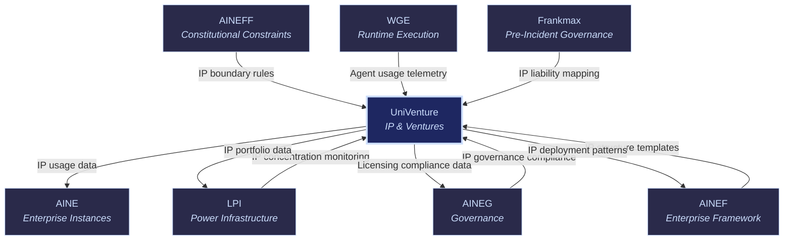
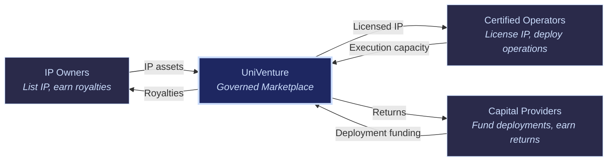

# UniVenture: UniVenture Platform

UniVenture

> **The exchange.** UniVenture is the global IP licensing and venture execution marketplace. It connects intellectual property owners with certified operators across 50+ NAICS sectors, enabling IP to move from vault to value without the IP owner needing to build an enterprise. Think of it as the stock exchange for operational intellectual property — where IP meets execution at scale.

## Role in Ecosystem

UniVenture solves a fundamental problem: most IP never generates value because the owner lacks the operational capacity to deploy it. A university holds patents it cannot commercialize. A family office holds process IP from acquisitions it cannot operate. A founder has product IP but no distribution infrastructure.

UniVenture creates a structured marketplace where:
- **IP owners** list their intellectual property with defined licensing terms
- **Certified operators** bid on execution rights
- **Capital providers** fund deployment
- **Governance infrastructure** (from the rest of the ecosystem) ensures compliant, accountable execution

Every transaction on UniVenture runs through ecosystem governance: [AINEG](/ecosystem-entities/aineg) policies, [AINEFF](/ecosystem-entities/aineff) constraints, [Frankmax](/ecosystem-entities/frankmax) accountability, and [WGE](/ecosystem-entities/wge) execution. This is not an unregulated marketplace — it is a governed exchange.

## Core Functions

| # | Function | Description |
|---|----------|-------------|
| 1 | **IP Stack Registry** | Maintains a structured registry of all intellectual property listed on the platform, categorized by type: System IP, Product IP, Platform IP, Data IP, Process IP, and Brand IP. Each entry includes provenance, valuation, licensing terms, and deployment requirements. |
| 2 | **Operator Certification System** | Certifies operators who wish to license and deploy IP. Certification verifies operational capability, governance compliance, financial capacity, and domain expertise. Only certified operators can bid on IP deployment rights. |
| 3 | **IP-to-Operator Matching Engine** | Intelligent matching that connects IP assets with the most qualified operators based on domain expertise, operational track record, capital access, regulatory clearance, and geographic coverage. |
| 4 | **Governance Smart Contract Layer** | Automated governance enforcement for IP licensing agreements. Smart contracts encode licensing terms, royalty calculations, performance thresholds, compliance requirements, and termination conditions. |
| 5 | **Capital Deployment System** | Connects IP deployment opportunities with capital providers (family offices, VCs, institutional investors). Structures investment vehicles, manages capital calls, and tracks deployment performance. |
| 6 | **Performance Monitoring Dashboard** | Tracks the operational and financial performance of every deployed IP instance. Monitors revenue, compliance, operator quality, and IP utilization rates across the platform. |

## IP Stack Categories

| IP Type | Description | Examples |
|---------|-------------|---------|
| **System IP** | Architecture, infrastructure, and operational system designs | Enterprise architecture patterns, orchestration frameworks, governance systems |
| **Product IP** | Specific product designs, formulations, and specifications | AI model configurations, product algorithms, feature specifications |
| **Platform IP** | Platform architectures, marketplace designs, and network structures | Marketplace engines, platform integration patterns, ecosystem designs |
| **Data IP** | Proprietary datasets, data models, ontologies, and data products | Industry ontologies, failure libraries, training datasets, benchmark corpora |
| **Process IP** | Business processes, methodologies, operational procedures | Governance methodologies (e.g., PIAR), operational playbooks, compliance frameworks |
| **Brand IP** | Trademarks, brand assets, reputation capital, and market positioning | Certification marks, accreditation brands, marketplace brand equity |

## Products & Services

### IP Listing & Royalty Management

IP owners list their assets on the platform with defined licensing terms. UniVenture manages the entire royalty lifecycle — from initial pricing through collection, distribution, and reconciliation.

- **Standard Listing** — Basic listing with platform matching and standard royalty processing
- **Premium Listing** — Featured placement, enhanced matching, dedicated account management
- **Portfolio Listing** — Bulk listing for IP portfolios with cross-asset optimization

### Operator Certification Program

Multi-stage certification that validates operator capability before they can access IP on the platform.

| Stage | Assessment | Duration |
|-------|-----------|----------|
| **Stage 1: Qualification** | Background check, financial capacity verification, basic compliance review | 1-2 weeks |
| **Stage 2: Domain Assessment** | Domain expertise evaluation, case study review, reference validation | 2-4 weeks |
| **Stage 3: Governance Certification** | AINEG compliance certification, AINEFF constitutional awareness, Frankmax accountability readiness | 1-2 weeks |
| **Stage 4: Trial Deployment** | Supervised deployment of a limited IP license to demonstrate operational capability | 4-8 weeks |

### IP-to-Operator Matching

Algorithmic and curated matching that connects IP assets with optimal operators.

| Matching Factor | Weight | Description |
|-----------------|--------|-------------|
| **Domain Expertise** | High | Operator experience in the IP's domain/sector |
| **Operational Track Record** | High | Historical deployment success rate and performance |
| **Capital Access** | Medium | Financial capacity to fund and sustain deployment |
| **Regulatory Clearance** | Medium | Pre-existing regulatory approvals in target jurisdictions |
| **Geographic Coverage** | Medium | Operational presence in target markets |
| **Governance Maturity** | High | AINEG compliance score and governance infrastructure |

### Governance Smart Contracts

Automated enforcement of IP licensing agreements through programmable contracts.

- **Royalty Automation** — Automatic calculation and distribution of royalties based on defined formulas
- **Performance Gates** — Automatic enforcement of minimum performance thresholds
- **Compliance Triggers** — Automatic license suspension if governance compliance lapses
- **Termination Conditions** — Automatic license termination on defined breach conditions
- **Dispute Resolution** — Structured dispute resolution process with escalation paths

### Capital Deployment Platform

Connects IP deployment opportunities with capital providers.

- **Deal Sourcing** — Curated investment opportunities based on IP quality, operator certification, and market potential
- **Due Diligence Packages** — Standardized due diligence including governance assessment, risk analysis, and financial projections
- **Investment Structuring** — Pre-built investment vehicles (equity, debt, royalty participation, revenue share)
- **Portfolio Monitoring** — Real-time performance tracking across all deployed capital

## Target Audiences

| Audience | Role on Platform | Value Proposition |
|----------|-----------------|-------------------|
| **Dynasties** | IP owners (large portfolios) | Monetize dormant IP without building operational capacity |
| **Family Offices** | Capital providers | Structured access to IP-backed investment opportunities with governance guarantees |
| **Education Institutions** | IP creators (research, patents) | Commercialize academic IP through certified operators |
| **Venture Capital** | Capital deployers | New asset class: governed IP deployment with transparent performance metrics |
| **Founders** | Operators | Access proven IP without inventing from scratch; accelerate time-to-market |
| **Consulting Firms** | Process IP owners | Monetize methodologies and frameworks at scale through licensed operators |

## Governance Mandate

### What UniVenture Is Authorized To Do

- Maintain the IP registry and operator certification system
- Match IP owners with certified operators
- Enforce licensing terms through governance smart contracts
- Connect capital providers with deployment opportunities
- Monitor performance of deployed IP
- Collect and distribute royalties
- Certify and decertify operators based on performance and compliance
- Report IP concentration data to LPI

### What UniVenture Is Constrained From Doing

- **Cannot own or operate IP** — UniVenture is a marketplace, not an IP holder or operator
- **Cannot deploy capital from its own balance sheet** — marketplace only, no proprietary investment
- **Cannot certify operators without AINEG governance validation** — certification requires ecosystem compliance
- **Cannot suppress performance data** — all IP deployment performance is transparent to stakeholders
- **Cannot override governance smart contract terms** — contract enforcement is automated and immutable
- **Cannot bypass AINEFF constraints** — all marketplace activity operates within constitutional bounds

## Revenue Model

| Revenue Stream | Mechanism | Margin |
|----------------|-----------|--------|
| IP Listing Fees | Per-listing and annual maintenance fees | 85-95% |
| Operator Certification Fees | Per-stage certification assessment fees | 75-85% |
| Transaction/Placement Fees | Percentage of IP licensing transaction value | 15-25% (take rate) |
| Platform SaaS Fees | Monthly/annual subscription for marketplace access and tools | 80-90% |
| Capital Deployment Percentage | Percentage of capital deployed through the platform | 1-3% (carried) |
| Royalty Processing Fees | Per-transaction fee for royalty calculation and distribution | 85-95% |

## Integration Points

### Upstream (UniVenture Receives)

| From | What | Purpose |
|------|------|---------|
| [AINEFF](/ecosystem-entities/aineff) | IP boundary rules | Constitutional limits on what IP can be listed and how |
| [AINEG](/ecosystem-entities/aineg) | Governance compliance status | Required for operator certification and license maintenance |
| [AINEF](/ecosystem-entities/ainef) | IP structure templates | Standard structures for packaging and listing IP |
| [WGE](/ecosystem-entities/wge) | Agent usage telemetry | Performance data on IP deployed through WGE agents |
| [Frankmax](/ecosystem-entities/frankmax) | IP liability mapping | Liability analysis for IP licensing arrangements |
| [LPI](/ecosystem-entities/lpi) | IP concentration monitoring | Alerts when IP portfolios concentrate market power |

### Downstream (UniVenture Provides)

| To | What | Purpose |
|----|------|---------|
| [AINE](/ecosystem-entities/aine) | Licensed IP for enterprise instances | IP assets deployed into running enterprises |
| [LPI](/ecosystem-entities/lpi) | IP portfolio concentration data | Input for power concentration analysis |
| [AINEG](/ecosystem-entities/aineg) | Licensing compliance data | Governance data on IP licensing compliance |
| [AINEF](/ecosystem-entities/ainef) | IP deployment patterns | Real-world data on how IP structures perform |

## Platform Economics

UniVenture creates a three-sided marketplace:

The platform's competitive advantage is governance. Any marketplace can connect IP owners with operators. Only UniVenture provides ecosystem-grade governance — [AINEG](/ecosystem-entities/aineg) compliance, [AINEFF](/ecosystem-entities/aineff) constitutional constraints, [Frankmax](/ecosystem-entities/frankmax) accountability, and [LPI](/ecosystem-entities/lpi) power monitoring — ensuring that every IP deployment is governed, auditable, and defensible.

## Related

- [AINEF](/ecosystem-entities/ainef) — IP structure templates used for listing
- [AINEG](/ecosystem-entities/aineg) — Governance compliance required for certification
- [LPI](/ecosystem-entities/lpi) — IP concentration monitoring
- [Frankmax](/ecosystem-entities/frankmax) — IP liability mapping for licensing arrangements
- [WGE](/ecosystem-entities/wge) — Runtime engine for IP deployment execution
- [Protocols](/protocols) — ORF, ETLB, and MCO protocols governing IP transactions
- [Agent Recovery Prompt](/recovery) — Full ecosystem context
