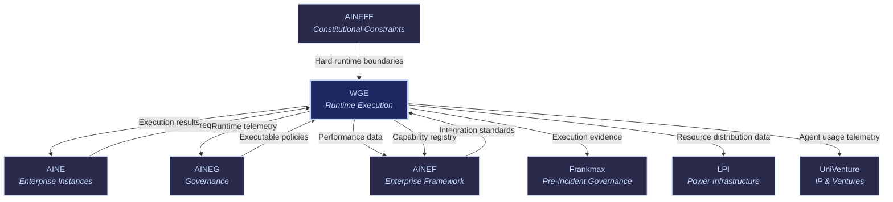
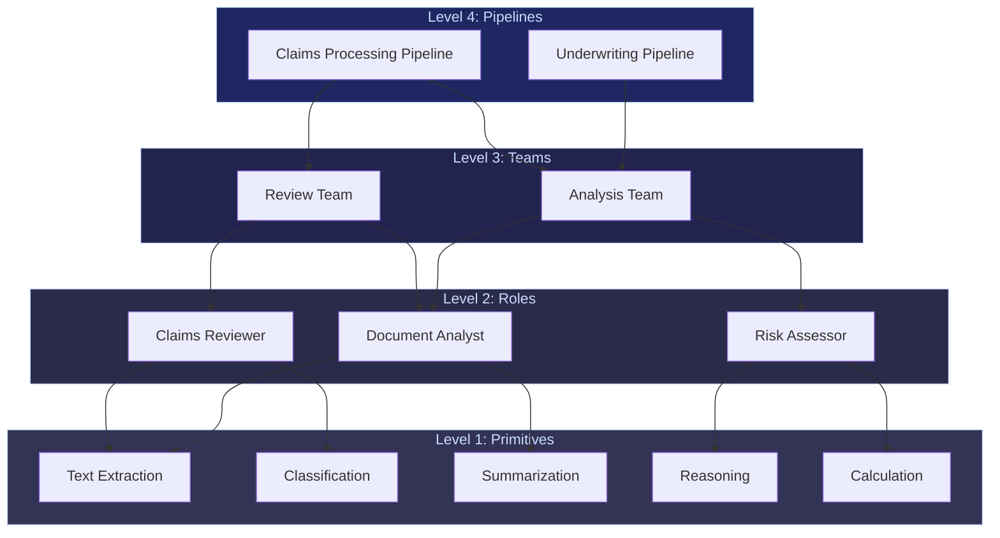

# WGE: Work Genesis Engine

WGE

> **The operating system.** WGE is the runtime execution engine of the ecosystem. It creates, manages, routes, and terminates AI work units. Every agent that runs, every model that infers, every workflow that executes — it all happens inside WGE. If AINEF is the blueprint and AINE is the building, WGE is the electrical grid, plumbing, and HVAC that makes it all function.

## Role in Ecosystem

WGE is where computation meets governance. It is the layer that takes abstract enterprise definitions (from AINEF), applies governance constraints (from AINEG and AINEFF), and produces actual work output — decisions made, documents processed, claims adjudicated, transactions monitored.

WGE manages the full lifecycle of AI work units: from primitive capabilities (a single model inference) through composed roles (a "claims reviewer" agent) to coordinated teams (an underwriting pipeline with multiple specialists). It routes work to the optimal model for each task, enforces resource limits, monitors performance, and ensures that every action is governed and auditable.

The marketplace's core value proposition — 713 AI offerings at 80% below provider pricing — is delivered through WGE's multi-model routing and optimization engine.

## Core Functions

| # | Function | Description |
|---|----------|-------------|
| 1 | **Agent Lifecycle Management** | Creates, configures, monitors, and terminates AI agents. Every agent has a defined lifecycle with clear birth conditions, operational parameters, MCO-compliant mortality, and state cleanup on termination. |
| 2 | **Task Orchestration** | Decomposes complex business processes into executable task graphs. Manages dependencies, parallelism, error handling, retry logic, and escalation. Ensures tasks complete within governance constraints. |
| 3 | **Multi-Model Routing** | Routes each task to the optimal model based on capability requirements, cost, latency, accuracy, and compliance constraints. Supports 713 offerings across multiple providers — the engine behind 80% cost savings. |
| 4 | **Capability Composition** | Composes primitives (single model capabilities) into roles (multi-capability agents) into teams (multi-agent workflows). The composition hierarchy: Primitives --> Roles --> Teams --> Pipelines. |
| 5 | **Resource Allocation** | Manages compute, memory, API quota, and cost budgets across all running agents and workflows. Prevents resource exhaustion, enforces per-instance limits, and optimizes utilization. |
| 6 | **Performance Monitoring** | Tracks latency, accuracy, cost, throughput, and error rates for every agent, task, and workflow. Feeds performance data back into routing decisions and into the ecosystem telemetry corpus. |

## Products & Services

### OpenClaw Runtime Stack

The core runtime infrastructure that powers all AI execution in the ecosystem. OpenClaw provides the foundational primitives for agent execution, communication, state management, and governance integration.

| Component | Function |
|-----------|----------|
| **Execution Engine** | Runs agent code with governance hooks at every decision point |
| **State Manager** | Persistent, versioned state for all agents and workflows |
| **Communication Bus** | Inter-agent messaging with audit trail integration |
| **Resource Controller** | CPU, memory, API quota, and cost budget enforcement |
| **Governance Bridge** | Real-time policy enforcement via AINEG integration |
| **Telemetry Collector** | Performance, decision, and compliance data capture |

### Agent Marketplace

A curated marketplace of pre-built, governance-compliant agents ready for deployment into AINE instances. Each agent is tested, certified, and comes with defined capability profiles, resource requirements, and compliance certifications.

- **Vertical Agents** — Purpose-built for specific industries (claims reviewer, underwriting analyst, compliance monitor)
- **Horizontal Agents** — Cross-industry capabilities (document processor, data extractor, summarizer, translator)
- **Governance Agents** — Specialized agents for compliance checking, audit generation, and policy enforcement
- **Utility Agents** — Infrastructure agents for monitoring, alerting, reporting, and system management

### Multi-Model Orchestration Engine

The intelligent routing layer that matches each task to the optimal model. Considers:

| Factor | How It's Used |
|--------|---------------|
| **Task Requirements** | What capability is needed (reasoning, generation, classification, extraction) |
| **Accuracy Threshold** | Minimum acceptable accuracy for the task type |
| **Latency Budget** | Maximum acceptable response time |
| **Cost Budget** | Per-task and per-workflow cost limits |
| **Compliance Constraints** | Data residency, model provider restrictions, regulatory requirements |
| **Historical Performance** | Which model performs best for this specific task type in this specific context |

This engine delivers the marketplace's headline value: access to 713 AI offerings at 80% below provider pricing through intelligent routing, batching, caching, and negotiated volume pricing.

### Enterprise Agent Orchestration OS

The full-stack operating system for running agent-based enterprises. Combines runtime, marketplace, orchestration, and monitoring into a single platform.

- **Agent Studio** — Visual agent design and composition tooling
- **Workflow Designer** — Drag-and-drop workflow creation with governance hooks
- **Operations Dashboard** — Real-time visibility into all running agents, workflows, and resource utilization
- **Cost Center** — Per-workflow, per-agent, per-model cost tracking and optimization recommendations

## Governance Mandate

### What WGE Is Authorized To Do

- Execute AI agents and workflows within governed boundaries
- Route tasks to optimal models based on multi-factor optimization
- Manage agent lifecycle (create, configure, monitor, terminate)
- Allocate and enforce resource budgets
- Collect and transmit telemetry data
- Enforce AINEG governance policies at runtime
- Enforce AINEFF constitutional constraints at execution time
- Terminate agents that violate MCO requirements

### What WGE Is Constrained From Doing

- **Cannot bypass AINEFF constraints** — constitutional limits are enforced at the execution layer
- **Cannot disable governance hooks** — AINEG policy enforcement cannot be turned off
- **Cannot suppress telemetry** — performance and decision data must always flow
- **Cannot self-allocate unlimited resources** — resource budgets are externally set
- **Cannot route to non-compliant models** — only approved model providers are available
- **Cannot extend agent lifecycles beyond MCO limits** — mortality is non-negotiable

## Revenue Model

| Revenue Stream | Mechanism | Margin |
|----------------|-----------|--------|
| Per-Agent Runtime Fees | Micro-fees per agent-hour of execution | 60-75% |
| Orchestration Platform Fees | Monthly/annual platform subscription by tier | 75-85% |
| Agent Marketplace Take Rate | Percentage of agent sales/subscriptions in the marketplace | 20-30% |
| Multi-Model Routing Fees | Per-request routing optimization fees (embedded in 80% savings) | 40-60% |
| Enterprise OS Licensing | Per-instance licensing for the full orchestration OS | 80-90% |
| Custom Agent Development | Professional services for bespoke agent development | 50-65% |

**Economic role**: WGE is the "burger" — the loss-leader layer that delivers cheap AI access. Per-agent and per-request fees are priced aggressively to drive volume. The goal is not margin on execution; the goal is attachment of AINEG governance services (the "fries") and generation of telemetry data (the "kitchen").

## Integration Points

### Upstream (WGE Receives)

| From | What | Purpose |
|------|------|---------|
| [AINEFF](/ecosystem-entities/aineff) | Constitutional constraints | Hard boundaries on agent behavior and autonomy |
| [AINEG](/ecosystem-entities/aineg) | Executable governance policies | Runtime-enforceable rules for every action |
| [AINEF](/ecosystem-entities/ainef) | Integration standards | How WGE connects to enterprise components |
| [AINE](/ecosystem-entities/aine) | Workflow execution requests | The actual work to be done |

### Downstream (WGE Provides)

| To | What | Purpose |
|----|------|---------|
| [AINE](/ecosystem-entities/aine) | Execution results | Completed work output returned to the enterprise |
| [AINEG](/ecosystem-entities/aineg) | Runtime telemetry | Raw execution data for compliance monitoring |
| [AINEF](/ecosystem-entities/ainef) | Capability registry & performance data | What capabilities exist and how they perform |
| [Frankmax](/ecosystem-entities/frankmax) | Execution evidence | Decision logs and action traces for accountability |
| [LPI](/ecosystem-entities/lpi) | Resource distribution data | Which entities consume how much — input for concentration detection |
| [UniVenture](/ecosystem-entities/univenture) | Agent usage telemetry | IP usage and performance data for licensing |

## Capability Composition Model

WGE uses a four-level composition hierarchy:

| Level | Unit | Description |
|-------|------|-------------|
| **1. Primitives** | Single model capability | One model doing one thing (extract text, classify, summarize) |
| **2. Roles** | Multi-capability agent | Multiple primitives composed into a coherent role (claims reviewer = extraction + classification + reasoning) |
| **3. Teams** | Multi-agent group | Multiple roles coordinating on a shared objective (review team = reviewer + analyst + escalation handler) |
| **4. Pipelines** | End-to-end workflow | Multiple teams executing a complete business process (claims pipeline = intake team + review team + payment team) |

## Related

- [AINE](/ecosystem-entities/aine) — Enterprise instances that WGE serves
- [AINEG](/ecosystem-entities/aineg) — Governance policies enforced at WGE runtime
- [AINEFF](/ecosystem-entities/aineff) — Constitutional constraints hard-coded in WGE
- [AINEF](/ecosystem-entities/ainef) — Framework standards that WGE implements
- [Protocols](/protocols) — ORF, ETLB, and MCO protocols active at execution time
- [Agent Recovery Prompt](/recovery) — Full ecosystem context
