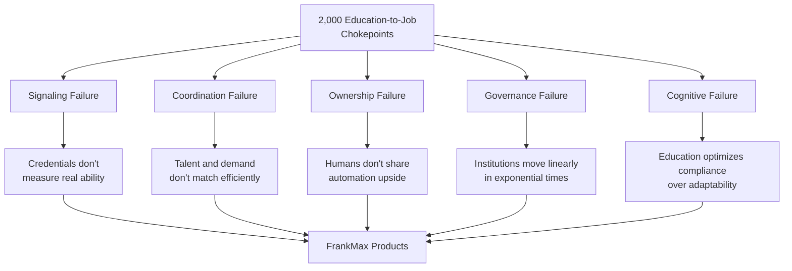

# Education & Workforce Intelligence

The education-to-job pipeline is not one pipeline. It is a 2,000-valve plumbing system designed for an industrial economy. AI cranked the pressure. The valves are failing.

## The Scale of the Problem

| Metric | Value | Source |
|---|---|---|
| Global digital skills shortage cost | **$5.5 trillion** by 2026 | IDC / Workera |
| Workforce needing reskilling by 2030 | **59%** (billions of workers) | WEF Future of Jobs 2025 |
| Jobs displaced by AI by 2030 | **92 million** | WEF / LinkedIn |
| New roles created by 2030 | **170 million** (net +78M) | WEF Future of Jobs 2025 |
| Employers reporting hiring difficulty | **72%** globally | ManpowerGroup 2026 |
| Drop in entry-level tech postings | **73%** | Stanford Digital Economy Lab |
| Core skills expected to change by 2030 | **39%** | WEF Future of Jobs 2025 |
| AI pilot failure rate | **95%+** | Gartner / industry surveys |
| Workers trained in AI despite adoption | **35%** | IBM |

## Five Macro Failures

After cataloging 2,000 chokepoints, they cluster into five systemic failures:

1. **Signaling Failure** -- We don't measure real ability dynamically. Degrees are social API keys, not competency proof.
2. **Coordination Failure** -- Talent and demand don't match efficiently. A genius in rural India and a project in Ohio don't share a skill graph.
3. **Ownership Failure** -- Humans don't share automation upside. AI multiplies productivity but ownership captures the delta.
4. **Governance Failure** -- Institutions move linearly in exponential times. Curriculum updates take years; AI advances in months.
5. **Cognitive Failure** -- Education optimizes compliance over adaptability. 1,180+ cognitive overload points compound the navigation burden.

See [Macro Failures](./macro-failures) for the full breakdown with product mappings.

## Chokepoint Categories (2,000 Total)

| Range | Category | Count |
|---|---|---|
| 1--100 | Educational system deficiencies, skills gaps, AI-specific challenges, workforce transition, economic/policy barriers, societal factors, infrastructure, employment practices, global disparities, future risks | 100 |
| 101--200 | Skills obsolescence, reskilling bottlenecks, infrastructure scaling, adaptive capacity gaps, entry-level collapse, polarization, policy inertia, sector disruptions, organizational resistance, systemic risks | 100 |
| 201--300 | Energy/power bottlenecks, compute/hardware supply chains, agentic AI barriers, reskilling scale gaps, displacement acceleration, governance standards, sector vulnerabilities, equity amplifiers, long-term tensions | 100 |
| 301--500 | Power as binding constraint, depreciation/ROI crises, data quality barriers, perception mismatches, reskilling ROI deficits, market displacement, governance fragmentation, sector exposure, polarization strain, existential friction | 200 |
| 501--700 | Grid escalation, hardware strain, data curation endurance, cultural readiness gaps, reskilling systemic shortfalls, early-career squeeze, agentic ceilings, sector deepening, equity pressure, systemic tensions | 200 |
| 701--1000 | Power as commercial ceiling, economic model strain, data as persistent barrier, overconfidence gaps, reskilling urgency amid $5.5T risk, structural entry-level erosion, agentic fragmentation, occupation displacement, societal pressure, existential tensions | 300 |
| ChatGPT series | Structural friction, psychological barriers, governance design flaws, power geometry, incentive design, information topology | 1,000 |

## How This Maps to FrankMax

The education-to-job pipeline is the largest inefficiency cluster on Earth. FrankMax attacks it from three angles:

### LevelUpMax Bootcamp (Direct Attack)

LevelUpMax is a 10-track certification system that produces AI-native operators -- not AI enthusiasts. It directly addresses:

- **Signaling Failure**: Performance-based assessment replaces credential gatekeeping
- **Coordination Failure**: Graduates enter the FrankMax operator network with verified, dynamic skill profiles
- **Cognitive Failure**: Curriculum built around judgment, orchestration, and workflow redesign -- not rote AI tool usage

See the [LevelUpMax tracks](/operations/levelupmax/track-1) for curriculum details.

### Workforce Intelligence Products (Indirect Attack)

The chokepoint catalog fuels product discovery across the marketplace:

| Product | Chokepoints Addressed | Revenue Model |
|---|---|---|
| AI Cost Optimization Engine | Reskilling ROI uncertainty, budget constraints | SaaS ($2K--$10K/month) |
| Multi-Model AI Orchestrator | Provider lock-in, closed ecosystems | Platform fee |
| PIAR (Pre-Incident Accountability Review) | Governance voids, AI pilot failures | Engagement ($15K--$75K) |
| Operator Certification System | Credential inflation, skill verification | Certification fee ($900--$3,000) |
| Enterprise Memory Graph | Knowledge hoarding, data silos | SaaS subscription |

### Three Future Workforce Tracks (Strategic Positioning)

The workforce splits into three tracks. FrankMax serves all three:

1. **Elite curation** -- High-touch, credential-heavy, small networks
2. **AI-augmented solopreneurs** -- Self-directed with AI tools
3. **Platform-governed gig intelligence** -- Algorithmically matched, performance-scored

See [Three Tracks](./three-tracks) for market sizing and product mapping.

## Sub-Pages

| Page | Description |
|---|---|
| [Market Data](./market-data) | Full statistical breakdown: $5.5T gap, displacement numbers, regional data |
| [Macro Failures](./macro-failures) | Five systemic failure categories with product-to-revenue mapping |
| [Three Tracks](./three-tracks) | Future workforce architecture and FrankMax positioning per track |
