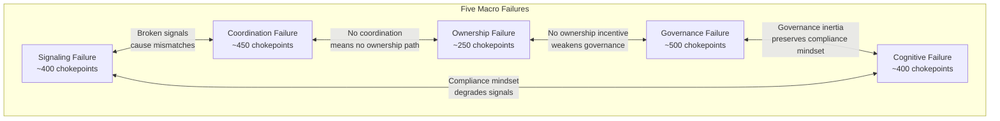

# Five Macro Failures

2,000 chokepoints. Five root causes.

After cataloging every friction point in the education-to-job pipeline -- from outdated curricula to power grid queues blocking AI training compute -- a pattern emerges. The chokepoints are not random. They cluster into five systemic failures that compound each other. Fix any one in isolation and the others absorb the gains.

---

## 1. Signaling Failure

**Core problem:** We don't measure real ability dynamically.

A degree is a social API key. It signals "this human passed the filter" -- not "this human can create value." In an AI-native world where skill half-lives compress to under 3 years, static credentials are structurally broken.

### Chokepoints in This Category

| # | Chokepoint | Impact |
|---|---|---|
| 1 | Degree as default signal of competence | Devalues practical experience |
| 10 | Overreliance on credentials over demonstrated competency | 55.9% of graduates underemployed in non-degree roles |
| 18 | Resume-based hiring over proof-of-work hiring | Blocks unconventional talent |
| 20 | HR keyword filtering algorithms | Excludes capable candidates who lack buzzwords |
| 72 | No continuous competency validation | Skill decay invisible until failure |
| 87 | 73% drop in entry-level tech postings | Apprenticeship-based learning model collapses |
| 109 | Erosion of traditional ROI on degrees | 51% of Gen Z sees degree value declining |
| 132 | Rapid depreciation of technical skills | 39% of core skills change by 2030 |

### What Breaks Without Fixing This

- Employers can't identify capable workers, default to brand-name degree filtering
- Workers invest $100K+ in credentials that depreciate faster than student loans
- AI-savvy youth without pedigree degrees get locked out by HR algorithms
- The $5.5T skills gap widens because capable humans can't prove capability

### FrankMax Products That Attack This

| Product | How It Attacks Signaling Failure | Revenue |
|---|---|---|
| **LevelUpMax Operator Certification** | Performance-based assessment replaces credential gatekeeping. Capstone projects demonstrate real output, not test scores. | $900--$3,000/cert |
| **Operator Certification System** | Dynamic, verifiable skill profiles updated on each track completion. Continuous competency validation. | Platform subscription |
| **Enterprise Memory Graph** | Captures institutional knowledge so capability is documented, not locked in individual heads or degree assumptions. | SaaS ($5K--$50K/month) |

---

## 2. Coordination Failure

**Core problem:** Talent and demand don't match efficiently.

A systems thinker in Vietnam, a retired aerospace engineer in Ohio, and a disciplined operator in Lagos -- they don't know each other. They don't share a skill graph. They don't operate in a synchronized AI layer. The planet runs 8 billion humans as a distributed supercomputer without a unified operating system.

### Chokepoints in This Category

| # | Chokepoint | Impact |
|---|---|---|
| 3 | Lack of integration between K-12 and higher education | Disjointed skill pathways |
| 11-14 | Skills shortages in management, teaching, nursing, engineering | Projected 600K+ shortfall in education alone |
| 42 | Long school-to-work transition (avg 12.41 months) | Psychological strain, lost productivity |
| 43 | Informal employment traps for low-educated youth | Blocks formal career access |
| 44 | Teens unaware of career options in AI-driven markets | Exposure gap at critical decision point |
| 59 | Affordable housing shortages restricting labor mobility to AI hubs | Geographic lock-in |
| 100 | Talent trapped in low-signal geographies | Over-centralization of opportunity |
| 143 | 59% of workforce needs reskilling, fragmented ecosystem | Online vs. employer vs. public programs don't integrate |

### What Breaks Without Fixing This

- $5.5T in unrealized productivity because supply and demand operate in separate information systems
- 92M displaced workers with no visibility into 170M new roles being created
- Regional concentration of AI talent in US/Europe while emerging economies face lower skill demand
- Brain drain from fragile economies with no redeployment mechanism

### FrankMax Products That Attack This

| Product | How It Attacks Coordination Failure | Revenue |
|---|---|---|
| **Multi-Model AI Orchestrator** | Provider-agnostic architecture gives organizations access to best-fit AI regardless of vendor lock-in, reducing coordination friction. | Platform fee |
| **LevelUpMax Network** | Graduates enter a verified operator network matched to organizational demand. Not a job board -- a coordination layer. | Network effects drive licensing |
| **AI Cost Optimization Engine** | Reduces the financial barrier to AI adoption so more organizations can participate in the coordination layer. | SaaS ($2K--$10K/month) |

---

## 3. Ownership Failure

**Core problem:** Humans don't share automation upside.

AI multiplies productivity, but ownership captures the delta. When a company replaces 1,000 junior analysts with 50 AI cores supervised by 20 operators, the productivity gain flows to capital, not labor. Without ownership participation in AI gains, the reskilling incentive structure collapses -- why retrain if the upside accrues to shareholders?

### Chokepoints in This Category

| # | Chokepoint | Impact |
|---|---|---|
| 32 | Job displacement in high-exposure occupations with low AI complementarity | Middle-skilled workers squeezed |
| 54 | Job polarization: high/low-skill gains, middle class shrinks | Second Gilded Age dynamics without intervention |
| 55 | Income inequality from AI displacing middle-skilled roles | Wage growth decoupled from productivity |
| 56 | Limited access to finance for firms to deploy new AI skills | Small businesses locked out |
| 90 | High training costs for juniors, favoring AI-augmented seniors | Entry-level investment stops |
| 274 | Wage premiums (23--56%) for AI skills widening inequality | Without broad access, premiums entrench divides |
| 334 | No labor-to-equity conversion mechanisms | Workers can't convert productivity into ownership |

### What Breaks Without Fixing This

- Reskilling becomes irrational for individuals if gains flow only to employers
- Middle class compresses into gig precarity
- Social contract linking education to stable careers erodes
- Political instability from widening inequality

### FrankMax Products That Attack This

| Product | How It Attacks Ownership Failure | Revenue |
|---|---|---|
| **LevelUpMax Track 5: Venture Production Operator** | 90-day track teaching operators to build, not just execute. Converts human capital into entrepreneurial capacity. | $2,500--$5,000/enrollment |
| **Corporate LevelUpMax Licensing** | Organizations pay for workforce transformation; employees gain portable, ownership-grade skills. | $50K--$500K/year |
| **UniVenture Entity** | Venture cell infrastructure enabling micro-equity models where operators share in output. | Equity participation |

---

## 4. Governance Failure

**Core problem:** Institutions move linearly in exponential times.

Curriculum updates take years. AI advances in months. 66% of job postings still require degrees while only 31% of the workforce holds them. Labor policies are designed for a pre-AI world. 95% of AI pilots fail because governance -- change management, workflow redesign, risk controls -- is absent.

### Chokepoints in This Category

| # | Chokepoint | Impact |
|---|---|---|
| 1-9 | Outdated curricula, overemphasis on rote learning, insufficient lifelong learning | Graduates unprepared for modern roles |
| 58 | Inadequate active labor market policies for AI-disrupted workers | No safety net for transitions |
| 161-170 | Workforce strategies designed for pre-AI world, rigid degree requirements, policy inertia | Slow K-12/higher ed alignment |
| 198 | 66% of postings require degrees; only 31% of workforce has them | Structural mismatch |
| 220 | 70% of AI implementation challenges are people/process-related | Governance void, not tech failure |
| 280 | 40%+ agentic projects canceled by 2027 due to governance failures | Gartner forecast |
| 400+ | Data quality as #1 barrier (52% of organizations) | No standardized curation protocols |
| 444 | Competing agent protocols (MCP, A2A) creating lock-in chokepoints | Standards fragmentation |

### What Breaks Without Fixing This

- 95% AI pilot failure rate continues because governance is treated as afterthought
- Entry-level hiring continues to collapse without policy intervention
- Regulatory fragmentation blocks global AI tool deployment in education
- Agentic AI adoption stalls without workflow redesign governance

### FrankMax Products That Attack This

| Product | How It Attacks Governance Failure | Revenue |
|---|---|---|
| **PIAR** | Pre-Incident Accountability Review -- governance before deployment, not after failure. | $15K--$75K/engagement |
| **ORF Protocol** | Obligation & Responsibility Finality -- makes governance machine-executable. | Protocol licensing |
| **ETLB Protocol** | Execution-Time Liability Binding -- assigns liability at runtime, not in retrospective audits. | Protocol licensing |
| **AI Audit & Verification Infrastructure** | Continuous governance verification, not periodic compliance theater. | SaaS subscription |
| **Governed AI Execution Engine** | Embeds governance into AI execution, not bolted on afterward. | Platform fee |

---

## 5. Cognitive Failure

**Core problem:** Education optimizes compliance over adaptability.

Standardized testing pressures prioritize test scores over collaboration and creativity. Students learn to pass filters, not to think. In an AI-native world where routine cognitive tasks are automated, the humans who were trained to perform routine cognitive tasks are the first displaced. 1,180+ cognitive overload points (doc 41) compound the problem -- career navigation itself has become cognitively overwhelming.

### Chokepoints in This Category

| # | Chokepoint | Impact |
|---|---|---|
| 7 | Standardized testing prioritizing scores over soft skills | Creativity and collaboration suppressed |
| 10 | Overreliance on credentials over competencies | Practical experience devalued |
| 26 | Soft skills erosion from remote learning and AI automation | Communication and teamwork atrophy |
| 33 | Critical thinking gaps exposed by AI | AI handles routine but requires human oversight |
| 39 | Overemphasis on AI tools without building human judgment | Supervision and strategy skills missing |
| 112 | Shift from memory-based to judgment-focused education, but systems lag | Structural redesign not happening |
| 172 | Overemphasis on technical upskilling, neglecting human-centric traits | AI can't replicate empathy and creativity |
| 411+ | Workers underestimating personal AI disruption | Proactive upskilling delayed |
| 537 | Entry-level overconfidence in soft skills despite AI augmentation | False sense of security |

### What Breaks Without Fixing This

- Workers trained for compliance get displaced by AI performing compliance tasks
- Career navigation becomes impossible amid 1,180+ cognitive overload points
- The "always-on learning" ecosystem fails because urgency perception is low
- Human traits AI cannot replicate (judgment, empathy, creativity) go undertrained

### FrankMax Products That Attack This

| Product | How It Attacks Cognitive Failure | Revenue |
|---|---|---|
| **LevelUpMax Track 1** | Teaches workflow deconstruction and AI-native process redesign -- judgment, not compliance. | $900--$1,500/enrollment |
| **LevelUpMax Track 2: Governance & Risk** | Trains operators to think in governance structures, not checkbox compliance. | $900--$1,500/enrollment |
| **Chokepoint Intelligence Engine** | Reduces cognitive load by surfacing the specific chokepoints relevant to an organization's context. | SaaS subscription |
| **Board Decision Intelligence** | Converts information overload into structured decision frameworks for leadership. | SaaS ($10K--$50K/month) |

---

## Macro Failure to Revenue Mapping

| Failure | Primary Products | Total Addressable Revenue |
|---|---|---|
| **Signaling** | LevelUpMax Certification, Operator Certification System, Enterprise Memory Graph | $50M--$200M (global workforce credentialing) |
| **Coordination** | Multi-Model Orchestrator, LevelUpMax Network, AI Cost Optimization | $100M--$500M (matching efficiency gains) |
| **Ownership** | Venture Production Track, Corporate Licensing, UniVenture | $20M--$100M (ownership infrastructure) |
| **Governance** | PIAR, ORF/ETLB Protocols, AI Audit Infrastructure, Governed Execution Engine | $200M--$1B (governance is the "Fries") |
| **Cognitive** | LevelUpMax Tracks 1--10, Chokepoint Intelligence, Board Decision Intelligence | $100M--$400M (human capital development) |

Governance is the largest revenue opportunity because it is the "Fries" in the Burger/Fries/Kitchen model -- high margin (70--95%), high attachment rate, and the reason enterprises pay. The "Burger" (cheap AI access) gets them in the door. The governance layer is where the money compounds.
