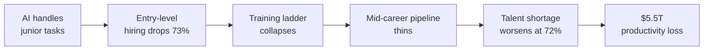

# Market Data -- The $5.5T Skills Shortage

Every number on this page comes from the source documents (doc 43: 2,000 education-to-job chokepoints). No projections have been softened. No ranges have been widened. This is the raw signal.

## Headline Numbers

| Metric | Value | Source | Date |
|---|---|---|---|
| Global digital skills shortage cost | **$5.5 trillion** | IDC via Workera | 2026 projection |
| Workforce needing reskilling by 2030 | **59%** | WEF Future of Jobs 2025 | 2025 |
| Jobs displaced by AI by 2030 | **92 million** | WEF / LinkedIn | 2025 |
| New roles created by 2030 | **170 million** | WEF Future of Jobs 2025 | 2025 |
| Net job change by 2030 | **+78 million** (but transitions are brutal) | WEF | 2025 |
| Structural labor market change by 2030 | **22%** of roles | WEF | 2025 |
| Core skills expected to change by 2030 | **39%** | WEF | 2025 |

## Hiring Difficulty

| Metric | Value | Source |
|---|---|---|
| Employers reporting hiring difficulty globally | **72%** | ManpowerGroup 2026 Talent Shortage Survey |
| Hardest-to-find skills (2026) | AI model/application development, AI literacy | ManpowerGroup 2026 |
| Employers prioritizing critical thinking | **94%** | U.S. Chamber of Commerce |
| Employers deeming financial literacy essential | **96%** | U.S. Chamber of Commerce |
| AI skills demand surpassing | Engineering and IT (first time) | ManpowerGroup 2026 |

## Entry-Level Collapse

This is the structural break that matters most for FrankMax's LevelUpMax positioning.

| Metric | Value | Source |
|---|---|---|
| Drop in entry-level tech postings | **73%** | Stanford Digital Economy Lab |
| Employers hesitant to hire recent grads | **89%** | Industry surveys |
| Employers preferring AI over new grads | **37%** (cost and efficiency) | Industry surveys |
| Relative employment decline, ages 22--25, AI-exposed fields (since late 2022) | **11--16%** | Stanford "Canaries" / Revelio Labs |
| Class of 2026 hiring increase vs. 2025 | **~1.6%** (effectively flat) | NACE |
| Entry-level white-collar roles potentially disrupted (next 5 years) | **up to 50%** | Industry leaders |
| Employers attributing entry-level decline to AI | **46%** | Cengage Group |

## AI Adoption & Readiness

| Metric | Value | Source |
|---|---|---|
| Workers trained in AI despite widespread adoption | **35%** | IBM |
| Talent gap projected by 2026 | **50%** | IBM |
| AI pilot failure rate | **95%+** | Industry surveys |
| AI implementation failures that are people/process-related | **70%** | Gartner |
| Agentic AI projects facing cancellation by 2027 | **40%+** | Gartner |
| Data quality/availability as #1 AI barrier | **52%+** of organizations | 2026 surveys |
| Leaders citing data privacy as AI barrier | **43%** | Workera |
| Leaders citing poor data quality as AI barrier | **40%** | Workera |
| Leaders preparing workforce for AI | **35%** | Workera |
| Workers expected to learn AI independently | **42%** | WEF |

## Displacement by Sector

The following sectors face the highest task-level AI exposure as of March 2026:

| Sector | Exposure Level | Key Roles Affected |
|---|---|---|
| Clerical / Administrative | Highest (up to 96% task exposure) | Secretarial, data entry, scheduling |
| Media / Communications | Very high | Journalists, editors, PR specialists |
| Customer Service / Sales | Very high | Representatives, support agents |
| Finance / Legal | High | Research analysts, paralegals, junior associates |
| Creative-Adjacent | High | Writers, graphic designers, content creators |
| Teaching / Education | Medium-high | Tutoring, personalization, assessment |
| Healthcare Admin | Medium-high | Billing, coding, scheduling (not direct care) |
| Manufacturing | Medium | Quality inspection, logistics optimization |
| Translation / Interpretation | Highest AI applicability | All levels |

## Skills Under Pressure

| Skill Category | Status | Implication |
|---|---|---|
| Routine coding | **Automated** | Entry coders displaced; AI supervision needed |
| Data analysis (mid-level) | **Rapidly automating** | Synthesis and reporting handled by AI |
| Report drafting / basic research | **Eroding** | Previously used for on-the-job learning |
| Prompt engineering | **Evolving** into AI orchestration | Not yet taught systematically |
| AI ethics / bias auditing | **Critical shortage** | Non-tech sectors unprepared |
| Human judgment / oversight | **Rising demand** | The skill AI cannot replace |
| Emotional intelligence / resilience | **Underinvested** | WEF identifies as key durable skill |

## Workforce Demographics Under Strain

| Demographic | Risk Factor | Data Point |
|---|---|---|
| Women | 3x more likely to be NEET; concentrated in clerical/exposed roles | ILO / IMF |
| Ages 22--25 | 13--16% employment drops in AI-exposed roles | Stanford |
| "Some college, no degree" | Persistent reskilling equity barriers | Multiple |
| Older workers in exposed roles | Longer transition periods, limited savings | IMF |
| Workers in midsized/university towns | Few local reemployment alternatives | Stanford |
| Emerging economy workers | Lower new-skill demand (half that of advanced economies) | IMF |

## Infrastructure Constraints Limiting Skills Access

| Constraint | Impact | Data Point |
|---|---|---|
| Power/grid queues | 5--10+ years in major AI hubs (PJM/Northern Virginia) | Morgan Stanley / IEA |
| US data center power shortfall | ~49 GW by 2028 | Morgan Stanley / Bloom Energy |
| AI power demand growth | **175%** increase projected by 2030 from 2023 levels | IEA |
| Annual AI-driven power surge | ~126 GW annually through 2028 | Morgan Stanley |
| Hardware depreciation cycle | Value halving in 18--24 months (vs. 5-year historical) | Industry data |
| Hyperscaler energy financing gap | **$1T+** needed 2025--2026 | Industry estimates |

These infrastructure constraints matter because they directly limit who gets access to AI training compute, AI-powered learning platforms, and the tools needed for workforce reskilling at scale. Regions without reliable power and compute access are structurally excluded from the AI-native workforce.

## What This Means for FrankMax

The $5.5T gap is not abstract. It decomposes into measurable product opportunities:

| Gap | FrankMax Product | Revenue Logic |
|---|---|---|
| 72% hiring difficulty + credential failure | LevelUpMax Operator Certification | $900--$3,000 per certification |
| 95% AI pilot failure rate | PIAR (Pre-Incident Accountability Review) | $15K--$75K per engagement |
| 52% data quality barrier | Enterprise Memory Graph | SaaS subscription |
| Entry-level collapse | Track 1: AI-Native Operator Foundation | Bootcamp revenue + employer licensing |
| AI literacy gap (35% trained) | Corporate LevelUpMax Licensing | $50K--$500K annual contracts |
| Provider lock-in risk | Multi-Model AI Orchestrator | Platform fee |

Every row in this table is a direct line from documented market failure to monetizable product.
