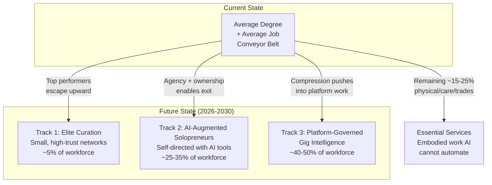
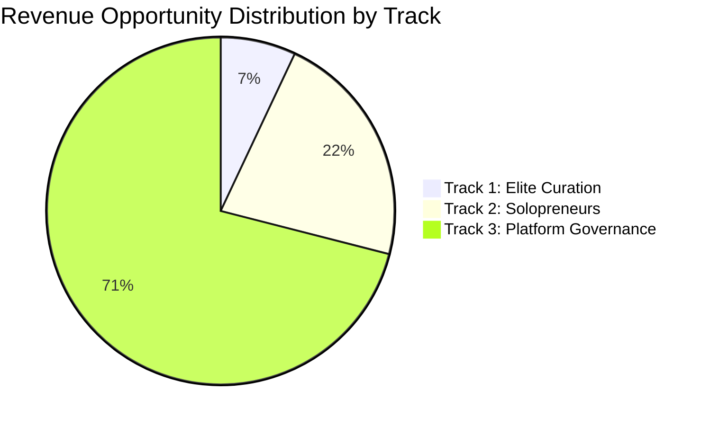

# Three Future Workforce Tracks

The middle -- the average degree plus average job conveyor belt -- gets compressed.

This is not speculation. It is an observable incentive gradient. When AI reduces the marginal cost of intelligence, institutions that charge for slow certification feel pressure. Systems follow incentive gradients like water follows gravity.

The future workforce splits into three distinct tracks. The education-to-job pipeline does not reform. It fractures.

---

## Track 1: Elite Human Capital Curation

**Who:** Top 5% of the workforce. High-agency operators, domain experts, strategic thinkers.

**How it works:** Small, high-trust networks where reputation is verified through output, not credentials. Think GitHub for everything -- proof instead of paper. Access is earned through demonstrated capability, not purchased through tuition.

**Key characteristics:**

| Attribute | Detail |
|---|---|
| Network size | Small (50--500 per cluster) |
| Entry mechanism | Performance-verified, peer-validated |
| Credential type | Dynamic skill ledger, contribution history |
| Compensation | Premium (23--56% AI skill wage premiums) |
| Relationship to AI | AI as force multiplier; human judgment is the scarce asset |
| Trust model | Network-validated reputation, cryptographic proof-of-work |

**Market signals validating this track:**

- 94% of employers prioritize critical thinking (U.S. Chamber) but can't find it through degree filtering
- Distributed operator networks: 10 people with the right AI stack outproduce 200-person legacy firms
- Indie game studios, solo creators, AI-native consultancies already demonstrate this model
- ManpowerGroup 2026: AI skills surpass engineering/IT as hardest to find -- scarcity commands premiums

**Market sizing:**

| Metric | Estimate |
|---|---|
| Global addressable population | ~200M high-agency professionals |
| Top 5% capture (elite curation tier) | ~10M workers |
| Average annual value per worker | $150K--$500K |
| Platform/certification revenue opportunity | $5B--$15B globally |

### How FrankMax Serves Track 1

| Product | Function |
|---|---|
| **LevelUpMax Tracks 5 & 8** | Venture Production Operator (90 days) and AI Engineering & Systems Architect (90 days) produce elite-tier operators |
| **Operator Certification System** | Verifiable, dynamic skill profiles that replace static credentials |
| **Corporate LevelUpMax Licensing** | Enterprise access to the elite operator pipeline ($50K--$500K/year) |
| **PIAR** | High-trust engagements ($15K--$75K) position FrankMax as the governance layer for elite networks |

---

## Track 2: AI-Augmented Solopreneurs

**Who:** 25--35% of the workforce. Self-directed professionals who leverage AI as a productivity multiplier. Not employees. Not founders of venture-scale companies. Operators who own their output.

**How it works:** One person with Claude, GPT, open-source models, and domain expertise produces output previously requiring a team of 5--10. The educational system is not training these people. FrankMax is.

**Key characteristics:**

| Attribute | Detail |
|---|---|
| Team size | 1--5 people |
| Revenue model | Service revenue, micro-SaaS, consulting |
| Credential type | Portfolio of output, client results |
| Compensation | Variable ($50K--$300K depending on leverage) |
| Relationship to AI | AI as universal intern -- handles tasks, human directs strategy |
| Capital requirement | Low ($0--$10K to start) |

**Market signals validating this track:**

- AI reduces the marginal cost of intelligence -- intelligence stops being scarce
- Solo creators and AI-native consultancies already outperform mid-size firms on output-per-person
- 42% of workers expected to learn AI independently (WEF) -- these are solopreneurs in training
- Collapse of entry-level jobs forces self-directed career paths
- GitHub, Substack, Shopify demonstrated the solopreneur infrastructure layer; AI extends it to knowledge work

**Market sizing:**

| Metric | Estimate |
|---|---|
| Global addressable population | ~500M self-directed professionals + aspiring solopreneurs |
| 25--35% capture (solopreneur tier) | ~125M--175M workers |
| Average annual productivity | $50K--$300K |
| Tools/training/certification revenue opportunity | $20B--$50B globally |

### How FrankMax Serves Track 2

| Product | Function |
|---|---|
| **LevelUpMax Track 1** | AI-Native Operator Foundation: teaches workflow deconstruction, AI capability mapping, process redesign ($900--$1,500) |
| **LevelUpMax Track 5** | Venture Production Operator: 90-day track converting operators into builders ($2,500--$5,000) |
| **AI Cost Optimization Engine** | Reduces the cost of AI tooling so solopreneurs can compete at enterprise scale |
| **Multi-Model AI Orchestrator** | Provider-agnostic access to Claude/GPT/Gemini/open-source without lock-in |
| **Chokepoint Intelligence Engine** | Surfaces market opportunities from the 2,000 chokepoints catalog -- product discovery fuel for solopreneurs |

---

## Track 3: Platform-Governed Gig Intelligence

**Who:** 40--50% of the workforce. Workers matched algorithmically to tasks via platforms. Performance-scored continuously. Not building leverage -- renting it.

**How it works:** A few AI-native corporations own the coordination infrastructure. Individuals plug in as high-skill nodes with limited bargaining power. Efficient but politically volatile. The platform decides who works, at what rate, on what tasks.

**Key characteristics:**

| Attribute | Detail |
|---|---|
| Matching mechanism | Algorithmic, performance-scored |
| Credential type | Platform reputation score, task completion metrics |
| Compensation | Commodity pricing ($15--$80/hour depending on domain) |
| Relationship to AI | AI performs most tasks; human handles edge cases, oversight, context |
| Bargaining power | Low -- platform sets terms |
| Value capture | Mostly flows to platform owners |

**Market signals validating this track:**

- 37% of employers already prefer AI over new grads for cost/efficiency
- Gig economy infrastructure (Uber, Upwork, Fiverr) already governs 150M+ workers globally
- AI augments the platform's matching capability, compresses human role to oversight and edge cases
- 50% of entry-level white-collar roles potentially disrupted in next 5 years -- these workers need somewhere to go
- Platform feudalism: efficient, scalable, but concentrates ownership

**Market sizing:**

| Metric | Estimate |
|---|---|
| Global addressable population | ~1.5B service/knowledge workers in emerging/middle economies |
| 40--50% gig intelligence tier | ~600M--750M workers |
| Average annual platform throughput | $10K--$50K per worker |
| Platform governance/compliance revenue opportunity | $50B--$200B globally |

### How FrankMax Serves Track 3

| Product | Function |
|---|---|
| **LevelUpMax Track 1** | Minimum viable operator certification -- proves baseline AI-native competency for platform matching |
| **Governed AI Execution Engine** | The governance layer platforms need to manage liability, compliance, and quality across distributed workers |
| **ORF / ETLB Protocols** | Machine-executable obligation and liability frameworks for platform-governed work |
| **MCO Protocol** | Mortality Compliance Object -- ensures human accountability in agentic workflows |
| **AI Audit & Verification Infrastructure** | Continuous compliance verification across platform workforces |

---

## Cross-Track Revenue Summary

| Track | FrankMax Role | Primary Revenue Streams | Estimated Revenue Opportunity |
|---|---|---|---|
| **Elite Curation** | Certification + governance provider | LevelUpMax advanced tracks, PIAR, Corporate Licensing | $500M--$2B |
| **AI-Augmented Solopreneurs** | Tools + training provider | LevelUpMax foundation, AI Cost Optimization, Orchestrator | $1B--$5B |
| **Platform-Governed Gig Intelligence** | Governance infrastructure | Protocols (ORF/ETLB/MCO), Governed Execution Engine, Audit | $5B--$20B |

The largest revenue opportunity is in Track 3 -- not because FrankMax builds the platforms, but because every platform needs a governance layer. Governance is the "Fries." The platforms are someone else's "Burger." FrankMax sells the compliance, audit, and liability infrastructure that makes platform-governed work legally and operationally viable.

---

## Strategic Positioning

The three tracks are not competing futures. They are co-existing tiers of a stratified workforce. FrankMax does not need to pick one:

| Layer | What FrankMax Sells | Margin Profile |
|---|---|---|
| **Across all tracks** | LevelUpMax certification (entry point) | Medium (40--60%) |
| **Track 1 specific** | Elite operator placement + governance consulting | High (60--80%) |
| **Track 2 specific** | AI tools at 80% discount + training | Low margin "Burger" (10--20%) driving attachment |
| **Track 3 specific** | Protocol licensing + governance infrastructure | Highest margin "Fries" (70--95%) |

The middle conveyor belt is compressing. FrankMax does not lament it. FrankMax sells the infrastructure for what replaces it.

### The Coordination Layer Question

The deepest strategic question from doc 43:

> "Who controls the coordination layer of human + AI labor? That's where the leverage hides."

FrankMax's answer: own the governance and compliance infrastructure that every coordination layer requires. Whether Track 1 networks, Track 2 solopreneurs, or Track 3 platforms win -- they all need auditable, governed, liability-bound AI execution.

That is the Kitchen. It compounds daily. And it is what makes the marketplace inevitable.
