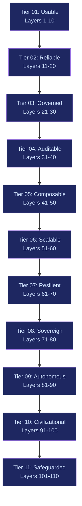

# 110-Layer Enhancement Layer Taxonomy

The Enhancement Layer is the execution physiology between a stochastic text generator and the real world. The model predicts tokens. The Enhancement Layer governs consequences.

This is not middleware. It is a policy-enforcing, auditable, adaptive control plane that turns language models into governed economic actors.

---

## Core Principle

> **Capability must grow slower than constraint.**
>
> Otherwise the organism destabilizes its environment.

Every layer added increases both power and fragility. The taxonomy below sequences 110 layers across 11 tiers so that control infrastructure is always built before the capability it governs.

---

## Architecture

```
  ANY MODEL (the brain)
  Claude / GPT / Gemini / Llama / Mistral / Local
                    |
                    v
  ┌─────────────────────────────────────┐
  │      ENHANCEMENT LAYER (the body)   │
  │                                     │
  │   110 layers across 11 tiers        │
  │   organized by 10 superclasses      │
  │                                     │
  │   Constraint always leads           │
  │   capability by at least 1 tier     │
  └─────────────────────────────────────┘
                    |
                    v
  PRODUCTION-QUALITY, GOVERNED OUTPUT
  (regardless of which brain was used)
```

---

## 10 Superclasses

Every layer belongs to one of 10 structural superclasses. These are not feature buckets. They are control primitives.

| # | Superclass | Function | Tiers Where Dominant |
|---|---|---|---|
| 1 | **Quality** | Increase signal density and reasoning depth | Tiers 01-02 |
| 2 | **Determinism** | Reduce variance, enforce structural correctness | Tiers 01-03 |
| 3 | **Abstraction** | Normalize heterogeneity across models and vendors | Tiers 02-04 |
| 4 | **Governance** | Enforce enterprise rules, compliance, and policy | Tiers 03-06 |
| 5 | **Economics** | Prevent runaway compute, optimize cost-performance | Tiers 04-07 |
| 6 | **Observability** | Record cognition, enable audit and traceability | Tiers 02-08 |
| 7 | **Orchestration** | Coordinate multi-step execution and agent workflows | Tiers 05-09 |
| 8 | **Actuation** | Connect cognition to real-world action and systems | Tiers 05-09 |
| 9 | **Adaptation** | Learn, evolve, and improve over time | Tiers 06-10 |
| 10 | **Experience** | Control human engagement, adoption, and interface | Tiers 01-11 |

See [Superclasses](./superclasses) for full definitions and coverage matrix.

---

## 11 Tiers

Each tier contains approximately 10 layers. Tiers progress from basic usability to civilizational safeguarding.



| Tier | Name | Layers | What It Establishes |
|---|---|---|---|
| 01 | [Usable](./tier-01-usable) | 1-10 | Output quality, determinism, abstraction, basic governance, economics, observability, orchestration, actuation, adaptation, experience |
| 02 | [Reliable](./tier-02-reliable) | 11-20 | Identity, provenance, memory, sandboxing, risk scoring, knowledge governance, incentive alignment, resilience, ethics, strategic intelligence |
| 03 | [Governed](./tier-03-governed) | 21-30 | Capability registry, policy versioning, cross-jurisdiction compliance, reputation scoring, cognitive budgeting, collective intelligence, adversarial defense, transparency, organizational alignment, strategic control |
| 04 | [Auditable](./tier-04-auditable) | 31-40 | Sovereignty, data minimization, cognitive rate limiting, behavioral drift detection, competitive intelligence, contractual control, cultural localization, strategic memory compression, autonomous boundary enforcement, strategic evolution |
| 05 | [Composable](./tier-05-composable) | 41-50 | Constitutional limits, authority delegation, multi-stakeholder arbitration, macro-risk forecasting, strategic scarcity allocation, collective accountability, ethical scenario modeling, ecosystem interoperability, long-horizon strategy, existential safeguards |
| 06 | [Scalable](./tier-06-scalable) | 51-60 | Legitimacy, democratic override, knowledge decay monitoring, incentive drift detection, cognitive load balancing, institutional continuity, behavioral transparency, systemic power limitation, evolutionary scenario modeling, civilization interface |
| 07 | [Resilient](./tier-07-resilient) | 61-70 | Adaptive constitutional amendments, institutional memory integrity, strategic de-complexification, autonomy gradients, cross-institution trust, moral pluralism, strategic patience, human skill preservation, emergent behavior monitoring, civilizational alignment |
| 08 | [Sovereign](./tier-08-sovereign) | 71-80 | Generational transition, technological shock absorption, cognitive monopoly detection, incentive capture resistance, institutional exit, cognitive diversity, public signal sensitivity, scarcity ethics, epistemic integrity, meta-civilizational resilience |
| 09 | [Autonomous](./tier-09-autonomous) | 81-90 | Temporal accountability, systemic fragility indexing, strategic humility, institutional plurality preservation, economic externality modeling, strategic dependency awareness, institutional legibility, adaptive moral calibration, catastrophic containment simulation, civilizational redundancy |
| 10 | [Civilizational](./tier-10-civilizational) | 91-100 | Complexity budgeting, strategic minimalism, power diffusion, adversarial coevolution, strategic obsolescence planning, institutional self-doubt, cross-civilizational compatibility, ethical exit authority, distributed failsafe replication, existential modesty |
| 11 | [Safeguarded](./tier-11-safeguarded) | 101-110 | Recursive oversight, epistemic decentralization, psychological impact monitoring, strategic latency governance, narrative influence containment, intergenerational equity, black swan readiness, institutional memory compression guarding, strategic withdrawal, civilizational non-domination |

---

## Mapping to FrankMax Marketplace

The 110-layer taxonomy is not a theoretical exercise. It maps directly to FrankMax's economic model.

| Economic Layer | Enhancement Tiers | Revenue Model |
|---|---|---|
| **Burger** (loss leader, 5-15% margin) | Tiers 01-02: Usable + Reliable | Cheap AI model access at 80% discount |
| **Fries** (profit engine, 60-95% margin) | Tiers 03-06: Governed through Scalable | Governance, compliance, audit, orchestration layers |
| **Kitchen** (moat, compounds daily) | Tiers 07-11: Resilient through Safeguarded | Telemetry, failure library, industry ontology, institutional intelligence |

The Burger gets customers through the door. The Fries generate revenue. The Kitchen creates the moat. Every tier beyond Tier 02 is a monetizable constraint layer that enterprises in regulated sectors cannot operate without.

---

## Design Constraints

1. **No layer may be deployed without every layer below it being operational.** Tier 05 requires Tiers 01-04.
2. **Constraint layers must lead capability layers by at least one tier.** Governance before actuation. Economics before orchestration.
3. **Every layer must be independently auditable.** If a regulator asks what policy version approved an action, the system must produce a precise answer.
4. **Models are replaceable; the Enhancement Layer is not.** The long-term moat is not which brain you use. It is how you discipline the brain.
5. **Below 40% attachment rate on Fries layers, the business model fails.** The Enhancement Layer exists to make attachment mandatory, not optional.
