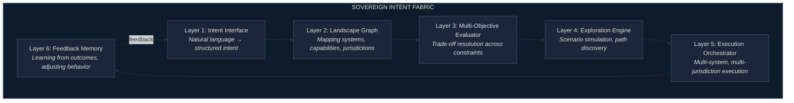
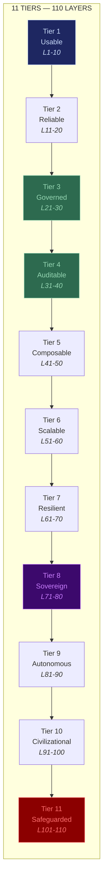

# Platform Architecture

The FrankMax Marketplace operates as a seven-layer stack. Every transaction flows from the storefront down through each layer, accruing margin and telemetry at every step. The architecture is designed so that **Layer 4 (Execution & Governance) is the chokepoint** — every AI action must pass through governance before it executes, and that chokepoint is where the majority of margin is captured.

---

## Marketplace Stack

The marketplace layers from customer-facing storefront down to infrastructure.

```mermaid
graph TB
    subgraph STOREFRONT["CUSTOMER-FACING"]
        S1["MARKETPLACE STOREFRONT<br/><i>AppSumo-style: browse, bundle, buy, deploy</i>"]
        S2["AUDIENCE-SPECIFIC STOREFRONTS<br/><i>15 audiences: Governments, Defense, Infrastructure,<br/>Institutions, Dynasties, Family Offices, Multinationals,<br/>Legacy Enterprise, Banks/Insurers, Healthcare,<br/>Universities, Legal, Accounting, Startups, Consumers</i>"]
    end

    subgraph COMMERCIAL["COMMERCIAL ENGINE"]
        C1["BUNDLE & PRICING ENGINE<br/><i>Dynamic bundling | Usage-based | Tiered | Enterprise agreements</i>"]
        C2["HIGH-MARGIN ATTACHMENT LAYER — THE FRIES<br/><i>Governance | Compliance | Audit | Workflow |<br/>Insurance | Certification | SLA | Data Sovereignty</i>"]
    end

    subgraph EXECUTION["EXECUTION LAYER"]
        E1["MULTI-MODEL ORCHESTRATION LAYER<br/><i>Claude | GPT | Gemini | Llama | Mistral | Custom Fine-Tunes</i>"]
        E2["AI MODEL ACCESS LAYER — THE BURGER<br/><i>80% below retail via routing, caching, batching, fine-tuning, open-source</i>"]
    end

    subgraph INFRA["INFRASTRUCTURE — THE KITCHEN"]
        I1["TELEMETRY & FAILURE LIBRARY<br/><i>Every execution logged | Every failure indexed | Every pattern learned</i>"]
        I2["INDUSTRY ONTOLOGY & AUDIT CHAIN<br/><i>NAICS/SIC mapping | Obligation chains | Immutable audit trail</i>"]
    end

    S1 --> S2
    S2 --> C1
    C1 --> C2
    C2 --> E1
    E1 --> E2
    E2 --> I1
    I1 --> I2

    style S1 fill:#1E2761,stroke:#CADCFC,color:#CADCFC
    style S2 fill:#1E2761,stroke:#CADCFC,color:#CADCFC
    style C1 fill:#1E2761,stroke:#CADCFC,color:#CADCFC
    style C2 fill:#2d6a4f,stroke:#95d5b2,color:#95d5b2
    style E1 fill:#1E2761,stroke:#CADCFC,color:#CADCFC
    style E2 fill:#7f4f24,stroke:#ddb892,color:#ddb892
    style I1 fill:#3c096c,stroke:#c77dff,color:#c77dff
    style I2 fill:#3c096c,stroke:#c77dff,color:#c77dff
```

---

## 7-Layer Core Systems Architecture

Beneath the marketplace stack, 42 core systems are organized into 7 layers. These systems power every offering in the catalog. Layer 4 is the chokepoint — all AI execution flows through governance before reaching the customer.

```mermaid
graph TB
    subgraph L7["LAYER 7: SIMULATION & DIGITAL TWIN — 4 systems"]
        L7A["Scenario Simulator"]
        L7B["Digital Twin Engine"]
        L7C["What-If Modeler"]
        L7D["Outcome Predictor"]
    end

    subgraph L6["LAYER 6: TRUST & CERTIFICATION — 4 systems"]
        L6A["Operator Certification"]
        L6B["Model Trust Scorer"]
        L6C["Vendor Risk Assessor"]
        L6D["Compliance Attestation"]
    end

    subgraph L5["LAYER 5: ECONOMIC & TRANSACTION — 5 systems"]
        L5A["Billing Engine"]
        L5B["Usage Metering"]
        L5C["Bundle Pricer"]
        L5D["Revenue Attribution"]
        L5E["Cost Optimizer"]
    end

    subgraph L4["LAYER 4: EXECUTION & GOVERNANCE — 7 systems *** THE CHOKEPOINT ***"]
        L4A["ORF Protocol Engine"]
        L4B["ETLB Liability Binder"]
        L4C["MCO Compliance Runtime"]
        L4D["Audit Trail Generator"]
        L4E["Policy Enforcement Point"]
        L4F["Approval Workflow Engine"]
        L4G["Kill Switch Controller"]
    end

    subgraph L3["LAYER 3: MEMORY & DATA CONTROL — 4 systems"]
        L3A["Knowledge Graph"]
        L3B["Semantic Cache"]
        L3C["Data Sovereignty Vault"]
        L3D["Failure Library"]
    end

    subgraph L2["LAYER 2: COGNITION & AGENT — 5 systems"]
        L2A["Multi-Model Router"]
        L2B["Agent Orchestrator"]
        L2C["Prompt Compiler"]
        L2D["Fine-Tune Manager"]
        L2E["Context Window Optimizer"]
    end

    subgraph L1["LAYER 1: COMPUTE & INFRASTRUCTURE — 4 systems"]
        L1A["API Gateway"]
        L1B["Compute Scheduler"]
        L1C["Telemetry Collector"]
        L1D["Model Registry"]
    end

    L7 --> L6
    L6 --> L5
    L5 --> L4
    L4 --> L3
    L3 --> L2
    L2 --> L1

    style L4 fill:#8b0000,stroke:#ff6b6b,color:#ff6b6b
    style L7 fill:#1E2761,stroke:#CADCFC,color:#CADCFC
    style L6 fill:#1E2761,stroke:#CADCFC,color:#CADCFC
    style L5 fill:#1E2761,stroke:#CADCFC,color:#CADCFC
    style L3 fill:#1E2761,stroke:#CADCFC,color:#CADCFC
    style L2 fill:#1E2761,stroke:#CADCFC,color:#CADCFC
    style L1 fill:#1E2761,stroke:#CADCFC,color:#CADCFC
```

---

## Layer-by-Layer Breakdown

### Layer 1: Compute & Infrastructure (4 systems)

The foundation. API gateway, compute scheduling, telemetry collection, and model registry. Every API call enters here and is logged before anything else happens.

| System | Function |
|---|---|
| API Gateway | Ingress, rate limiting, authentication, request routing |
| Compute Scheduler | Allocates inference resources across models and priorities |
| Telemetry Collector | Captures latency, token counts, error rates, cost-per-query |
| Model Registry | Tracks all available models, versions, capabilities, and pricing |

### Layer 2: Cognition & Agent (5 systems)

The intelligence layer. Routes queries to optimal models, manages agent compositions, compiles prompts, and handles fine-tuned model lifecycle.

| System | Function |
|---|---|
| Multi-Model Router | Selects cheapest capable model per task based on complexity, latency, and cost |
| Agent Orchestrator | Composes multi-step agent workflows from primitive agent roles |
| Prompt Compiler | Transforms business intent into optimized prompts per model |
| Fine-Tune Manager | Manages fine-tuning jobs, evaluations, and model promotion |
| Context Window Optimizer | Manages context length, chunking, and retrieval augmentation |

### Layer 3: Memory & Data Control (4 systems)

The persistence layer. Knowledge graphs, semantic caching, sovereign data storage, and the failure library that compounds institutional learning.

| System | Function |
|---|---|
| Knowledge Graph | Industry-specific ontology linking entities, regulations, and obligations |
| Semantic Cache | Deduplicates repeated queries; 30-50% cache hit rate on institutional workloads |
| Data Sovereignty Vault | Jurisdiction-aware storage ensuring data residency compliance |
| Failure Library | Indexed repository of every AI failure, near-miss, and degradation event |

### Layer 4: Execution & Governance (7 systems) -- THE CHOKEPOINT

**Every AI action passes through this layer.** This is where margin is captured, liability is bound, and compliance is enforced. The 7 systems in this layer collectively implement the three core protocols (ORF, ETLB, MCO).

| System | Function | Protocol |
|---|---|---|
| ORF Protocol Engine | Tracks obligation chains from model output to business outcome | ORF |
| ETLB Liability Binder | Binds liability to the actor at execution time, not contract time | ETLB |
| MCO Compliance Runtime | Maintains live compliance state as regulations change | MCO |
| Audit Trail Generator | Produces immutable, tamper-evident audit records for every action | All |
| Policy Enforcement Point | Evaluates governance policies before execution proceeds | All |
| Approval Workflow Engine | Routes high-risk actions through human approval chains | All |
| Kill Switch Controller | Halts AI execution when risk thresholds are breached | All |

### Layer 5: Economic & Transaction (5 systems)

The commercial layer. Metering, billing, bundling, revenue attribution, and cost optimization.

| System | Function |
|---|---|
| Billing Engine | Generates invoices from usage data with per-model, per-feature granularity |
| Usage Metering | Tracks consumption by customer, model, feature, and fries attachment |
| Bundle Pricer | Calculates dynamic pricing for multi-product bundles |
| Revenue Attribution | Maps revenue to originating audience, tool, and entity |
| Cost Optimizer | Monitors margin per query and triggers model-switching when margins drop |

### Layer 6: Trust & Certification (4 systems)

The credentialing layer. Operator certification, model trust scoring, vendor risk assessment, and compliance attestation.

| System | Function |
|---|---|
| Operator Certification | Issues and manages certifications for AI system operators |
| Model Trust Scorer | Evaluates model reliability, bias, and safety per use case |
| Vendor Risk Assessor | Scores third-party model providers on stability, compliance, and SLA adherence |
| Compliance Attestation | Generates verifiable compliance certificates for audit submission |

### Layer 7: Simulation & Digital Twin (4 systems)

The modeling layer. Scenario simulation, digital twins, what-if analysis, and outcome prediction.

| System | Function |
|---|---|
| Scenario Simulator | Runs multi-variable simulations for policy, financial, and operational decisions |
| Digital Twin Engine | Creates digital replicas of business processes for testing AI interventions |
| What-If Modeler | Evaluates alternative scenarios before committing to AI-driven actions |
| Outcome Predictor | Forecasts business outcomes from proposed AI deployments with confidence intervals |

---

## System Count Summary

| Layer | Systems | Role |
|---|---|---|
| Layer 1: Compute & Infrastructure | 4 | Foundation |
| Layer 2: Cognition & Agent | 5 | Intelligence |
| Layer 3: Memory & Data Control | 4 | Persistence |
| Layer 4: Execution & Governance | 7 | **Chokepoint** |
| Layer 5: Economic & Transaction | 5 | Commercial |
| Layer 6: Trust & Certification | 4 | Credentialing |
| Layer 7: Simulation & Digital Twin | 4 | Modeling |
| **Total** | **42** | |

---

## Sovereign Intent Fabric — 6-Layer Architecture (Doc 42)

Beyond the marketplace stack, the Sovereign Intent Fabric (SIF) defines a civilization-scale infrastructure layer. SIF operates above the 7-layer marketplace stack as an intent-driven orchestration membrane. Users declare outcomes; SIF translates intent across systems, jurisdictions, and compute boundaries.

| SIF Layer | Function | Maps to Marketplace Layer |
|---|---|---|
| Intent Interface | Translates natural language intent into structured execution specs | Layer 7 (Simulation) |
| Landscape Graph | Maps available systems, capabilities, and jurisdictional boundaries | Layer 3 (Memory) |
| Multi-Objective Evaluator | Resolves trade-offs across cost, compliance, latency, and risk | Layer 4 (Governance) |
| Exploration Engine | Simulates execution paths before committing resources | Layer 7 (Simulation) |
| Execution Orchestrator | Coordinates multi-system, multi-jurisdiction execution | Layer 2 (Cognition) |
| Feedback Memory | Learns from execution outcomes and adjusts future behavior | Layer 3 (Memory) |

**Revenue target:** Y1 $250K → Y2 $1M → Y3 $3M → Y4 $5-8M at $48K/customer/year, 46% margin.

**First product:** Secure Legal AI Node v1 for mid-sized law firms ($36K-$50K/year).

**Detailed pages:** [SIF Architecture](/sovereign-intent-fabric/architecture) | [Revenue Plan](/sovereign-intent-fabric/revenue-plan) | [20 Deliverables](/sovereign-intent-fabric/deliverables/01-sip)

---

## Enhancement Layer — 110-Layer Taxonomy (Doc 39)

The Enhancement Layer sits between raw AI model output and enterprise-ready deployment. 110 layers organized in 11 tiers across 10 superclasses enforce the principle: **capability must grow slower than constraint**.

| Superclass | Layers | Focus |
|---|---|---|
| Quality | Cross-tier | Output correctness, consistency, factuality |
| Determinism | Cross-tier | Reproducibility, predictability |
| Abstraction | Cross-tier | Interface clarity, modularity |
| Governance | Tiers 3-4, 8 | Policy enforcement, compliance |
| Economics | Tiers 5-6 | Cost optimization, resource allocation |
| Observability | Cross-tier | Monitoring, tracing, alerting |
| Orchestration | Tiers 5-7 | Multi-agent, multi-model coordination |
| Actuation | Tiers 7-9 | Real-world action execution |
| Adaptation | Tiers 9-10 | Self-improvement, learning |
| Experience | Cross-tier | User interaction, cognitive load reduction |

**Detailed pages:** [Enhancement Layer Overview](/enhancement-layer) | [Superclass Reference](/enhancement-layer/superclasses) | [Tier 01: Usable](/enhancement-layer/tier-01-usable) through [Tier 11: Safeguarded](/enhancement-layer/tier-11-safeguarded)

---

## Related

- [The Marketplace Premise](/executive-overview/premise)
- [Economic Model Summary](/executive-overview/economics)
- [Marketplace Statistics](/executive-overview/statistics)
- [Sovereign Intent Fabric](/sovereign-intent-fabric)
- [Enhancement Layer](/enhancement-layer)
- [Organizational Formalization](/organizational-formalization)
- [Education & Workforce Intelligence](/education-workforce)
