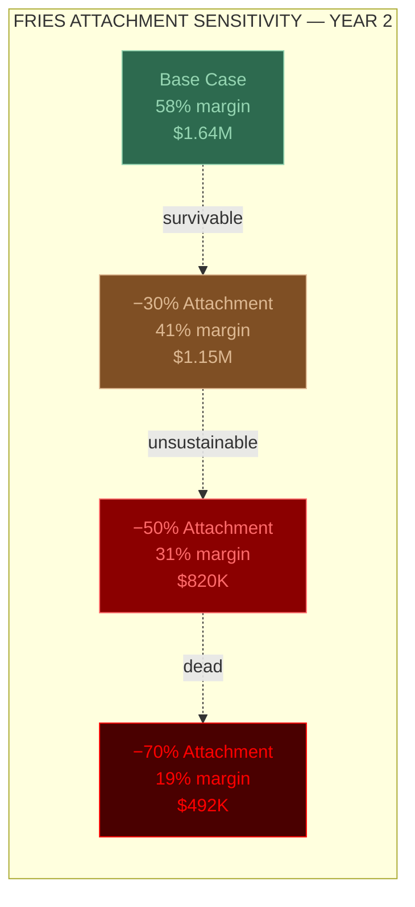
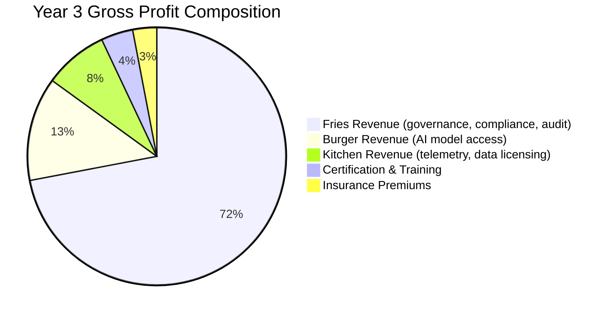

# Economic Model Summary

The FrankMax Marketplace economic model is built on one principle: **the burger funds the relationship, the fries fund the business, the kitchen funds the future.** Every number below follows from that structure.

---

## Unit Economics Per Account

| Metric | Year 1 | Year 2 | Year 3 |
|---|---|---|---|
| Customers (organizations) | 50 | 200 | 800 |
| Avg Revenue Per Account | $4,500/yr | $8,200/yr | $14,000/yr |
| AI Model Cost (burger) | $2,800/yr | $3,100/yr | $3,400/yr |
| Attachment Revenue (fries) | $1,700/yr | $5,100/yr | $10,600/yr |
| Burger Margin | 12% | 15% | 18% |
| Fries Margin | 78% | 82% | 85% |
| **Blended Margin** | **38%** | **58%** | **67%** |
| **Total Revenue** | **$225K** | **$1.64M** | **$11.2M** |
| **Gross Profit** | **$85K** | **$951K** | **$7.5M** |

The trajectory from 38% to 67% blended margin is driven by two forces: (1) fries attachment rate increases as customers adopt more governance layers, and (2) kitchen data compounds, improving model routing, caching, and fine-tuning efficiency, which reduces burger cost.

---

## Sensitivity Analysis: Fries Attachment Rate

The single most important variable in the model. If customers buy burgers but skip the fries, the business dies.

| Scenario | Blended Margin (Y2) | Revenue (Y2) | Assessment |
|---|---|---|---|
| **Base case** | 58% | $1.64M | Sustainable, fundable |
| Attachment drops 30% | 41% | $1.15M | Survivable but tight |
| Attachment drops 50% | 31% | $820K | Unsustainable |
| Attachment drops 70% | 19% | $492K | **Dead** |

**Critical threshold: below 40% attachment rate, the model is dead.** Every product design decision, onboarding flow, and pricing structure must be optimized to drive fries attachment above this line.

---

## The 10 Fries Layers

Each fries layer is a distinct revenue stream with its own margin profile. Customers typically attach 2-4 layers in Year 1, expanding to 5-8 by Year 3.

| # | Fries Layer | Margin Range | Attachment Driver |
|---|---|---|---|
| 1 | **Governance** | 70-85% | Regulatory mandate — must have for regulated industries |
| 2 | **Workflow Templates** | 80-90% | Operational efficiency — reduces implementation time by 60-80% |
| 3 | **Audit Trail** | 75-85% | Compliance requirement — auditors demand it, insurers require it |
| 4 | **Multi-Model Orchestration** | 65-75% | Cost optimization — customers see immediate savings from model routing |
| 5 | **Failure Intelligence** | 85-95% | Risk mitigation — access to the failure library prevents repeating others' mistakes |
| 6 | **Operator Certification** | 90%+ | Credentialing — operators need certification to deploy AI in regulated environments |
| 7 | **Insurance** | 60-70% | Liability transfer — AI execution insurance underwritten by failure data |
| 8 | **Custom Fine-Tuning** | 70-80% | Performance — fine-tuned models match large model quality at 1/20th cost |
| 9 | **Priority SLA** | 80-90% | Reliability — guaranteed latency and uptime for mission-critical workloads |
| 10 | **Data Sovereignty** | 85-95% | Jurisdiction compliance — data residency requirements for government and finance |

---

## Revenue Across All Channels

| Channel | Year 1 | Year 2 | Year 3 |
|---|---|---|---|
| Direct marketplace sales | $225K | $1.64M | $11.2M |
| Enterprise agreements | $800K | $4.2M | $18.5M |
| Government contracts | $500K | $2.8M | $12.0M |
| Channel partners | $200K | $1.5M | $6.4M |
| UniVenture IP licensing | $100K | $600K | $2.5M |
| LPI legal vertical | $150K | $800K | $3.0M |
| Certification & training | $75K | $400K | $1.5M |
| Insurance premiums | $50K | $160K | $500K |
| **Total** | **$2.1M** | **$12.1M** | **$55.6M** |

---

## Total Addressable Market by Audience

| Audience Segment | TAM | SOM Year 3 |
|---|---|---|
| Governments & Ministries | $50B+ | $5M |
| Defense & Security | $30B+ | $2M |
| Critical Infrastructure | $25B+ | $3M |
| International Institutions | $8B+ | $1M |
| Dynasties & UHNWIs | $15B+ | $2M |
| Family Offices | $12B+ | $1.5M |
| Multinational Corporate Empires | $200B+ | $15M |
| Legacy Enterprises | $80B+ | $8M |
| Banks & Insurers | $80B+ | $8M |
| Healthcare Systems | $30B+ | $4M |
| Universities & Research | $10B+ | $2M |
| Legal Sector | $8B+ | $3M |
| Accounting & Audit | $5B+ | $2M |
| Startups & Scale-ups | $15B+ | $4M |
| Consumer & Prosumer | $5B+ | $2M |
| **Total** | **$563B+** | **$63.5M** |

:::info SOM Methodology
SOM (Serviceable Obtainable Market) Year 3 assumes 800 organizational customers across all audience segments, with average contract sizes ranging from $8K (consumer/prosumer) to $150K (multinationals). These are not aspirational targets. They represent the minimum viable customer base needed to sustain 67% blended margin.
:::

---

## Margin Architecture

The fries dominate gross profit by Year 3. The burger never exceeds 18% margin, but it does not need to — its purpose is customer acquisition and data generation. The kitchen begins generating direct revenue in Year 2 through data licensing and failure intelligence subscriptions.

---

## Key Takeaways

1. **The business lives or dies on fries attachment.** Below 40%, the model is unsustainable. Above 60%, it compounds.
2. **Burger margin improves with scale** — caching, batching, and fine-tuning get more efficient with more data and more queries.
3. **Year 2 is the inflection point** — the model crosses from 38% to 58% blended margin as customers expand from 2-3 fries layers to 4-6.
4. **Year 3 total revenue across all channels exceeds $55M** — but only if the product delivers on the governance value proposition.
5. **The kitchen is the long-term moat** — by Year 3, the failure library and industry ontology contain data that would take a competitor 3+ years to replicate.

---

## Related

- [The Marketplace Premise](/executive-overview/premise)
- [Platform Architecture](/executive-overview/architecture)
- [Marketplace Statistics](/executive-overview/statistics)
