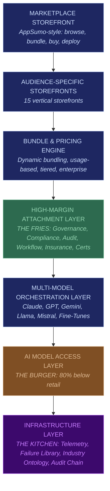

# The Marketplace Premise

**FrankMax Marketplace is "The AppSumo of Institutional AI."**

A marketplace that packages AI models (Claude, GPT, Gemini, open-source) at approximately 80% below provider pricing, bundled into vertical-specific tools, systems, and platforms targeting **15 institutional audience segments** across all NAICS/SIC industries.

---

## The Burger, Fries, and Kitchen Model

Every offering in the marketplace follows a three-layer economic structure designed to capture compounding value from each customer relationship.

### The Burger (Loss Leader)

Cheap AI model access at **5-15% margin**. This is what gets buyers in the door. Institutional customers pay roughly 80% less than going directly to OpenAI, Anthropic, or Google. The burger is not the business. The burger funds the relationship.

### The Fries (Profit Engine)

Governance, compliance, orchestration, audit, workflow, insurance, and certification layers at **70-95% margin**. Every institutional buyer who touches an AI model needs at least three of these. The fries are the business. Without them, the marketplace is a commodity reseller burning cash.

**Critical threshold: below 40% attachment rate, the model is dead.**

### The Kitchen (Compounding Moat)

Telemetry, failure library, and industry ontology that compound daily. Every transaction, every failure, every audit event feeds a data asset that cannot be replicated by a competitor starting from zero. The kitchen is the defensibility. It is what makes the marketplace worth more tomorrow than today.

---

## How the 80% Discount Works

The discount is not a subsidy. It is an engineering outcome achieved through five techniques applied in combination:

| Technique | Cost Reduction | Mechanism |
|---|---|---|
| **Model Routing** | 30-60% | Route each task to the cheapest capable model. A contract summary does not need GPT-4 when GPT-3.5 or Llama handles it at 1/10th the cost. |
| **Semantic Caching** | 30-50% | 30-50% of institutional queries repeat (compliance checks, policy lookups, standard clauses). Cache the result; never pay twice. |
| **Batch Inference** | 20-40% | Aggregate non-urgent requests into bulk API calls. Provider batch pricing is 40-60% cheaper than real-time. |
| **Fine-Tuning** | 40-70% | Train smaller models on domain-specific data. A 7B parameter model fine-tuned on insurance claims matches GPT-4 quality at 1/20th the cost. |
| **Open-Source Fallback** | 60-80% | Llama, Mistral, and other open-weight models handle commodity tasks (summarization, extraction, classification) at near-zero marginal cost. |

These techniques stack. A query that hits cache costs nothing. A query that routes to a fine-tuned open-source model costs 1/50th of retail GPT-4. The blended average across all traffic delivers the 80% headline discount.

---

## Marketplace Scope

| Dimension | Count |
|---|---|
| **Distinct marketplace offerings** | ~713 |
| **Audience segments** | 15 |
| **NAICS/SIC sectors covered** | All (20+ top-level) |
| **Ecosystem entities** | 8 |
| **Core protocols** | 3 |

### The 8 Ecosystem Entities

| Entity | Role |
|---|---|
| **AINEFF** | AI Non-Profit Ethical Foundation (governance oversight) |
| **AINEF** | AI Non-Profit Education Foundation (training, certification) |
| **AINEG** | AI Non-Profit Ethics Governance (standards body) |
| **AINE** | AI Non-Profit Enforcement (compliance enforcement) |
| **WGE** | Workplace Governance Engine (operational compliance) |
| **Frankmax** | FrankMax Digital (marketplace operator, commercial entity) |
| **LPI** | Legal Process Intelligence (legal automation vertical) |
| **UniVenture** | University venture IP commercialization |

### The 3 Core Protocols

| Protocol | Full Name | Purpose |
|---|---|---|
| **ORF** | Obligation & Responsibility Finality | Defines who owes what to whom when an AI system acts. Immutable obligation chain from model output to business outcome. |
| **ETLB** | Execution-Time Liability Binding | Binds liability at the moment of AI execution, not at contract signing. Liability follows the action, not the agreement. |
| **MCO** | Mortality Compliance Object | Encodes regulatory and compliance state as a living object that updates as regulations change. Compliance is a runtime property, not a document. |

---

## Marketplace Architecture (Simplified)

---

## The Thesis in One Sentence

Sell cheap AI (the burger) to get institutional buyers in the door, attach high-margin governance and compliance layers (the fries) to every transaction, and compound a data moat (the kitchen) that makes the platform more valuable and more defensible with every interaction.

---

## Related

- [Platform Architecture](/executive-overview/architecture)
- [Economic Model Summary](/executive-overview/economics)
- [Marketplace Statistics](/executive-overview/statistics)
