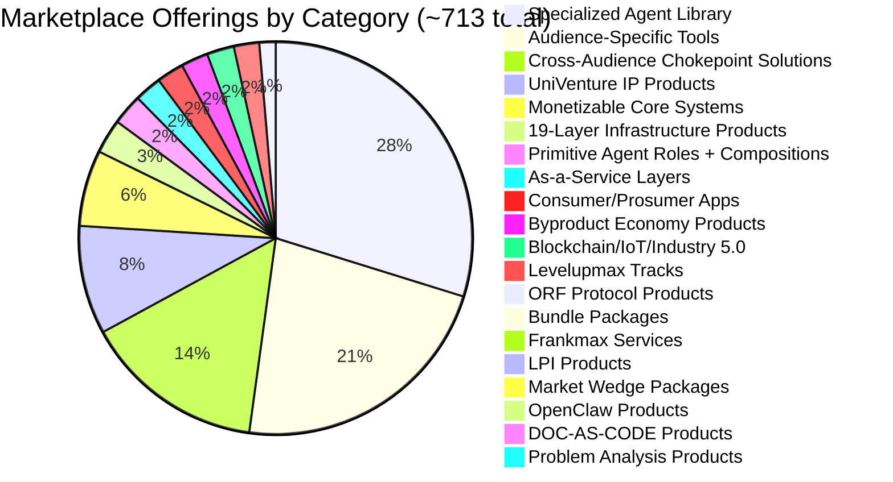

# Marketplace Statistics

A comprehensive count of every distinct offering in the FrankMax Marketplace catalog, organized by category, followed by the revenue priority stack that determines build order.

---

## Offering Count by Category

| Category | Count |
|---|---|
| Audience-Specific Tools | 150 |
| Cross-Audience Chokepoint Solutions | 100 |
| Monetizable Core Systems | 42 |
| As-a-Service Layers | 15 |
| Bundle Packages | 7 |
| UniVenture IP Products | 60+ |
| Consumer/Prosumer Apps | 15 |
| Specialized Agent Library | 200+ |
| ORF Protocol Products | 9 |
| Byproduct Economy Products | 15 |
| Market Wedge Packages | 6 |
| DOC-AS-CODE Products | 5 |
| OpenClaw Products | 6 |
| Blockchain/IoT/Industry 5.0 | 15 |
| LPI Products | 7 |
| Levelupmax Tracks | 14 |
| Frankmax Services | 7 |
| Problem Analysis Products | 4 |
| Primitive Agent Roles + Compositions | 17 |
| 19-Layer Infrastructure Products | 19 |
| **TOTAL DISTINCT OFFERINGS** | **~713** |

---

## Category Breakdown

### Audience-Specific Tools (150)

10 tools per audience segment across 15 audiences. Each tool is purpose-built for a specific business process within that audience's operational context. Examples: Policy Compiler Engine (Governments), Billing Leakage Detector (Multinationals), Claims Processing Accelerator (Banks/Insurers).

### Cross-Audience Chokepoint Solutions (100)

Tools that address systemic problems shared across multiple audiences. These are horizontal capabilities sold vertically — the same underlying engine with audience-specific configuration. Examples: regulatory compliance, audit trail generation, multi-model orchestration.

### Monetizable Core Systems (42)

The 42 systems across the 7-layer architecture (see [Platform Architecture](/executive-overview/architecture)). Each system is independently monetizable as an as-a-service offering while also serving as infrastructure for higher-level tools.

### Specialized Agent Library (200+)

Pre-built AI agents for specific tasks, composed from primitive agent roles. Agents range from simple (document classifier, summarizer) to complex (multi-step regulatory compliance auditor, cross-jurisdictional obligation tracker).

### UniVenture IP Products (60+)

Intellectual property products commercialized through the UniVenture entity, primarily targeting university research labs, academic spin-outs, and institutional R&D divisions.

---

## Offering Distribution

---

## Revenue Priority Stack

Build order is determined by two factors: (1) time to first revenue, and (2) fries attachment potential. The first five products must generate revenue within 90 days.

| Priority | Product | Timeline | Rationale |
|---|---|---|---|
| 1 | **PIAR** | 0-30 days | Fastest path to cash. Pre-built, minimal customization, immediate value demonstration. Target: $15K-$75K initial contracts. |
| 2 | **Billing Leakage Detector** | 30-60 days | Self-funding — finds money the customer is already losing. ROI proven in the first invoice. |
| 3 | **DocuFlow** | 30-60 days | Document intelligence is the most universal pain point across all 15 audiences. High fries attachment (audit trail, compliance, workflow). |
| 4 | **Claims Processing Accelerator** | 60-90 days | Insurance and banking vertical entry point. High-volume, measurable throughput gains. |
| 5 | **AI Cost Optimization Engine** | 60-90 days | Meta-product: optimizes the customer's existing AI spend. Proves the 80% discount thesis with their own data. |
| 6 | **Governed AI Execution Engine** | 90-120 days | The chokepoint product. Once deployed, all AI execution flows through governance. Maximum fries attachment. |
| 7 | **AI Audit & Verification** | 90-120 days | Regulatory pull — auditors and regulators increasingly require AI audit trails. Demand-driven, not sales-driven. |
| 8 | **Regulatory Reporting Automator** | 90-120 days | Compliance automation for financial services and government. Recurring quarterly/annual cadence creates predictable revenue. |
| 9 | **Multi-Model Orchestrator** | 120-180 days | The model routing engine exposed as a product. Customers see cost savings in real time. Drives burger adoption. |
| 10 | **Operator Certification System** | 120-180 days | Credentialing moat. Once operators are certified on the platform, switching costs become permanent. 90%+ margin. |

```mermaid
gantt
    title Revenue Priority Build Timeline
    dateFormat X
    axisFormat %s days

    section Immediate Revenue (0-30 days)
    PIAR                          :done, p1, 0, 30

    section Early Revenue (30-60 days)
    Billing Leakage Detector      :active, p2, 30, 60
    DocuFlow                      :active, p3, 30, 60

    section Growth Revenue (60-90 days)
    Claims Processing Accelerator :p4, 60, 90
    AI Cost Optimization Engine   :p5, 60, 90

    section Platform Revenue (90-120 days)
    Governed AI Execution Engine  :p6, 90, 120
    AI Audit & Verification       :p7, 90, 120
    Regulatory Reporting Automator:p8, 90, 120

    section Moat Revenue (120-180 days)
    Multi-Model Orchestrator      :p9, 120, 180
    Operator Certification System :p10, 120, 180
```

---

## Audience Coverage

| # | Audience Segment | Tools | NAICS Range |
|---|---|---|---|
| 1 | Governments & Ministries | 20 | 921110-928120 |
| 2 | Defense & Security | 10 | 928110, 541715 |
| 3 | Critical Infrastructure | 10 | 221110-237310 |
| 4 | International Institutions | 10 | 928120, 813311 |
| 5 | Dynasties & UHNWIs | 10 | 523930, 551111 |
| 6 | Family Offices | 10 | 523920, 523930 |
| 7 | Multinational Corporate Empires | 10 | 551111-551114 |
| 8 | Legacy Enterprises | 10 | 331-339, 423-425 |
| 9 | Banks & Insurers | 10 | 522110-524298 |
| 10 | Healthcare Systems | 10 | 621-623 |
| 11 | Universities & Research | 10 | 611310, 541710 |
| 12 | Legal Sector | 10 | 541110-541199 |
| 13 | Accounting & Audit | 10 | 541211-541219 |
| 14 | Startups & Scale-ups | 10 | 541511-541519 |
| 15 | Consumer & Prosumer | 10 | B2C |
| | **Total Audience-Specific** | **150** | |

---

## Ecosystem Entity Ownership

Each offering maps to one of the 8 ecosystem entities. The entity determines governance structure, revenue model, and compliance regime.

| Entity | Products Owned | Revenue Model |
|---|---|---|
| **Frankmax** | Marketplace platform, services, commercial tools | Transaction fees, subscriptions, enterprise agreements |
| **AINEFF** | Governance frameworks, ethical standards | Certification fees, membership dues |
| **AINEF** | Training, education, curriculum | Course fees, institutional licensing |
| **AINEG** | Standards body, governance protocols | Standard licensing, audit fees |
| **AINE** | Compliance enforcement, violation tracking | Enforcement fees, remediation services |
| **WGE** | Workplace governance, operational compliance | SaaS subscriptions, per-seat licensing |
| **LPI** | Legal process intelligence, legal automation | Per-document, per-case pricing |
| **UniVenture** | IP commercialization, academic spin-outs | Royalties, licensing, equity stakes |

---

## Protocol Product Distribution

The three core protocols (ORF, ETLB, MCO) generate 9 direct products and are embedded in hundreds of other offerings as infrastructure.

| Protocol | Direct Products | Embedded In |
|---|---|---|
| **ORF** (Obligation & Responsibility Finality) | 3 | 400+ offerings |
| **ETLB** (Execution-Time Liability Binding) | 3 | 350+ offerings |
| **MCO** (Mortality Compliance Object) | 3 | 300+ offerings |
| **Total** | **9** | Overlapping across catalog |

---

## Key Ratios

| Metric | Value |
|---|---|
| Offerings per audience segment | ~48 (150 specific + 713 total / 15) |
| Core systems per layer (avg) | 6 |
| Agents per audience (avg) | 13+ |
| Fries layers per offering (avg) | 3-5 |
| Revenue priority products | 10 (first 5 within 90 days) |
| Days to first revenue (PIAR) | 0-30 |

---

## Related

- [The Marketplace Premise](/executive-overview/premise)
- [Platform Architecture](/executive-overview/architecture)
- [Economic Model Summary](/executive-overview/economics)
