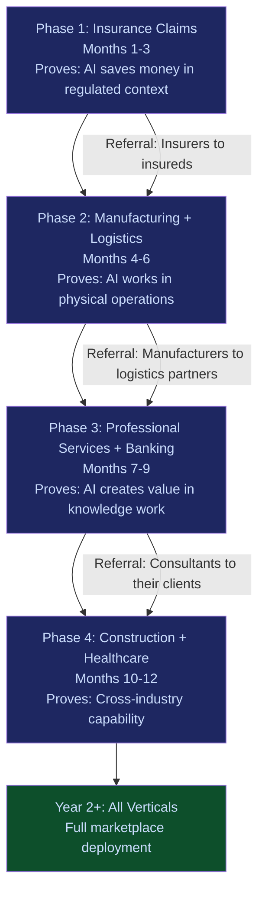

# Wedge Sequencing Strategy

The market wedge sequence is not random. Each phase proves a specific capability that makes the next phase possible. Failure to follow the sequence means trying to sell into a vertical without the proof that vertical requires.

---

## Sequencing Flow

---

## Phase 1: Insurance Claims (Months 1--3)

**Vertical**: Insurance (NAICS 524)
**Entry product**: Claims Processing Accelerator
**Why first**: Insurance claims processing is the single best proof-of-concept for the entire marketplace because:

1. **Regulated context** -- proves AI can operate under compliance constraints
2. **Measurable outcome** -- claims accuracy and speed are directly measurable in dollars
3. **High pain** -- claims processing errors cost $15K--$300K/month per insurer (Chokepoint #11)
4. **Network position** -- insurers connect to every other vertical through underwriting relationships

**Proof generated**: "AI reduced claims processing time by X% and errors by Y% in a regulated financial environment."

This proof unlocks every subsequent phase.

---

## Phase 2: Manufacturing + Logistics (Months 4--6)

**Verticals**: Manufacturing (NAICS 311-339) + Logistics (NAICS 481-488)
**Entry products**: Predictive Maintenance + Quality Prediction + Route Optimization
**Why second**: Physical operations proof.

| Attribute | Manufacturing | Logistics |
|---|---|---|
| Entry Price | $95,000 | $80,000 |
| Sales Cycle | 45--60 days | 30--45 days |
| Target Buyer | VP Operations | Head of Logistics |
| Key Metric | Downtime reduction | Fuel/route savings |

**Proof generated**: "AI saves money in physical operations -- factories and fleets, not just digital processes."

**Referral path**: Insurance clients refer their insureds (manufacturers, logistics companies) based on Phase 1 success. Manufacturers refer their logistics partners.

---

## Phase 3: Professional Services + Banking (Months 7--9)

**Verticals**: Professional Services (NAICS 541) + Banking (NAICS 522)
**Entry products**: Knowledge Reuse + AML/KYC Automation
**Why third**: Knowledge work + financial services proof.

| Attribute | Professional Services | Banking |
|---|---|---|
| Entry Price | $110,000 | $85,000 |
| Sales Cycle | 60--90 days | 60--90 days |
| Target Buyer | Managing Partner | CRO/CCO |
| Key Metric | Knowledge reuse rate | False positive reduction |

**Proof generated**: "AI creates value in knowledge-intensive environments and satisfies financial regulatory requirements."

**Referral path**: Consulting firms (Audience 12) deploy internally, then recommend to their enterprise clients. Banking success creates insurance cross-sell (same compliance infrastructure).

---

## Phase 4: Construction + Healthcare (Months 10--12)

**Verticals**: Construction (NAICS 236-238) + Healthcare (NAICS 621-624)
**Entry products**: Project Risk Predictor + Clinical Decision Support
**Why fourth**: Cross-industry proof.

| Attribute | Construction | Healthcare |
|---|---|---|
| Entry Price | $90,000 | $70,000--$90,000 |
| Sales Cycle | 45--60 days | 60--90 days |
| Target Buyer | VP Operations | COO/CMO |
| Key Metric | Cost variance reduction | Claims denial reduction |

**Proof generated**: "AI works across industries -- physical, knowledge, regulatory, clinical. The marketplace is industry-agnostic."

**Referral path**: Banking clients refer construction companies (commercial lending relationships). Insurance clients refer healthcare providers (malpractice underwriting).

---

## Year 2+: Full Marketplace Deployment

With four phases of vertical proof complete, the marketplace has demonstrated capability in:

- Regulated financial environments (insurance, banking)
- Physical operations (manufacturing, logistics)
- Knowledge work (professional services)
- Safety-critical operations (construction, healthcare)

This proof base supports expansion into all 20 NAICS sectors covered by the marketplace catalog.

---

## Cumulative Revenue Model

| Phase | Months | Verticals | Revenue per Phase | Cumulative Revenue |
|---|---|---|---|---|
| Phase 1 | 1--3 | Insurance Claims | $70,000--$90,000 | $70,000--$90,000 |
| Phase 2 | 4--6 | Manufacturing + Logistics | $175,000 | $245,000--$265,000 |
| Phase 3 | 7--9 | Professional Services + Banking | $195,000 | $440,000--$460,000 |
| Phase 4 | 10--12 | Construction + Healthcare | $160,000--$180,000 | $600,000--$640,000 |

This is marketplace tool revenue only. Frankmax Digital Advisory services (PIAR, Authority Mapping, etc.) generate additional revenue in parallel.

---

## Cell Economics (Consistent Across All Wedges)

| Metric | Value |
|---|---|
| Revenue per venture cell | $100,000 |
| Cost per cell (delivery, support, infrastructure) | $48,000 |
| **Margin per cell** | **$52,000 (52%)** |
| Time to break-even per cell | 4--6 months |

At 6 wedge verticals with 1 cell each = $600K revenue, $312K margin in Year 1. Scaling to 2--3 cells per vertical in Year 2 = $1.2M--$1.8M revenue.

---

## Sequencing Rules

1. **Never skip a phase.** Each phase generates the proof the next phase requires. Selling into healthcare without insurance + manufacturing + banking proof means selling without credibility.
2. **Referral paths are structural.** The sequence is designed so each phase's clients have natural referral relationships to the next phase's targets.
3. **Governance attachment increases with phase.** Phase 1 clients adopt basic governance. Phase 4 clients demand comprehensive governance. The "fries" revenue grows as the sequence progresses.
4. **Kill criteria apply per phase.** If a phase does not achieve target revenue and proof metrics within its window, the next phase does not begin. Failing forward is not permitted.
