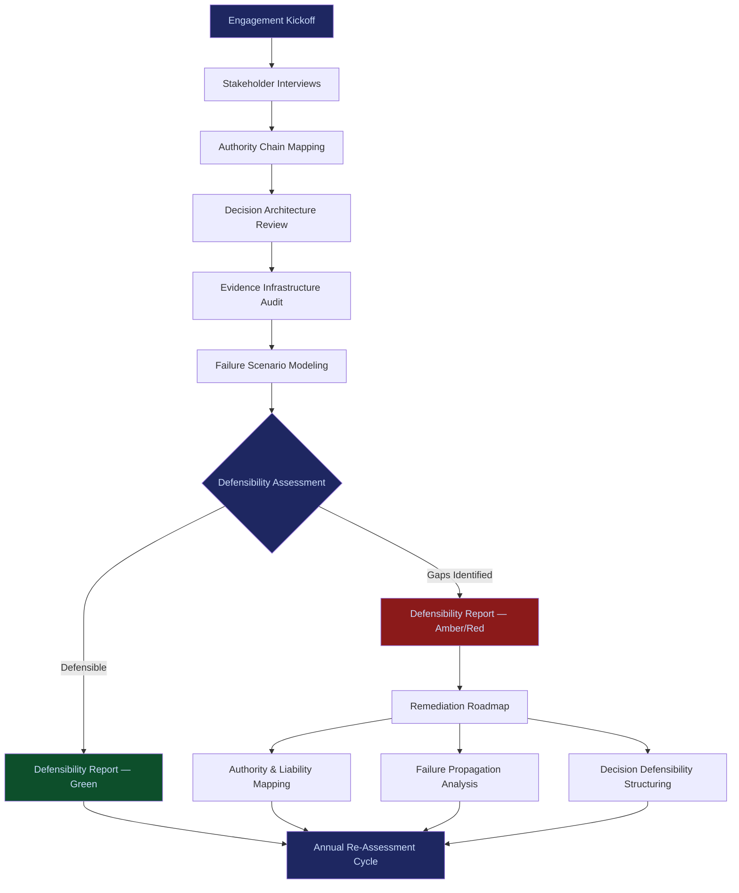

# PIAR (Pre-Incident Accountability Review)

**Revenue Priority**: #1 -- First dollar, no code required.

| Attribute | Detail |
|---|---|
| **Price** | $15,000 -- $75,000 per engagement |
| **Duration** | 2--4 week engagement |
| **Delivery** | Workshop-based assessment |
| **Deliverable** | Defensibility Report |
| **Buyer** | CFOs, General Counsel, Chief Risk Officers |
| **Time to Revenue** | 0--30 days |
| **Dependencies** | None -- advisory service, no code needed |

---

## What PIAR Does

PIAR answers one question: **"If this fails, can you survive investigation?"**

It is a mandatory entry-point engagement that exposes failure paths before they become evidence. Every organization deploying AI systems -- or relying on automated decisions -- carries latent accountability exposure. PIAR surfaces that exposure before regulators, litigants, or insurers do.

The output is not a risk register. It is a **defensibility report** -- a structured assessment of whether the organization's decision architecture, authority chains, and evidence infrastructure can survive adversarial scrutiny after an incident.

---

## Why PIAR Is First

1. **No code required.** Pure advisory. A founder with a laptop and domain knowledge can deliver it.
2. **Immediate revenue.** $15K--$75K per engagement with a 2--4 week cycle.
3. **Creates urgency for everything else.** Every PIAR engagement reveals gaps that require Authority Mapping, Failure Propagation, Decision Defensibility, and Institutional Memory services to resolve.
4. **Positions Frankmax as the accountability authority.** The organization that identified the exposure becomes the natural vendor to remediate it.

---

## The Inevitability Argument

Retrospective accountability is now harsher than prospective constraint. This condition has flipped permanently.

Regulators, courts, and insurers have shifted from "did you follow the rules?" to "can you prove you made defensible decisions?" The burden of proof moved from the accuser to the organization. AI accelerates this shift because automated decisions create evidence trails that are either complete or catastrophically incomplete -- there is no middle ground.

Every organization will eventually face a PIAR-equivalent review. The only question is whether it happens **before** an incident (at $15K--$75K, on the organization's terms) or **after** an incident (at $500K--$5M+, on the regulator's terms).

---

## PIAR Process Flow

---

## Engagement Structure

### Week 1: Discovery
- Stakeholder interviews with C-suite, legal, risk, and operations leadership
- Map current decision authority chains (who can authorize what, under what constraints)
- Inventory existing evidence infrastructure (audit logs, approval workflows, documentation practices)

### Week 2: Analysis
- Model 5--10 high-probability failure scenarios specific to the organization's AI deployments
- Trace each scenario through the decision chain to identify accountability gaps
- Assess evidence completeness for each scenario: would the organization's records survive adversarial scrutiny?

### Week 3: Synthesis
- Score each failure scenario on a defensibility matrix (evidence quality, authority clarity, response readiness)
- Identify systemic patterns across scenarios (common gaps, recurring authority ambiguities)
- Draft the Defensibility Report with specific, actionable findings

### Week 4: Delivery
- Present findings to executive leadership and board risk committee
- Deliver the Defensibility Report with scored findings and prioritized remediation roadmap
- Scope follow-on engagements (Authority Mapping, Failure Propagation, Decision Defensibility)

---

## Defensibility Report Contents

| Section | Purpose |
|---|---|
| Executive Summary | One-page finding: defensible or not, with severity score |
| Authority Chain Map | Visual map of who authorized what, where chains are broken |
| Evidence Gap Analysis | What records exist, what is missing, what is fabricated-after-the-fact |
| Failure Scenario Matrix | 5--10 modeled scenarios with defensibility scores |
| Regulatory Exposure Assessment | Which jurisdictions, which enforcement mechanisms, which penalties |
| Remediation Roadmap | Prioritized actions ranked by exposure severity and implementation cost |
| Service Recommendations | Specific Frankmax services mapped to identified gaps |

---

## Buyer Triggers

| Signal | Buyer | Urgency |
|---|---|---|
| Board asks "are we covered?" after competitor incident | General Counsel | Immediate |
| Insurer raises premiums or requests AI governance proof | CFO | 30 days |
| Regulator issues sector-specific AI guidance | CRO | 60 days |
| Failed audit reveals decision-trail gaps | Head of Internal Audit | Immediate |
| M&A due diligence uncovers governance gaps | CFO / Board | Deal-dependent |

---

## Pricing Logic

| Engagement Size | Price Range | Typical Buyer |
|---|---|---|
| Single business unit, limited AI deployment | $15,000 -- $25,000 | Mid-market CFO |
| Multi-unit, moderate AI deployment | $25,000 -- $50,000 | Enterprise GC / CRO |
| Enterprise-wide, significant AI exposure | $50,000 -- $75,000 | Board Risk Committee |

---

## Relationship to Other Frankmax Services

PIAR is the diagnostic. Everything else is the treatment.

- **Authority & Liability Mapping** resolves the "who authorized this?" gaps PIAR identifies
- **Failure Propagation Analysis** models the blast radius of the scenarios PIAR surfaces
- **Jurisdictional Exposure** quantifies the cross-border enforcement risk PIAR flags
- **Decision Defensibility Structuring** rebuilds the approval processes PIAR finds lacking
- **Institutional Memory** prevents the accountability gaps PIAR identifies from recurring after leadership changes
- **Accreditation** provides the external signal that PIAR's remediation recommendations have been implemented
