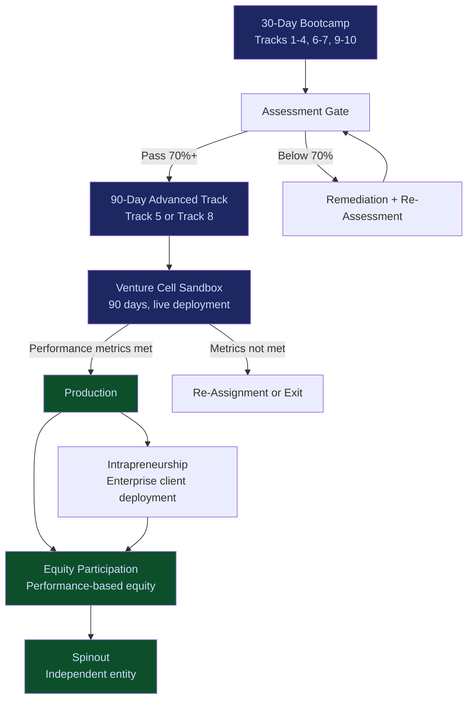

# LevelUpMax Advancement Path

The LevelUpMax advancement path is not a certification ladder. It is a production pipeline that takes an individual from foundational AI literacy to operating a revenue-generating venture cell with equity participation.

---

## The Full Path

---

## Stage 1: 30-Day Bootcamp

**Duration**: 30 days | **Cost**: $900 -- $2,200 depending on track

The entry point. Every operator begins with one of the eight 30-day tracks:

| Track | Focus | Target Participant |
|---|---|---|
| Track 1: AI-Native Operator Foundation | Workflow deconstruction + AI redesign | Early-career professionals |
| Track 2: Governance & Risk Operator | Policy enforcement, kill-switch management | Compliance/risk professionals |
| Track 3: Revenue Systems Operator | Leakage detection, billing optimization | Sales ops/revenue managers |
| Track 4: Capital Allocation & Portfolio Operator | Capital envelope management, milestone gating | Finance professionals |
| Track 6: Data Infrastructure Operator | Data pipelines, RAG, knowledge graphs | Data engineers/analysts |
| Track 7: Enterprise Workflow Optimization Operator | Process mining, AI automation | Operations managers |
| Track 9: Compliance & Regulatory Deployment Operator | AI compliance, regulatory translation | Legal/compliance professionals |
| Track 10: Performance Intelligence & Learning Systems Operator | Decision accuracy measurement | Learning/OD professionals |

**Exit criteria**: 70% assessment score. Certificate issued.

---

## Stage 2: Assessment Gate

Between the 30-day bootcamp and the 90-day advanced track, every operator passes through an assessment gate:

| Assessment Component | What It Measures |
|---|---|
| Technical competency test | Can they do the work? |
| Portfolio review | Quality of bootcamp deliverables |
| Peer evaluation | Can they collaborate effectively? |
| Motivation interview | Why do they want to advance? (Filters for commitment, not enthusiasm) |

Operators who do not pass the gate receive specific remediation guidance and can re-assess after 30 days.

---

## Stage 3: 90-Day Advanced Track

**Duration**: 90 days | **Cost**: $2,500 -- $4,500

Two advanced tracks:

| Track | Focus | Prerequisite |
|---|---|---|
| Track 5: Venture Production Operator | End-to-end venture cell creation | Any 30-day track |
| Track 8: AI Engineering & Systems Architect | Agent architecture, multi-model orchestration | Track 1 or Track 6 recommended |

**Exit criteria**: 75% assessment score (higher bar). Certificate issued.

---

## Stage 4: Venture Cell Sandbox

**Duration**: 90 days | **Structure**: Live deployment with limited capital and governance oversight

The sandbox is not a simulation. Operators deploy a real venture cell with:

- Real customers (limited scope)
- Real revenue targets (achievable but meaningful)
- Real governance requirements (full ETLB/MCO compliance)
- Real capital constraints (envelope-managed, milestone-gated)

| Success Metric | Threshold |
|---|---|
| Revenue generated | Minimum $10,000 in 90 days |
| Governance compliance | Zero ETLB violations |
| Customer satisfaction | NPS 40+ |
| Operational metrics | Defined per venture cell type |

Operators who meet all thresholds advance to Production. Operators who do not are re-assigned to roles that match their demonstrated capability or exit the program.

---

## Stage 5: Production

Operators in Production run a fully operational venture cell with:

- Full revenue targets ($100K+ annualized per cell)
- Full governance requirements
- Full capital management responsibility
- Performance-based compensation

---

## Stage 6: Intrapreneurship

High-performing Production operators can be deployed into enterprise client organizations to run venture cells as internal operators. The client pays for the operator; the operator runs the cell using FrankMax methodology and tools.

---

## Stage 7: Equity Participation

Operators who demonstrate sustained production performance earn equity participation in their venture cell. Equity vests based on performance milestones, not time.

---

## Stage 8: Spinout

Venture cells that achieve escape velocity -- sustainable revenue, proven market, scalable operations -- can spin out as independent entities. The operator becomes the founder. FrankMax retains a governance and licensing relationship.

---

## Economics of the Path

| Stage | Operator Pays | Operator Earns |
|---|---|---|
| 30-Day Bootcamp | $900 -- $2,200 | Certificate + skills |
| 90-Day Advanced | $2,500 -- $4,500 | Certificate + portfolio |
| Venture Cell Sandbox | $0 (subsidized) | Experience + track record |
| Production | $0 | Performance-based compensation |
| Intrapreneurship | $0 | Enhanced compensation + client exposure |
| Equity | $0 | Equity in venture cell |
| Spinout | $0 | Founder equity in independent entity |

The operator's investment is front-loaded ($3,400 -- $6,700 total). Every stage after the sandbox is compensation-positive.
