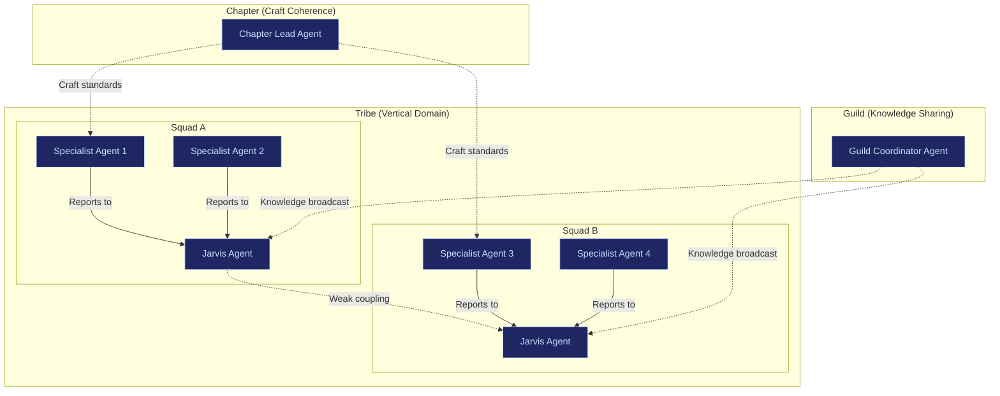
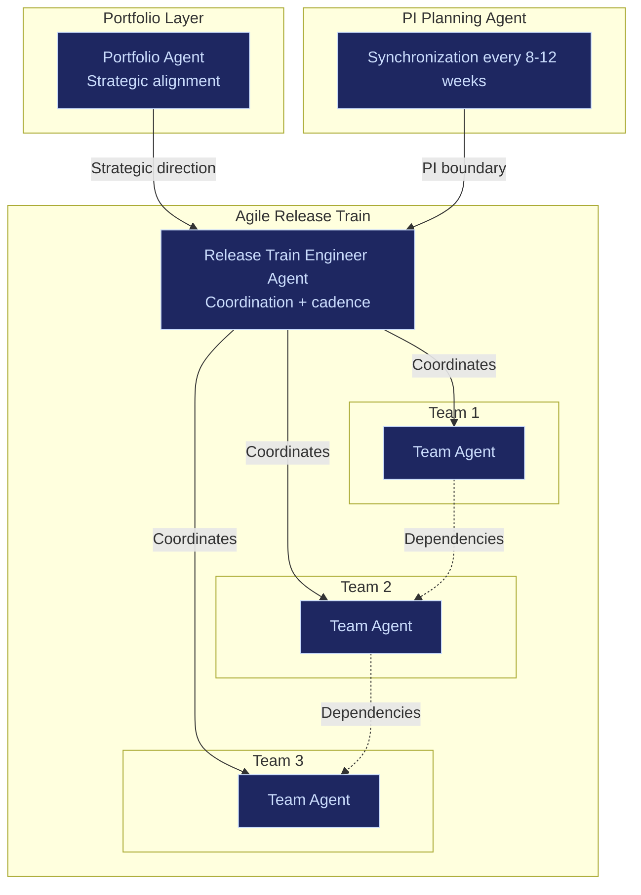

# Agent Topology Mapping

Organizational models are not culture choices. They are **information-routing architectures**. Each one encodes assumptions about how decisions move, how work decomposes, and how risk propagates.

AI agent topologies must mirror these information routes. An agent system configured for Spotify-style autonomous squads will fail catastrophically in a SAFe-regulated environment. The topology must match the governance.

---

## The Core Principle

Every organizational formalization model implies a specific agent topology:

- **Node types**: What kinds of agents exist (squad agents, train coordinators, platform agents, escalation agents)
- **Edge contracts**: How agents interact (collaborate, serve, enable, escalate)
- **Cadence configuration**: When agents synchronize (iteration, PI cycle, continuous flow)
- **Governance intensity**: How much oversight each agent transaction requires (lightweight, regulated, defense-grade)

The platform configures all four dimensions automatically when an enterprise selects a governance model or adjusts control variables.

---

## Primary Topology Mappings

### Spotify Model: Autonomous Jarvis Cells

| Attribute | Configuration |
|---|---|
| **Node type** | Independent Jarvis cells per squad, each owning end-to-end problem execution |
| **Edge contract** | Weak inter-squad coupling. Squads interact via shared APIs, not direct coordination |
| **Cadence** | Squad-defined iteration length. No global synchronization required |
| **Governance intensity** | Lightweight. Minimal approval gates. Post-hoc audit preferred over pre-approval |
| **Agent autonomy** | High. Each Jarvis cell decides routing, model selection, and escalation independently |

**Control variable signature**:

| Variable | Setting |
|---|---|
| Authority Concentration | 0.2 (distributed) |
| Protocol Rigidity | 0.3 (flexible) |
| Integration Depth | 0.2 (modular) |
| Escalation Latency | 0.3 (fast within squads) |
| Transparency Gradient | 0.6 (open within tribes) |

**Risk**: Coordination drift. Duplication of effort. Shadow standards. In regulated industries, this becomes compliance roulette.

**Use when**: Product velocity matters more than regulatory coherence.

---

### SAFe: Train Orchestration Layer

| Attribute | Configuration |
|---|---|
| **Node type** | Portfolio agents, Release Train Engineer (RTE) agents, team agents in value streams |
| **Edge contract** | Strong reporting cadence. Dependency tracking. Cross-team synchronization points |
| **Cadence** | Fixed PI cadence (8-12 weeks). Teams synchronized within trains |
| **Governance intensity** | Heavy. Ceremony as control mechanism. Escalation lattice baked in |
| **Agent autonomy** | Low-moderate. Teams operate within train constraints. Strategic direction from portfolio layer |

**Control variable signature**:

| Variable | Setting |
|---|---|
| Authority Concentration | 0.7 (centralized at portfolio/RTE level) |
| Protocol Rigidity | 0.7 (heavy ceremony, structured cadence) |
| Integration Depth | 0.7 (tightly coupled value streams) |
| Escalation Latency | 0.5 (cadence-driven, PI boundaries) |
| Transparency Gradient | 0.7 (visible dashboards, PI reporting) |

**Risk**: Bureaucratic bloat. Process worship. PI theater. But it makes chaos legible to executives.

**Use when**: You need traceability, regulatory defensibility, and synchronized releases across dozens of teams.

---

### Scrum@Scale: Recursive Agent Layers

| Attribute | Configuration |
|---|---|
| **Node type** | Recursive Jarvis layers. Each Scrum-of-Scrums node aggregates and reconciles signals upward |
| **Edge contract** | Vertical aggregation. Each layer summarizes and escalates to the next |
| **Cadence** | Sprint-based at leaf level. Meta-Scrum cadence at coordination layers |
| **Governance intensity** | Moderate. Lightweight scaling of existing Scrum discipline |
| **Agent autonomy** | Moderate. Teams autonomous within sprint. Cross-team coordination at meta level |

**Control variable signature**:

| Variable | Setting |
|---|---|
| Authority Concentration | 0.4 (distributed with coordination layers) |
| Protocol Rigidity | 0.5 (Scrum ceremonies preserved at scale) |
| Integration Depth | 0.4 (loosely coupled teams, meta-coordination) |
| Escalation Latency | 0.4 (fast within sprints, meta-level for cross-team) |

**Risk**: Coordination gaps between layers. Authority ambiguity. Depends heavily on leadership maturity.

**Use when**: You want to scale Scrum without installing a full industrial governance stack.

---

### Team Topologies: Typed Agent Classes

| Attribute | Configuration |
|---|---|
| **Node type** | Four typed agent classes: stream-aligned, platform, enabling, complicated-subsystem |
| **Edge contract** | Explicit interaction modes: collaboration, X-as-a-Service, facilitation |
| **Cadence** | Team-defined. No global sync required |
| **Governance intensity** | Moderate. Structural discipline without ceremony overhead |
| **Agent autonomy** | High within type. Controlled at interface boundaries |

**Control variable signature**:

| Variable | Setting |
|---|---|
| Authority Concentration | 0.3 (distributed by team type) |
| Protocol Rigidity | 0.5 (explicit interaction contracts) |
| Integration Depth | 0.4 (controlled coupling via typed interfaces) |
| Market Interface | 0.6 (platform teams serve internal market) |

This model maps extremely well to AI-governed enterprise systems because it already thinks in typed agents with explicit interaction contracts.

**Use when**: You care about long-term system maintainability and platform thinking.

---

### DORA/DevOps: Telemetry-First Architecture

| Attribute | Configuration |
|---|---|
| **Node type** | Instrumented execution agents at every workflow transition |
| **Edge contract** | Metric-driven. Agents report deployment frequency, lead time, MTTR, change failure rate |
| **Cadence** | Continuous. No iteration boundaries |
| **Governance intensity** | Light on ceremony, heavy on measurement |
| **Agent autonomy** | High. Performance accountability through metrics, not process |

**Control variable signature**:

| Variable | Setting |
|---|---|
| Transparency Gradient | 0.8 (all metrics visible) |
| Protocol Rigidity | 0.3 (flexible process, rigid measurement) |
| Incentive Alignment | 0.7 (performance tied to four key metrics) |
| Escalation Latency | 0.2 (MTTR minimization is core objective) |

**Risk**: Gaming metrics. Optimizing for speed over safety. Ignoring non-software value streams.

**Use when**: You need empirical performance feedback loops.

---

### Kanban Enterprise: Queue-Aware Agents

| Attribute | Configuration |
|---|---|
| **Node type** | Queue-aware agents with WIP limit enforcement |
| **Edge contract** | Pull-based. Agents pull work when capacity is available |
| **Cadence** | Continuous flow. No iteration boundaries |
| **Governance intensity** | Flow-state visibility. Bottleneck detection modules |
| **Agent autonomy** | Moderate. Agents operate within WIP constraints |

**Control variable signature**:

| Variable | Setting |
|---|---|
| Protocol Rigidity | 0.5 (WIP limits enforced, process flexible) |
| Transparency Gradient | 0.7 (flow metrics visible to all) |
| Integration Depth | 0.5 (connected via flow pipeline) |
| Escalation Latency | 0.3 (bottlenecks surface immediately) |

**Use when**: Operational work dominates -- incident response, infrastructure, legal review pipelines.

---

### Military Doctrine: Distributed Command Cells

| Attribute | Configuration |
|---|---|
| **Node type** | Small autonomous command units with clear intent parameters |
| **Edge contract** | Commander's intent broadcast. Rapid escalation protocols |
| **Cadence** | Event-driven. No fixed cadence |
| **Governance intensity** | High doctrine alignment. Low procedural overhead |
| **Agent autonomy** | High within intent boundaries. Strict escalation on boundary violations |

**Control variable signature**:

| Variable | Setting |
|---|---|
| Authority Concentration | 0.3 (distributed execution, concentrated intent) |
| Protocol Rigidity | 0.6 (doctrine is rigid, tactics are flexible) |
| Escalation Latency | 0.1 (immediate escalation on critical events) |
| Incentive Alignment | 0.9 (mission alignment is absolute) |
| Time-Horizon Insulation | 0.7 (strategic patience under tactical pressure) |

**Use when**: High-uncertainty, high-stakes operations. Crisis response. Security.

---

## Full Topology Mapping Table

| Organizational Model | Agent Node Type | Edge Contract | Cadence | Governance Intensity |
|---|---|---|---|---|
| Spotify | Autonomous Jarvis cells | Weak coupling, shared APIs | Squad-defined | Lightweight |
| SAFe | Portfolio/RTE/Team layers | Strong reporting, dependency tracking | PI cadence (8-12 weeks) | Heavy |
| Scrum@Scale | Recursive Jarvis layers | Vertical aggregation | Sprint + meta-sprint | Moderate |
| LeSS | Flat agent topology | High transparency, minimal meta-layer | Sprint-based | Minimal |
| Team Topologies | Typed agent classes (4 types) | Explicit interaction contracts | Team-defined | Moderate |
| DORA/DevOps | Instrumented execution agents | Metric-driven | Continuous | Light process, heavy measurement |
| Kanban Enterprise | Queue-aware agents | Pull-based, WIP-limited | Continuous flow | Flow-state governance |
| Holacracy | Role-based agents in circles | Consent-based, tension processing | Meeting-driven | Structured but decentralized |
| Three Horizons | Horizon-segmented agent pools | Budget-gated, horizon-isolated | Strategy cycle | Portfolio-level |
| Mission Command | Distributed command cells | Intent broadcast, rapid escalation | Event-driven | High doctrine, low ceremony |
| Berkshire Hathaway | Independent subsidiary agents | Capital-only reporting | Annual/quarterly | Minimal |
| Amazon Two-Pizza | Small autonomous team agents | Single-threaded ownership | Team-defined | Lightweight |
| Goldman Sachs Partnership | Equity-aligned partner agents | Long-term incentive contracts | Performance cycle | High accountability |

---

## How Topology Mapping Drives Product Adoption

### 1. Immediate Value at Onboarding

The moment an enterprise declares "We run SAFe," the platform can auto-configure:
- Agent hierarchy (portfolio -> RTE -> team)
- Reporting dashboards (PI metrics, dependency heat maps, value stream flow)
- Escalation paths (team -> RTE -> portfolio -> executive)
- Compliance template (audit trail structure matching SAFe ceremony outputs)

Time to value: **2-4 weeks** versus 3-6 months for manual configuration.

### 2. Diagnostic Power

When an enterprise says "We run Spotify" but their diagnostic reveals authority concentration of 0.8 and protocol rigidity of 0.7, the platform can flag: "Your stated model is Spotify, but your actual governance fingerprint matches SAFe. This mismatch is generating friction." That insight alone justifies the diagnostic fee.

### 3. Migration Path

Most enterprises spend **18-36 months "transforming" between organizational models**. If the FrankMax system can morph agent topology while preserving traceability and historical decision lineage, that is not agile tooling. That is organizational firmware. Migration that takes competitors 18 months takes the platform 2-4 weeks of reconfiguration.

### 4. Ecosystem Gravity

Every governance model configured on the platform generates telemetry:
- Which escalation thresholds fire most often
- Which authority distributions produce bottlenecks
- Which capital buffer levels correlate with project failure
- Which topology configurations produce the highest DORA metrics

This telemetry feeds the inference engine. More customers = better recommendations = more customers. The flywheel is structural, not viral.

---

## Hybrid Topologies

Real enterprises do not run a single model. They stack 3-6 simultaneously. The platform must support hybrid configurations:

| Enterprise Profile | Execution Layer | Governance Layer | Capital Layer | Agent Topology |
|---|---|---|---|---|
| Regulated bank | SAFe | Risk-Weighted Governance | Beyond Budgeting | Train orchestration + centralized risk engine + dynamic forecasting agents |
| Tech startup | Spotify | OKRs | VC Power Law | Autonomous Jarvis cells + objective-tracking agents + portfolio allocation agents |
| Defense contractor | Mission Command | Stage-Gate | Fortress Balance Sheet | Distributed command cells + gate-review agents + capital buffer monitors |
| Healthcare system | Team Topologies | RACI + Balanced Scorecard | PMO Model | Typed agent classes + role-clarity agents + stage-gate capital agents |
| Global FMCG | Matrix Organization | Hoshin Kanri | Category P&L | Dual-reporting agents + strategy cascade agents + brand-level budget agents |

The configuration engine generates these hybrid topologies automatically from the 10 control variable settings. No manual mapping required.
