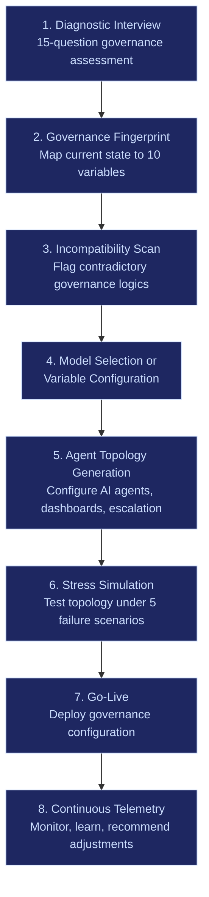
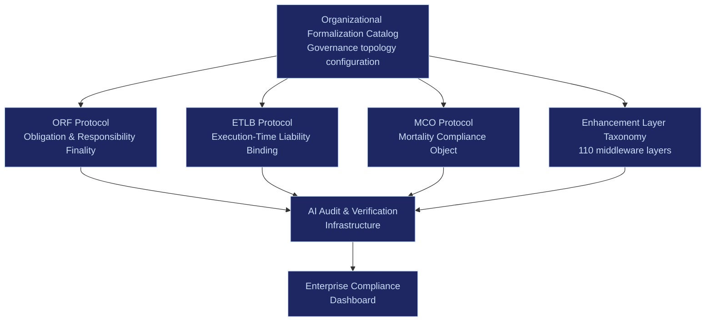

# Catalog Product

The Organizational Formalization Catalog is not a document. It is a product that evolves through three distinct phases, each with increasing lock-in, margin, and defensibility.

---

## Product Evolution

### Phase 1: Static Menu (Months 0-6)

**What the customer sees**: A catalog of 340 named organizational models organized by structural layer (execution topology, governance contracts, capital allocation, etc.).

**What the customer does**: Selects 1-3 models that match their current operating philosophy. Example: "We run SAFe for execution, OKRs for governance, and Beyond Budgeting for capital allocation."

**What the platform does**:
- Configures AI agent topology to match selected models
- Sets reporting cadence, dashboard views, and escalation paths
- Generates compliance templates and audit trail structure
- Maps selected models to the 10 control variables and displays the resulting governance fingerprint

**Revenue**: Per-seat SaaS license, $500-$2,000/user/month depending on enterprise tier.

**Lock-in**: Low-moderate. Customer could theoretically switch to manual configuration. But the agent topology configuration and dashboard customization create immediate switching friction.

---

### Phase 2: Configuration Engine (Months 6-18)

**What the customer sees**: A 10-slider configuration interface. Each slider corresponds to one control variable (capital buffer, authority concentration, risk dispersion, etc.). Named models disappear. Only outcomes and trade-offs remain.

**What the customer does**: Adjusts variable settings to match their actual operating constraints. The system shows real-time trade-off visualizations -- "increasing protocol rigidity from 0.4 to 0.7 will improve audit defensibility by ~35% but increase escalation latency by ~20%."

**What the platform does**:
- Generates hybrid governance topologies from parameter combinations (no single named model required)
- Runs compatibility checks -- flags structurally contradictory variable settings
- Simulates governance topology under stress scenarios
- Recommends adjustments based on industry benchmarks and failure mode data

**Revenue**: Platform license ($50K-$200K/year) + configuration consulting ($15K-$50K per engagement) + ongoing optimization fee ($5K-$20K/month).

**Lock-in**: High. The configuration is enterprise-specific. The stress simulation data is proprietary. The compatibility engine relies on telemetry from the installed base. No competitor has this data.

---

### Phase 3: Inference Engine (Months 18-36)

**What the customer sees**: An outcome declaration interface. No sliders. No model names. Just desired outcomes: "high autonomy," "regulated," "innovation lab," "cost discipline," "crisis resilience."

**What the customer does**: Declares constraints and desired outcomes. Example: "We operate in healthcare. We need FDA audit defensibility. We want innovation velocity in our R&D division but fortress-grade compliance in our clinical operations."

**What the platform does**:
- Dynamically composes governance topology from declared outcomes
- Applies industry-specific constraint overlays (HIPAA, SOX, ITAR, GDPR)
- Continuously adjusts topology based on live telemetry
- Predicts governance failures before they occur based on pattern matching against the failure library
- Generates recommended reconfigurations when operating conditions change

**Revenue**: Outcome-based pricing ($100K-$500K/year) + continuous optimization fee (% of governance cost reduction) + failure prevention premium.

**Lock-in**: Irreversible. The inference engine is trained on the enterprise's own telemetry combined with the global failure library. Replacing it means starting from zero data. In regulated industries, the historical decision lineage alone makes switching a 12-18 month compliance project.

---

## Product Phase Comparison

| Attribute | Static Menu | Configuration Engine | Inference Engine |
|---|---|---|---|
| **Customer input** | Select named models | Adjust 10 variable sliders | Declare desired outcomes |
| **Platform output** | Pre-built topology | Hybrid custom topology | Dynamic adaptive topology |
| **Data dependency** | None | Industry benchmarks | Enterprise telemetry + global failure library |
| **Switching cost** | $50K-$200K | $200K-$1M | $1M-$5M+ |
| **Margin** | 40-60% | 60-80% | 80-95% |
| **Competitive moat** | Low (copyable) | Medium (data advantage) | High (compounding telemetry) |

---

## Enterprise Onboarding UX Flow

### Step 1: Diagnostic Interview (30 minutes)

15 structured questions that map the enterprise's current governance state. Not "which framework do you use?" but:

| Question | What It Measures |
|---|---|
| Who can stop a production deployment? | Authority concentration + escalation latency |
| How often do you reforecast budgets? | Capital buffer + time-horizon insulation |
| Can a team lead override a compliance flag? | Protocol rigidity + risk dispersion |
| How many approval layers for a $100K spend? | Authority concentration + escalation latency |
| What happens when two teams want the same resource? | Market interface + incentive alignment |
| How long before a critical incident reaches the CEO? | Escalation latency + transparency gradient |
| Can a junior engineer halt a release for quality? | Escalation latency + protocol rigidity |
| How are team budgets set -- top-down, negotiated, or formula? | Capital buffer + authority concentration |
| What percentage of decisions are documented? | Transparency gradient |
| How often do teams reorganize? | Integration depth + protocol rigidity |

### Step 2: Governance Fingerprint

Output: a radar chart showing the enterprise's current position on all 10 control variables. This becomes the baseline for all subsequent optimization.

### Step 3: Incompatibility Scan

The system cross-references the enterprise's governance fingerprint against known unstable combinations. Output: a list of structural contradictions with severity ratings.

Example output:
> **WARNING**: Authority concentration (0.8) combined with escalation latency (0.7) produces bureaucratic paralysis. 73% of enterprises with this combination report decision bottleneck incidents within 6 months.

### Steps 4-8: Configuration, Deployment, Continuous Learning

Standard enterprise SaaS onboarding with governance-specific telemetry collection from day one.

---

## Revenue Model

### Revenue by Product Phase

| Phase | Year 1 Target | Year 2 Target | Year 3 Target |
|---|---|---|---|
| Static Menu (per-seat SaaS) | $500K | $1.5M | $2M (declining as customers upgrade) |
| Configuration Engine (platform license) | -- | $500K | $3M |
| Inference Engine (outcome-based) | -- | -- | $2M |
| **Total** | **$500K** | **$2M** | **$7M** |

### Revenue Per Customer

| Revenue Stream | Amount | Frequency | Margin |
|---|---|---|---|
| Diagnostic assessment | $5K-$15K | One-time | 90% |
| Platform license | $50K-$200K/year | Annual | 70-80% |
| Configuration consulting | $15K-$50K | Per engagement | 60-70% |
| Ongoing optimization | $5K-$20K/month | Monthly | 80-90% |
| Compliance audit trail access | $10K-$30K/year | Annual | 95% |
| Stress simulation runs | $2K-$5K | Per scenario | 90% |

### Unit Economics (Steady State)

| Metric | Value |
|---|---|
| Average contract value | $120K/year |
| Customer acquisition cost | $15K-$25K |
| Gross margin | 75-85% |
| Payback period | 2-3 months |
| Net revenue retention | 130%+ (expansion via configuration upgrades) |
| Churn (annual) | Below 5% (switching cost barrier) |

---

## Integration with FrankMax Governance-as-a-Service

The Organizational Formalization Catalog is not a standalone product. It is the entry point to FrankMax's Governance-as-a-Service (GaaS) stack:

| GaaS Component | What the Catalog Feeds It |
|---|---|
| **ORF** | Governance topology defines obligation maps -- who owes what to whom under which conditions |
| **ETLB** | Agent topology from the catalog determines liability binding at execution time |
| **MCO** | Governance configuration defines what happens when agents, processes, or teams are terminated |
| **Enhancement Layer** | The 110-layer middleware taxonomy maps to governance variable settings |
| **PIAR** | Pre-Incident Accountability Review uses governance fingerprint to identify accountability gaps |

### Cross-Sell Path

Every enterprise that buys the Organizational Formalization Catalog is a qualified lead for:
1. **PIAR** ($15K-$75K) -- immediate upsell at diagnostic step
2. **Compliance audit trail** ($10K-$30K/year) -- automatic at go-live
3. **Full GaaS stack** ($100K-$500K/year) -- natural progression from configuration to inference engine

The catalog is the top of the funnel. The inference engine is the bottom. Everything in between generates margin.
