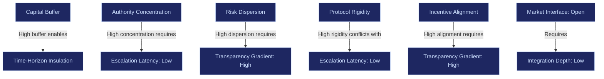

# Control Variables

340 models. 10 variables. Zero new structural axes after the first 60.

The empirical cataloging of 340 organizational formalization models across enterprises, sovereign institutions, financial infrastructure, military doctrine, and open-source ecosystems proved one thing conclusively: the institutional design space is **finite and closed**. Every governance topology is a permutation of the same 10 control variables.

These variables are not abstract. They are measurable, tunable, and -- critically -- programmable.

---

## The 10 Variables

| # | Variable | What It Controls | Range |
|---|---|---|---|
| 1 | Capital Buffer | How much reserve capital is held against shocks | Minimal (Ryanair) to Fortress (JPMorgan) |
| 2 | Authority Concentration | How decision power is distributed | Distributed (Holacracy) to Concentrated (Apple Functional Hierarchy) |
| 3 | Risk Dispersion | Where risk is absorbed across the structure | Centralized (BlackRock Risk Engine) to Dispersed (Swiss Re Syndication) |
| 4 | Protocol Rigidity | How strictly rules and processes are enforced | Flexible (Netflix F&R) to Rigid (Lockheed Martin Program Governance) |
| 5 | Transparency Gradient | How much information flows openly across the organization | Opaque (CIA Compartmentalization) to Radical (GitLab Transparency-by-Default) |
| 6 | Escalation Latency | How quickly decisions move up the hierarchy under stress | Immediate (Toyota Andon) to Slow (UN Multilateral Consensus) |
| 7 | Incentive Alignment | How tightly individual/unit incentives match enterprise objectives | Loose (Berkshire Hathaway Autonomy) to Tight (Goldman Sachs Partnership Equity) |
| 8 | Market Interface | How the organization interacts with external markets | Closed (Apple Vertical Stack) to Open (Shopify Merchant Enablement) |
| 9 | Integration Depth | How tightly internal systems and units are coupled | Modular (Stripe API-First) to Integrated (Tesla Vertical Integration) |
| 10 | Time-Horizon Insulation | How well long-term strategy is protected from short-term pressure | Short-term (Public Quarterly) to Long-term (Cargill Private Capital) |

---

## Variable Definitions and Measurement

### 1. Capital Buffer

**Definition**: The ratio of reserve capital to operational exposure. Determines how much shock the organization can absorb before structural failure.

**Measurement scale**: 0.0 (no buffer, all capital deployed) to 1.0 (maximum reserves, minimal deployment)

| Setting | Example Model | Effect on Governance |
|---|---|---|
| 0.1 - 0.2 | Ryanair Extreme Cost Compression | Maximum capital velocity, zero margin for error |
| 0.3 - 0.5 | Standard corporate treasury | Moderate resilience, standard risk tolerance |
| 0.6 - 0.8 | JPMorgan Fortress Balance Sheet | High survivability, reduced growth velocity |
| 0.9 - 1.0 | IEA Strategic Reserve Buffer | Crisis-grade resilience, significant carrying cost |

**Interaction effects**: High capital buffer + low authority concentration = slow but resilient. High capital buffer + high protocol rigidity = fortress mode (defense, banking).

---

### 2. Authority Concentration

**Definition**: The degree to which decision-making power is concentrated in a small number of nodes versus distributed across many.

**Measurement scale**: 0.0 (fully distributed, peer-based) to 1.0 (fully concentrated, single authority)

| Setting | Example Model | Effect on Governance |
|---|---|---|
| 0.0 - 0.2 | Holacracy, W.L. Gore Lattice, Semco Democracy | High autonomy, slow strategic coherence |
| 0.3 - 0.5 | Spotify Model, Berkshire Hathaway Decentralized | Balanced autonomy with loose coordination |
| 0.6 - 0.8 | SAFe, PMO Model, Samsung Chaebol | Strong central coordination, clear escalation |
| 0.9 - 1.0 | Apple Functional Hierarchy, Singapore Technocratic | Maximum coherence, executive bottleneck risk |

**Interaction effects**: High authority concentration + low escalation latency = rapid decisive action. High authority concentration + high protocol rigidity = bureaucratic lock.

---

### 3. Risk Dispersion

**Definition**: How risk is distributed across organizational units. Centralized risk means one node absorbs all exposure. Dispersed risk means exposure is shared or syndicated.

**Measurement scale**: 0.0 (fully centralized) to 1.0 (fully dispersed)

| Setting | Example Model | Effect on Governance |
|---|---|---|
| 0.0 - 0.2 | BlackRock Centralized Risk Engine, Deutsche Bank Risk Committee | Single point of risk visibility and control |
| 0.3 - 0.5 | Credit Suisse Ring-Fencing, Alphabet Subsidiary Containment | Risk isolated by unit but centrally monitored |
| 0.6 - 0.8 | Swiss Re Layered Reinsurance, CME Default Waterfall | Risk syndicated across multiple absorbers |
| 0.9 - 1.0 | Haier Microenterprise, VC Power Law Portfolio | Each unit owns its own risk entirely |

**Interaction effects**: Low risk dispersion + high transparency = strong central oversight. High risk dispersion + low transparency = hidden systemic exposure.

---

### 4. Protocol Rigidity

**Definition**: How strictly codified rules, processes, and compliance requirements constrain action. Rigid protocols prioritize predictability. Flexible protocols prioritize adaptation.

**Measurement scale**: 0.0 (minimal rules, discretion-based) to 1.0 (maximum rules, zero discretion)

| Setting | Example Model | Effect on Governance |
|---|---|---|
| 0.0 - 0.2 | Netflix Freedom & Responsibility, Basecamp Calm | Trust-based, minimal process |
| 0.3 - 0.5 | Spotify Model, Amazon Two-Pizza Teams | Lightweight guardrails, team discretion |
| 0.6 - 0.8 | SAFe, ITIL Service Model, ISO Standards | Heavy process, ceremony as control |
| 0.9 - 1.0 | Lockheed Martin Program Governance, Boeing Systems Engineering | Compliance-driven, audit-grade rigidity |

**Interaction effects**: High protocol rigidity + low escalation latency = regulated excellence (defense, pharma). High protocol rigidity + high authority concentration = bureaucratic paralysis.

---

### 5. Transparency Gradient

**Definition**: The degree to which information flows openly across organizational boundaries. Ranges from strict need-to-know compartmentalization to radical public disclosure.

**Measurement scale**: 0.0 (fully compartmentalized) to 1.0 (fully transparent)

| Setting | Example Model | Effect on Governance |
|---|---|---|
| 0.0 - 0.2 | CIA Compartmentalization, ASML Supplier Lock-step | Information as control mechanism |
| 0.3 - 0.5 | Standard corporate NDA/classification | Selective disclosure, hierarchical access |
| 0.6 - 0.8 | Bridgewater Radical Transparency, OKR Public Scoring | Open performance data, cultural pressure |
| 0.9 - 1.0 | GitLab Transparency-by-Default, Wikipedia Open Governance | All decisions publicly documented |

**Interaction effects**: High transparency + distributed authority = high-trust self-organization. High transparency + centralized authority = panopticon.

---

### 6. Escalation Latency

**Definition**: The time between a problem being detected and reaching a decision-maker with authority to act. Measures organizational response speed.

**Measurement scale**: 0.0 (immediate, any actor can halt/escalate) to 1.0 (slow, multi-layer consensus required)

| Setting | Example Model | Effect on Governance |
|---|---|---|
| 0.0 - 0.2 | Toyota Andon, USMC Distributed Command Cell | Immediate halt/escalation authority |
| 0.3 - 0.5 | Scrum@Scale, DARPA Program Manager Autonomy | Fast escalation within defined bounds |
| 0.6 - 0.8 | SAFe PI Planning, PMO Stage-Gate | Cadence-driven escalation windows |
| 0.9 - 1.0 | UN Multilateral Governance, EU Subsidiarity | Consensus-driven, multi-stakeholder negotiation |

**Interaction effects**: Low escalation latency + high protocol rigidity = mission-critical operations (military, healthcare). High escalation latency + low authority concentration = decision paralysis.

---

### 7. Incentive Alignment

**Definition**: How tightly individual and unit-level incentives are coupled to enterprise-level objectives. Loose alignment allows local optimization. Tight alignment forces system-level coherence.

**Measurement scale**: 0.0 (fully autonomous incentives) to 1.0 (fully aligned to enterprise KPIs)

| Setting | Example Model | Effect on Governance |
|---|---|---|
| 0.0 - 0.2 | Berkshire Hathaway Subsidiary Autonomy, Haier Microenterprise | Units pursue own P&L, minimal coordination |
| 0.3 - 0.5 | Spotify Chapters/Guilds, Amazon Two-Pizza | Local goals with shared technical standards |
| 0.6 - 0.8 | OKR Cascades, Hoshin Kanri, Balanced Scorecard | Explicit goal alignment across layers |
| 0.9 - 1.0 | Goldman Sachs Partnership Equity, Bain Results-Based Fee | Compensation tied directly to enterprise outcomes |

**Interaction effects**: High incentive alignment + high transparency = performance culture. High incentive alignment + low transparency = metric gaming.

---

### 8. Market Interface

**Definition**: How the organization's boundary interacts with external markets, customers, and ecosystems. Closed interfaces control the entire value chain. Open interfaces enable ecosystem participation.

**Measurement scale**: 0.0 (fully closed, vertically integrated) to 1.0 (fully open, platform/marketplace)

| Setting | Example Model | Effect on Governance |
|---|---|---|
| 0.0 - 0.2 | Apple Closed Ecosystem, Tesla Vertical Integration | End-to-end control, maximum margin capture |
| 0.3 - 0.5 | IBM Services-Led, Siemens Industrial Platform | Controlled integration with select partners |
| 0.6 - 0.8 | NVIDIA Architecture-Control Platform, Visa Network Orchestrator | Platform with controlled interfaces |
| 0.9 - 1.0 | Shopify Merchant Enablement, Airbnb Marketplace Network | Open platform, ecosystem-driven value |

**Interaction effects**: Closed market interface + high integration depth = maximum control, maximum capital intensity. Open market interface + low protocol rigidity = ecosystem growth, quality variance.

---

### 9. Integration Depth

**Definition**: How tightly internal systems, teams, and units are coupled. Deep integration means changes propagate across the entire system. Shallow integration means units can change independently.

**Measurement scale**: 0.0 (fully modular, API-boundaries) to 1.0 (fully integrated, monolithic)

| Setting | Example Model | Effect on Governance |
|---|---|---|
| 0.0 - 0.2 | Stripe API-First, Amazon Internal API Mandate | Maximum modularity, independent deployment |
| 0.3 - 0.5 | Team Topologies, GitHub Fork-and-Merge | Typed interactions, controlled coupling |
| 0.6 - 0.8 | SAFe Value Streams, Toyota Supplier Keiretsu | Tight operational coupling, shared cadence |
| 0.9 - 1.0 | SpaceX Integrated Mission Stack, BASF Value-Chain | Full vertical integration, shared destiny |

**Interaction effects**: Low integration depth + high transparency = composable organization. High integration depth + low escalation latency = synchronized execution machine.

---

### 10. Time-Horizon Insulation

**Definition**: How well the organization's strategic decision-making is insulated from short-term pressures (quarterly earnings, political cycles, market volatility).

**Measurement scale**: 0.0 (fully exposed to short-term pressure) to 1.0 (fully insulated for generational planning)

| Setting | Example Model | Effect on Governance |
|---|---|---|
| 0.0 - 0.2 | Public quarterly reporting, activist investor exposure | Maximum short-term accountability |
| 0.3 - 0.5 | Dual-class share structures, controlled boards | Moderate founder/leadership insulation |
| 0.6 - 0.8 | Foundation-controlled (IKEA), Mission-locked (Patagonia) | Strategic patience, reduced capital access |
| 0.9 - 1.0 | Cargill Private Long-Horizon, Sovereign Wealth Fund | Generational planning, minimal market noise |

**Interaction effects**: High time-horizon insulation + high capital buffer = maximum strategic patience. Low time-horizon insulation + high incentive alignment = quarterly performance pressure cooker.

---

## Variable Interaction Matrix

Not all combinations are stable. Some produce structural contradictions. Some produce reinforcing loops.

### Stable Combinations (Reinforcing)

| Pattern | Variables | Example |
|---|---|---|
| **Fortress mode** | High buffer + high rigidity + low dispersion + low latency | Defense contractors, regulated banking |
| **Innovation sandbox** | Low rigidity + high dispersion + high transparency + low integration | Spotify squads, DARPA programs |
| **Platform dominance** | Open interface + low integration + high protocol rigidity + high buffer | NVIDIA, Visa, AWS |
| **Mission command** | Low latency + distributed authority + high incentive alignment + high transparency | Military doctrine, SpaceX |

### Unstable Combinations (Contradictory)

| Pattern | Variables | Failure Mode |
|---|---|---|
| **Bureaucratic paralysis** | High rigidity + high authority concentration + high escalation latency | SAFe without executive sponsorship |
| **Compliance roulette** | Low rigidity + high risk dispersion + low transparency | Spotify Model in regulated industries |
| **Structural schizophrenia** | Distributed authority + centralized risk + high rigidity | Holacracy + PMO gatekeeping |
| **Performance theater** | High incentive alignment + low transparency + high escalation latency | MBO in siloed organizations |

---

## From Variables to Computational Governance

Once these 10 variables are formalized as adjustable parameters, three things become possible:

1. **Diagnostic**: Surface which variables are misconfigured relative to an enterprise's actual operating constraints (industry, regulation, market volatility, talent density)
2. **Simulation**: Model stress scenarios -- what happens to governance topology when escalation latency increases by 30%? When capital buffers drop below threshold?
3. **Dynamic adjustment**: Variables reconfigure automatically based on telemetry -- capital buffers resize from live data, escalation thresholds trigger algorithmically, authority redistributes under defined stress states

That is the transition from organizational doctrine to **institutional firmware**.

And firmware, once embedded, is very hard to rip out.
