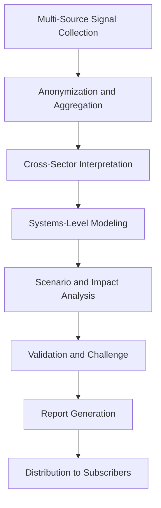

# Civilization-Scale Agents

## Role

Civilization-Scale Agents operate across institutional boundaries to address problems that no single organization can solve alone -- public health coordination, critical infrastructure resilience, cross-jurisdictional regulatory harmonization, climate adaptation, and systemic financial stability. They synthesize data from multiple entities, sectors, and jurisdictions into unified intelligence.

These agents represent the long-term vision of the FrankMax platform: a multi-entity, multi-sector intelligence fabric that generates insights impossible for any single institution to produce. Civilization-Scale Agents are the ultimate expression of the "Kitchen" moat -- the cross-entity telemetry, failure library, and industry ontology that compounds across the entire platform. They require the highest levels of data governance, anonymization, and privacy protection.

## Agent Roster

| Name | Function | Trigger | Output |
|------|----------|---------|--------|
| Cross-Sector Risk Correlator | Identifies systemic risk patterns that span NAICS sectors | Monthly cross-sector analysis | Systemic risk correlation report |
| Pandemic Preparedness Monitor | Tracks public health signals and models institutional readiness | Continuous (daily aggregation) | Preparedness scorecard with early warning signals |
| Critical Infrastructure Mapper | Maps dependencies between critical infrastructure systems | Quarterly analysis or incident event | Infrastructure dependency map with failure cascade models |
| Regulatory Harmonization Analyzer | Identifies conflicts and overlaps in regulations across jurisdictions | Regulatory change event | Harmonization opportunity report |
| Climate Adaptation Planner | Models climate risk exposure and recommends institutional adaptation | Annual assessment or climate event | Climate adaptation plan with timeline and cost |
| Workforce Transition Modeler | Projects workforce displacement and reskilling needs from AI adoption | Quarterly analysis cycle | Workforce transition plan by sector |
| Supply Chain Resilience Analyzer | Maps and stress-tests multi-tier supply chain dependencies | Monthly analysis or disruption event | Supply chain resilience scorecard |
| Public Trust Index | Measures institutional trust across sectors using public sentiment data | Monthly aggregation | Public trust index by sector |
| Cross-Entity Benchmark Engine | Produces anonymized performance benchmarks across platform entities | Quarterly benchmark cycle | Anonymized benchmark report by sector |
| Systemic Failure Predictor | Models cascading failure scenarios across interconnected systems | Quarterly analysis or early warning trigger | Failure cascade model with intervention points |
| Digital Divide Monitor | Tracks technology access disparities and institutional response gaps | Quarterly analysis | Digital equity scorecard with gap analysis |
| Intergenerational Impact Modeler | Projects long-term impact of current decisions on future stakeholders | Annual analysis or major policy event | Intergenerational impact assessment |

## Composition

Civilization-Scale Agents use the full primitive stack: **Perceiver + Retriever (multiple) + Interpreter + Planner + Critic + Verifier + Monitor + Memory Keeper + Reflector + Router**. Multiple Retrievers pull from cross-entity anonymized data stores, public data sources, and government databases. The Interpreter applies macro-economic and systems-thinking models. The Planner models intervention scenarios. The Critic challenges assumptions. The Verifier confirms data integrity. The Reflector improves predictions based on historical accuracy.

**Critical constraint**: All cross-entity data passes through an anonymization and aggregation layer before reaching Civilization-Scale Agents. No individual entity data is ever accessible at this level.

## BPMN Workflow

## Integration Points

- **Core Systems**: Cross-entity anonymized data warehouse, public data APIs (BLS, Census, WHO, NOAA), NAICS sector ontology
- **Marketplace Tools**: All marketplace offerings contribute anonymized telemetry to civilization-scale analysis
- **Upstream Feeds**: Anonymized aggregations from all 11 other agent categories
- **Downstream Consumers**: Strategy Agents (macro context), Risk Agents (systemic risk), Compliance Agents (cross-jurisdictional intelligence), Innovation Agents (macro trends)

## Deployment Model

Civilization-Scale Agents are deployed as **platform-level shared services** with no entity-specific instances. They operate in an isolated compute environment with access only to anonymized, aggregated data. Processing runs on scheduled cycles (monthly/quarterly) with event-triggered interim analyses. These agents have the longest warm-up time (30-90 days of data accumulation before reliable output) and the highest compute requirements on the platform.

## Revenue Model

- **Civilization Intelligence subscription**: $1,000/month per subscribing entity
- **Cross-sector risk reports**: $500 per report (available to all subscribers)
- **Custom systems analysis**: $5,000-$25,000 per commissioned analysis
- **Benchmark access**: Included in subscription (anonymized cross-entity benchmarks)
- **Early warning alerts**: Included in subscription (systemic risk and disruption signals)
- **Revenue model**: Requires minimum 10 entity subscribers per NAICS sector to produce statistically valid analysis
- **Margin**: 85%+ at scale (shared infrastructure, anonymized data, no per-entity customization)
