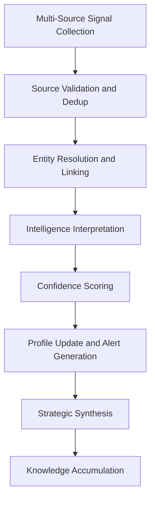

# Competitive Intelligence Agents

## Role

Competitive Intelligence Agents systematically gather, analyze, and deliver actionable intelligence about competitors, market movements, technology shifts, and industry trends. They process public filings, patent databases, job postings, news feeds, pricing data, and regulatory actions to build continuously updated competitive profiles.

These agents convert publicly available information into strategic advantage. They do not engage in espionage or access non-public data -- they apply AI-powered analysis to the overwhelming volume of public signals that no human team could process. In a marketplace serving 15 audience segments and 20+ NAICS sectors, competitive intelligence is sector-specific and requires deep ontological awareness.

## Agent Roster

| Name | Function | Trigger | Output |
|------|----------|---------|--------|
| Competitor Profile Builder | Maintains continuously updated profiles of key competitors | Continuous (daily refresh) | Competitor profile with change log |
| Patent Landscape Analyzer | Monitors patent filings and identifies technology direction signals | Weekly patent office data refresh | Patent landscape report with trend analysis |
| Pricing Intelligence Agent | Tracks competitor pricing and identifies positioning opportunities | Price change detection or weekly scan | Pricing comparison matrix with recommendations |
| Job Posting Analyzer | Extracts strategic signals from competitor hiring patterns | Daily job board scrape | Hiring trend report with capability implications |
| Regulatory Action Monitor | Tracks regulatory actions against competitors and peers | Regulatory filing event | Regulatory action digest with impact analysis |
| Technology Stack Detector | Identifies competitor technology choices from public signals | Monthly analysis cycle | Technology stack comparison matrix |
| Market Share Estimator | Estimates competitor market share from available proxy data | Quarterly analysis cycle | Market share model with confidence intervals |
| News and Event Aggregator | Consolidates competitor mentions across news, press releases, and social media | Continuous (hourly) | News digest with sentiment and relevance scoring |
| Strategic Move Predictor | Forecasts likely competitor actions based on accumulated intelligence | Quarterly or significant event trigger | Strategic prediction report with probability scores |
| Partnership and Alliance Tracker | Monitors competitor partnerships, alliances, and ecosystem moves | Partnership announcement event | Alliance map with strategic implications |
| Customer Win/Loss Analyzer | Analyzes patterns in competitive win/loss outcomes | Win/loss event recording | Win/loss pattern analysis with recommendations |
| Industry Benchmark Agent | Compiles industry benchmarks from public data across NAICS sectors | Quarterly cycle | Benchmark report by sector with percentile rankings |

## Composition

Competitive Intelligence Agents are **Retriever-heavy**: **Perceiver + Retriever (multiple) + Interpreter + Critic + Memory Keeper**. Multiple Retrievers target different data sources (patent databases, news APIs, regulatory feeds, job boards). The Interpreter synthesizes cross-source signals into coherent intelligence. The Critic evaluates source reliability and signal confidence. The Memory Keeper accumulates competitive knowledge over time.

The Strategic Move Predictor adds a **Planner** and **Reflector** for scenario modeling based on historical prediction accuracy.

## BPMN Workflow

## Integration Points

- **Core Systems**: Knowledge graph, entity resolution service, NAICS sector ontology
- **Marketplace Tools**: PIAR Generator (competitive context), AI Cost Optimization Engine (pricing benchmarks)
- **Upstream Feeds**: Perceiver streams from news APIs, patent databases, SEC EDGAR, job boards, social media APIs
- **Downstream Consumers**: Strategy Agents (competitive positioning), Influence Agents (narrative context), Risk Agents (competitive risk), Innovation Agents (whitespace identification)

## Deployment Model

Competitive Intelligence Agents operate as **always-on collectors with scheduled synthesis**. Collection agents (News Aggregator, Patent Analyzer) run continuously with configurable polling intervals. Synthesis agents (Strategic Move Predictor, Market Share Estimator) run on scheduled cycles. Each entity gets isolated competitive profiles. Intelligence compounds over time -- older instances produce better predictions than new ones.

## Revenue Model

- **CI Suite**: $3,500/month per entity (includes all 12 agents)
- **Individual monitors**: $500/month per agent
- **Strategic prediction reports**: $750 per report
- **Custom competitor deep-dive**: $1,500 per target analysis
- **Industry benchmark reports**: $400 per sector per quarter
- **Alert-based pricing**: $0.50 per competitive alert delivered (for high-volume monitoring)
