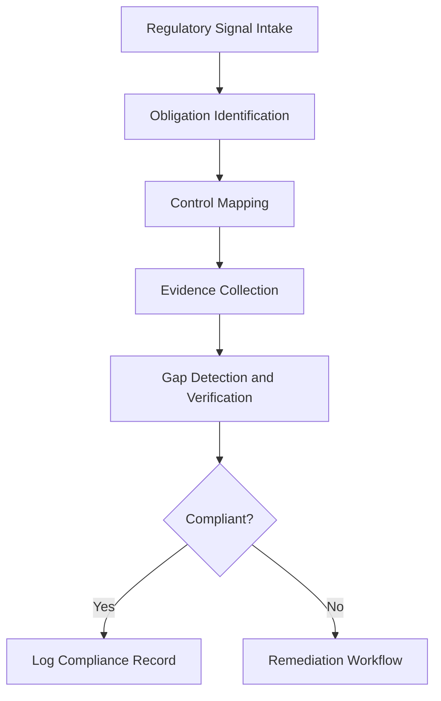

# Compliance Agents

## Role

Compliance Agents automate regulatory compliance monitoring, evidence collection, policy mapping, and reporting across jurisdictions and regulatory frameworks. They track regulatory changes, map obligations to internal controls, detect compliance gaps, and produce audit-ready evidence packages.

Compliance is distinct from governance: governance defines internal policy, while compliance ensures adherence to external regulatory requirements. For institutional clients operating across multiple jurisdictions and NAICS sectors, the regulatory burden is enormous -- thousands of obligations across dozens of frameworks. Compliance Agents reduce the cost of staying compliant by 60-80% while improving coverage from periodic spot-checks to continuous monitoring.

## Agent Roster

| Name | Function | Trigger | Output |
|------|----------|---------|--------|
| Regulatory Change Tracker | Monitors regulatory bodies for new rules, amendments, and guidance | Continuous (daily scan) | Regulatory change digest with impact mapping |
| Obligation Mapper | Maps regulatory requirements to internal controls and policies | Regulatory change event or periodic review | Obligation-to-control mapping matrix |
| Compliance Gap Detector | Identifies gaps between regulatory obligations and current controls | Quarterly assessment or regulation change | Gap analysis report with remediation priorities |
| Evidence Collector | Gathers and packages compliance evidence from operational systems | Audit preparation trigger or continuous | Evidence package per control per period |
| Audit Preparation Agent | Assembles complete audit-ready documentation packages | Audit notification or scheduled preparation | Audit package with evidence index |
| Policy-to-Regulation Aligner | Validates that internal policies satisfy all applicable regulations | Policy change or regulation change | Alignment matrix with coverage scores |
| Training Compliance Tracker | Monitors completion of required compliance training across staff | Training deadline approach or completion event | Training compliance dashboard |
| Incident Reporting Agent | Generates regulatory incident reports in required formats | Incident declaration event | Formatted incident report per regulator |
| Cross-Jurisdiction Mapper | Identifies overlapping and conflicting obligations across jurisdictions | New jurisdiction entry or regulation change | Cross-jurisdiction obligation matrix |
| Compliance Risk Scorer | Quantifies compliance risk exposure by regulation and control | Monthly recalculation | Compliance risk scorecard |
| Regulatory Filing Agent | Prepares and validates regulatory filings in required formats | Filing deadline trigger | Draft filing with validation checklist |
| Compliance Dashboard Agent | Aggregates compliance posture metrics into executive dashboards | Continuous (hourly aggregation) | Compliance posture dashboard |

## Composition

Compliance Agents rely heavily on **Retriever + Interpreter + Verifier + Memory Keeper**. The Retriever pulls regulatory texts, control documentation, and operational evidence. The Interpreter maps obligations to controls and identifies gaps. The Verifier confirms that evidence satisfies requirements. The Memory Keeper maintains compliance history for trend analysis and audit trails.

The Regulatory Change Tracker adds a **Perceiver + Monitor** pair for continuous regulatory feed monitoring. The Audit Preparation Agent adds a **Planner + Executor** pair for assembling multi-source evidence packages.

## BPMN Workflow

## Integration Points

- **Core Systems**: Regulatory databases (Federal Register, EU OJ, sector-specific), GRC platforms, training management systems
- **Marketplace Tools**: PIAR Generator (compliance context for assessments), DocuFlow (regulatory document processing)
- **Upstream Feeds**: Governance Agents (internal policy), Risk Agents (compliance risk), Operations Agents (operational evidence)
- **Downstream Consumers**: Finance Agents (regulatory cost), Strategy Agents (regulatory strategy), Influence Agents (regulatory narratives)

## Deployment Model

Compliance Agents are deployed as **always-on monitors with scheduled deep assessments**. The Regulatory Change Tracker and Compliance Dashboard run continuously. Gap Detection, Evidence Collection, and Audit Preparation run on regulatory calendars (quarterly for most frameworks, annually for others). Each entity gets jurisdiction-specific agent configurations based on their operational footprint. Compliance data is retained for 7 years minimum per regulatory requirements.

## Revenue Model

- **Compliance Suite**: $3,500/month per entity (includes all 12 agents)
- **Per-framework monitoring**: $500/month per regulatory framework tracked
- **Audit preparation packages**: $2,000 per audit package assembled
- **Gap assessments**: $750 per assessment
- **Regulatory filings**: $300 per filing prepared and validated
- **Evidence storage**: $0.15 per 1,000 evidence records retained beyond standard retention
- **Cross-jurisdiction mapping**: $1,500 per jurisdiction pair analyzed
