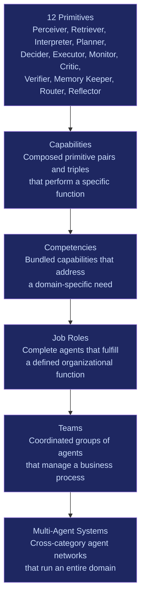
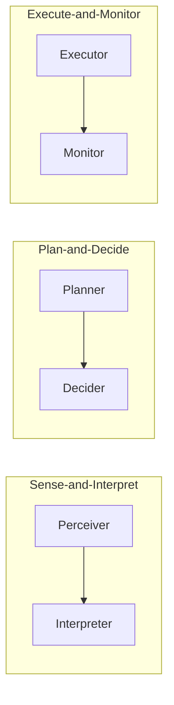
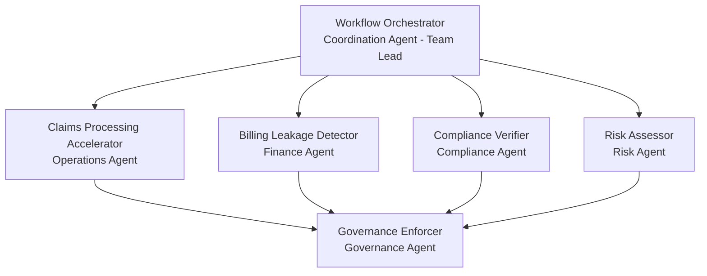

# Agent Composition Model

The FrankMax Agent Composition Model defines how atomic primitives combine into progressively more capable structures. Every agent on the platform -- from a simple document classifier to a civilization-scale systemic risk predictor -- is built from the same 12 primitives assembled at increasing levels of abstraction.

## The Composition Hierarchy

## Level 1: Primitives

The 12 primitives are the atomic building blocks. Each primitive does exactly one thing and does it well. Primitives are stateless, single-purpose, and independently testable. They never operate alone in production -- they are always composed into higher structures.

| Primitive | Core Function |
|-----------|--------------|
| Perceiver | Ingests and normalizes raw signals |
| Retriever | Fetches relevant knowledge from data sources |
| Interpreter | Extracts meaning and structure from data |
| Planner | Decomposes goals into executable task sequences |
| Decider | Selects actions from evaluated alternatives |
| Executor | Performs operations that modify external state |
| Monitor | Tracks ongoing processes and detects drift |
| Critic | Evaluates output quality and completeness |
| Verifier | Confirms factual accuracy against authoritative sources |
| Memory Keeper | Persists state, history, and accumulated knowledge |
| Router | Dispatches work to appropriate targets |
| Reflector | Analyzes execution history to improve future performance |

## Level 2: Capabilities

Capabilities are composed primitive pairs or triples that perform a specific, reusable function. They represent the smallest useful unit of agent behavior.

**Examples:**

| Capability | Primitives | Function |
|-----------|------------|----------|
| Sense-and-Interpret | Perceiver + Interpreter | Ingest raw data and extract structured meaning |
| Retrieve-and-Verify | Retriever + Verifier | Fetch data and confirm its accuracy |
| Plan-and-Decide | Planner + Decider | Generate options and select the best one |
| Execute-and-Monitor | Executor + Monitor | Perform an action and track its outcome |
| Critique-and-Reflect | Critic + Reflector | Evaluate quality and extract improvement insights |
| Classify-and-Route | Interpreter + Router | Determine type and dispatch to the correct handler |

## Level 3: Competencies

Competencies bundle multiple capabilities into domain-specific functional units. A competency addresses a recognizable business need but is not yet a complete agent.

**Examples:**

| Competency | Capabilities | Domain Need |
|-----------|-------------|-------------|
| Document Intelligence | Sense-and-Interpret + Retrieve-and-Verify + Memory Keeper | Extract, validate, and store document content |
| Risk Assessment | Sense-and-Interpret + Retrieve-and-Verify + Critique-and-Reflect | Identify, quantify, and evaluate risks |
| Workflow Automation | Classify-and-Route + Plan-and-Decide + Execute-and-Monitor | Automate multi-step business processes |
| Compliance Monitoring | Sense-and-Interpret + Retrieve-and-Verify + Monitor | Continuously track regulatory compliance |

## Level 4: Job Roles

Job Roles are complete, deployable agents. Each Job Role combines competencies into a single agent that fulfills a defined organizational function. The 12 agent categories contain approximately 12 Job Roles each, for a total of 144 agents in the platform catalog.

**Examples:**

| Job Role | Competencies | Agent Category |
|---------|-------------|----------------|
| Claims Processing Accelerator | Document Intelligence + Workflow Automation + Compliance Monitoring | Operations |
| Billing Leakage Detector | Document Intelligence + Risk Assessment | Finance |
| Regulatory Change Tracker | Compliance Monitoring + Risk Assessment | Compliance |
| Competitive Position Analyzer | Risk Assessment + Document Intelligence + Memory Keeper | Competitive Intelligence |

## Level 5: Teams

Teams are coordinated groups of agents that manage a complete business process end-to-end. A team has a designated lead agent (typically a Coordination Agent) that orchestrates the work of member agents.

**Example -- Claims Processing Team:**

## Level 6: Multi-Agent Systems

Multi-Agent Systems are cross-category agent networks that manage an entire domain. They span all 12 agent categories, coordinate dozens of agents, and operate continuously. A Multi-Agent System is the highest unit of composition -- it represents the full intelligence fabric for a domain like "Healthcare Operations" or "Financial Services Compliance."

**Example -- Institutional Risk Management System:**

| Category | Contributing Agents |
|---------|-------------------|
| Strategy | Strategic Risk Assessor, Scenario Planner |
| Operations | SLA Monitor, Quality Control Agent |
| Governance | ORF Enforcer, Policy Engine |
| Finance | Financial Risk Calculator, Billing Leakage Detector |
| Risk | Enterprise Risk Aggregator, Scenario Stress Tester, Emerging Risk Detector |
| Compliance | Regulatory Change Tracker, Compliance Gap Detector |
| Competitive Intelligence | Competitive Position Analyzer |
| Coordination | Workflow Orchestrator, Priority Scheduler |
| Civilization-Scale | Cross-Sector Risk Correlator, Systemic Failure Predictor |

## Composition Rules

1. **Primitives are never deployed alone** -- minimum viable agent requires 2+ primitives
2. **Every agent must include Memory Keeper** for audit trail compliance under ORF
3. **Every Executor requires an upstream Decider or Planner** -- no unguided execution
4. **Every Executor requires ETLB binding** via Governance Agents before action
5. **Every agent has MCO mortality rules** -- no immortal agents; all have defined termination conditions
6. **Cross-category composition** goes through Coordination Agents, never direct coupling
7. **Civilization-Scale agents** only consume anonymized, aggregated data -- never entity-specific data

## Composition Economics

The composition model directly maps to the Burger/Fries/Kitchen economic model:

- **Burger** (loss leader): The primitives and basic capabilities -- cheap AI model access at 80% discount
- **Fries** (profit): Governance primitives (Verifier, Critic) and Governance Agents -- 70-95% margin
- **Kitchen** (moat): Memory Keeper accumulation, Reflector learning, Civilization-Scale aggregation -- compounds daily, impossible to replicate

**Critical metric**: Governance attachment rate must exceed 40% of all agent invocations. Below that threshold, the economic model fails.
