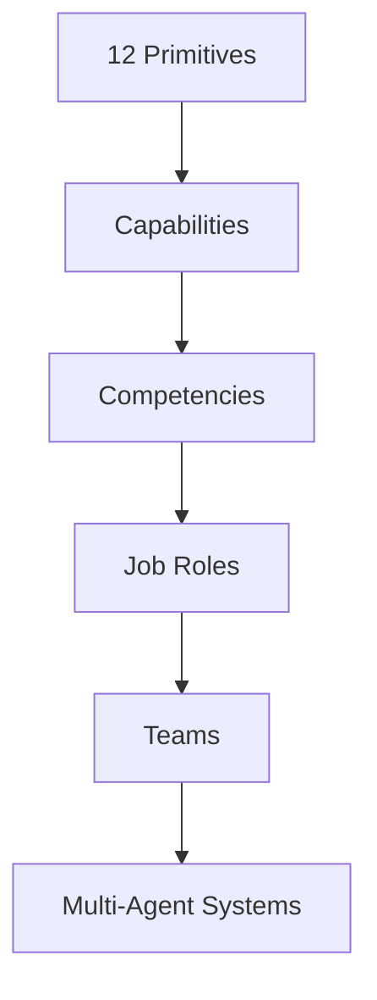

# Agent Composition Model

```mermaid
graph TB
    A[12 Primitives] --> B[Capabilities]
    B --> C[Competencies]
    C --> D[Job Roles]
    D --> E[Teams]
    E --> F[Multi-Agent Systems]
```

<!-- TODO: Fill from Gap 14 -->
