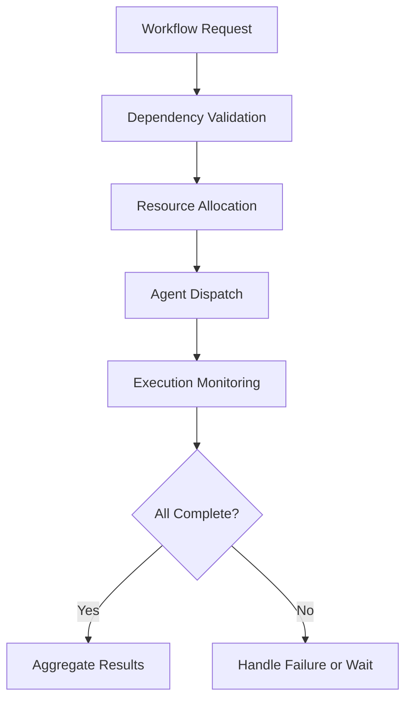

# Coordination Agents

## Role

Coordination Agents orchestrate work across agent categories, manage cross-functional workflows, resolve resource conflicts, and ensure that multi-agent operations execute in the correct sequence with the correct dependencies. They are the platform's air traffic control layer.

In a system with 12 agent categories and hundreds of individual agents, coordination is not optional -- it is the difference between a functioning multi-agent system and chaos. Coordination Agents manage the handoffs between Strategy and Operations, between Risk and Compliance, between Innovation and Finance. They enforce sequencing, detect deadlocks, and optimize resource utilization across the entire agent fleet.

## Agent Roster

| Name | Function | Trigger | Output |
|------|----------|---------|--------|
| Workflow Orchestrator | Manages multi-agent workflows with dependency tracking and sequencing | Workflow initiation event | Workflow completion record with timing |
| Resource Arbiter | Resolves conflicts when multiple agents compete for shared resources | Resource contention event | Arbitration decision with priority justification |
| Handoff Manager | Manages data and context handoffs between agents in a workflow | Agent completion event | Handoff confirmation with context integrity check |
| Deadlock Detector | Identifies and resolves circular dependencies in multi-agent workflows | Continuous (10-second intervals) | Deadlock alert with resolution recommendation |
| Priority Scheduler | Schedules agent execution across the fleet based on business priority | Scheduling cycle (1-minute) or priority change | Execution schedule with priority rankings |
| Cross-Category Coordinator | Manages workflows that span multiple agent categories | Cross-category workflow trigger | Coordination plan with category-specific assignments |
| Capacity Planner | Forecasts agent fleet capacity needs based on demand patterns | Daily forecast cycle | Capacity plan with scaling recommendations |
| Event Bus Manager | Routes events between agents with guaranteed delivery and ordering | Continuous (event-driven) | Event delivery confirmation |
| Saga Coordinator | Manages distributed transactions across multiple agents with compensation logic | Multi-agent transaction initiation | Saga completion or compensating action record |
| Health Aggregator | Monitors health of all running agents and reports fleet status | Continuous (30-second intervals) | Fleet health dashboard |
| Dependency Resolver | Validates that all dependencies for a workflow are available before execution | Workflow pre-check trigger | Dependency validation report |
| Throttle Controller | Manages rate limits across the agent fleet to prevent platform overload | Continuous (real-time) | Throttle status with queued work counts |

## Composition

Coordination Agents are **Router-heavy**: **Router + Monitor + Decider + Memory Keeper**. The Router dispatches work across agents. The Monitor tracks execution state and health. The Decider resolves conflicts and makes scheduling decisions. The Memory Keeper logs all coordination events for audit and replay.

The Workflow Orchestrator adds a **Planner** for workflow construction. The Saga Coordinator adds a **Verifier** for transaction integrity and an **Executor** for compensation actions.

## BPMN Workflow

## Integration Points

- **Core Systems**: Agent runtime, event bus, resource manager, scheduling engine
- **Marketplace Tools**: All marketplace tools (Coordination Agents are cross-cutting infrastructure)
- **Upstream Feeds**: All agent categories (Coordination receives completion events from everyone)
- **Downstream Consumers**: All agent categories (Coordination dispatches work to everyone)

## Deployment Model

Coordination Agents are deployed as **platform-level singleton services**. The Workflow Orchestrator, Event Bus Manager, and Priority Scheduler are always-on with hot standby for failover. They operate at the platform level, not the entity level -- a single Coordination layer manages all entities with strict isolation. Scaling is vertical (larger instances) rather than horizontal (more instances) to maintain global consistency.

## Revenue Model

- **Coordination is included** in platform subscription -- it is infrastructure, not a billable product
- **Advanced orchestration**: $500/month premium for custom multi-agent workflow definitions
- **Saga coordination**: $1.00 per distributed transaction managed (above 1,000/month included)
- **Priority scheduling**: $250/month premium for guaranteed priority lanes
- **Capacity planning reports**: $200 per forecast report
- **Custom event routing rules**: $100 per rule definition (one-time)
