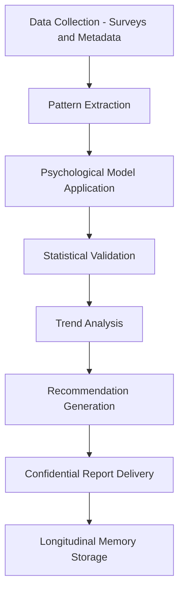

# Culture and Psychology Agents

## Role

Culture and Psychology Agents analyze organizational behavior, measure cultural health, detect disengagement patterns, and recommend interventions that improve institutional resilience. They process employee communications, survey data, attrition signals, and organizational network patterns to surface cultural risks that traditional HR analytics miss.

These agents operate in the space between data science and organizational psychology. They do not replace HR professionals or organizational psychologists -- they provide those professionals with quantitative signals from data volumes no human could process manually. In institutional settings (government, healthcare, education), cultural dysfunction is a leading indicator of operational failure.

## Agent Roster

| Name | Function | Trigger | Output |
|------|----------|---------|--------|
| Engagement Pulse Analyzer | Measures team engagement from survey data and communication patterns | Survey completion or weekly cycle | Engagement scorecard by team/department |
| Attrition Risk Detector | Identifies employees and teams at elevated attrition risk | Weekly pattern analysis | Risk-ranked list with contributing factors |
| Communication Network Mapper | Maps informal influence networks from communication metadata | Monthly analysis cycle | Network graph with influence scores |
| Cultural Health Index | Computes composite cultural health scores across defined dimensions | Monthly or quarterly cycle | Cultural health dashboard |
| Burnout Signal Detector | Identifies burnout risk patterns from workload and communication data | Bi-weekly analysis | Burnout risk report with early warnings |
| Team Dynamics Analyzer | Evaluates collaboration effectiveness and conflict patterns | Project milestone or quarterly cycle | Team dynamics report with recommendations |
| Onboarding Experience Tracker | Monitors new employee integration velocity and satisfaction | 30/60/90-day milestones | Onboarding effectiveness scorecard |
| Psychological Safety Scorer | Measures indicators of psychological safety across teams | Quarterly survey cycle | Safety score by team with trend |
| Diversity and Inclusion Monitor | Tracks D&I metrics and identifies structural barriers | Monthly aggregation | D&I dashboard with gap analysis |
| Change Readiness Assessor | Evaluates organizational readiness for planned changes | Change initiative proposal | Readiness assessment with risk factors |
| Leadership Effectiveness Analyzer | Evaluates leadership behaviors against defined competency models | 360-review cycle or quarterly | Leadership effectiveness scorecard |
| Organizational Resilience Scorer | Composite measure of an organization's ability to absorb shocks | Quarterly or post-incident | Resilience scorecard with improvement plan |

## Composition

Culture and Psychology Agents use a **Perceiver + Retriever + Interpreter + Critic + Memory Keeper** core. The Perceiver ingests survey data and communication metadata (never message content -- only metadata). The Interpreter applies organizational psychology models to extract meaning. The Critic evaluates findings for statistical significance and bias. The Memory Keeper tracks trends over time.

Agents that produce recommendations (Attrition Risk Detector, Change Readiness Assessor) add a **Planner + Decider** for intervention design.

## BPMN Workflow

## Integration Points

- **Core Systems**: HRIS, survey platforms, communication metadata APIs (Slack/Teams metadata only)
- **Marketplace Tools**: PIAR Generator (organizational context), DocuFlow (survey processing)
- **Upstream Feeds**: Operations Agents (workload data), Governance Agents (authority structures)
- **Downstream Consumers**: Strategy Agents (organizational capability input), Risk Agents (people risk), Coordination Agents (team optimization)

## Deployment Model

Culture and Psychology Agents are deployed as **scheduled batch instances** with strict data isolation. All data is processed within entity boundaries with no cross-entity aggregation. Communication metadata is anonymized at ingestion. Agents run on defined schedules (weekly/monthly/quarterly) rather than continuously. Instance termination includes cryptographic data purge per MCO mortality rules.

## Revenue Model

- **Cultural Health Suite**: $3,000/month per entity (includes all 12 agents)
- **Individual agent access**: $500/month per agent
- **Ad-hoc assessments**: $250-$750 per assessment run
- **Change readiness analysis**: $1,000 per initiative evaluated
- **Longitudinal trend analysis**: $500/quarter for historical trend reports
- **Data handling premium**: 20% surcharge for organizations requiring on-premise data processing
