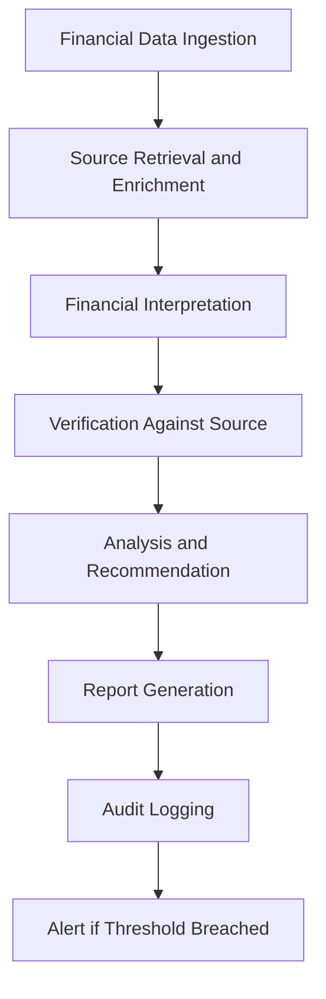

# Finance Agents

## Role

Finance Agents automate financial analysis, billing operations, cost optimization, and financial reporting for institutional clients. They process invoices, detect billing leakage, forecast revenue, reconcile accounts, and produce financial intelligence that drives margin improvement.

This category contains two of the top-5 revenue priority products: Billing Leakage Detector (30-60 day launch window) and AI Cost Optimization Engine (60-90 day launch window). Finance Agents generate measurable, dollar-denominated ROI on every invocation, making them the easiest category to sell and the fastest to demonstrate value.

## Agent Roster

| Name | Function | Trigger | Output |
|------|----------|---------|--------|
| Billing Leakage Detector | Identifies missed charges, incorrect rates, and unbilled services | Invoice batch or continuous monitoring | Leakage report with dollar recovery estimates |
| AI Cost Optimization Engine | Analyzes AI model usage and recommends cost-reduction strategies | Weekly usage aggregation or threshold breach | Optimization plan with projected savings |
| Revenue Forecaster | Projects revenue by segment, product, and entity using historical trends | Monthly cycle or significant variance | Revenue forecast with confidence intervals |
| Accounts Reconciler | Matches transactions across ledgers and flags discrepancies | Period close or continuous reconciliation | Reconciliation report with exception list |
| Expense Classifier | Categorizes expenses by GL code, cost center, and NAICS sector | Expense submission or batch import | Classified expense records |
| Budget Variance Analyzer | Compares actual spending to budget and explains variances | Period close or threshold breach | Variance analysis with root cause |
| Cash Flow Projector | Models cash flow scenarios based on receivables, payables, and commitments | Weekly cycle or liquidity event | Cash flow projection with risk scenarios |
| Pricing Optimizer | Recommends pricing adjustments based on cost, competition, and demand | Quarterly review or market event | Pricing recommendations with elasticity analysis |
| Financial Report Generator | Produces GAAP/IFRS-compliant financial statements and analyses | Period close schedule | Formatted financial reports |
| Tax Obligation Estimator | Calculates estimated tax obligations across jurisdictions | Quarterly or event-triggered | Tax estimate with jurisdiction breakdown |
| Vendor Payment Optimizer | Optimizes payment timing to maximize cash position and capture discounts | Payment batch cycle | Optimized payment schedule |
| Margin Analyzer | Calculates and trends gross/net margins by product, client, and segment | Monthly aggregation | Margin analysis with trend visualization |

## Composition

Finance Agents rely heavily on the **Retriever + Interpreter + Verifier** primitive trio. Financial data must be retrieved from authoritative sources, interpreted in context, and verified for accuracy before any output is produced. The Billing Leakage Detector adds a **Critic** to challenge potential false positives. The AI Cost Optimization Engine adds a **Planner** to sequence optimization actions.

All Finance Agents include a **Memory Keeper** for audit trail compliance and a **Monitor** for threshold-based alerting.

## BPMN Workflow

## Integration Points

- **Core Systems**: General ledger, accounts payable/receivable, billing systems, ERP
- **Marketplace Tools**: Billing Leakage Detector, AI Cost Optimization Engine, PIAR Generator
- **Upstream Feeds**: Operations Agents (transaction data), Governance Agents (policy constraints)
- **Downstream Consumers**: Strategy Agents (financial intelligence), Risk Agents (financial risk), Compliance Agents (regulatory reporting)

## Deployment Model

Finance Agents are deployed as **scheduled and event-driven instances**. Batch-oriented agents (Reconciler, Report Generator) run on period-close schedules. Event-driven agents (Billing Leakage Detector, Expense Classifier) scale with transaction volume. The AI Cost Optimization Engine runs as a long-lived instance with weekly analysis cycles. All Finance Agents maintain encrypted, entity-isolated data stores.

## Revenue Model

- **Billing Leakage Detector**: 15% of recovered leakage (performance-based) or $1,500/month flat
- **AI Cost Optimization Engine**: 10% of documented savings or $2,000/month flat
- **Financial reporting**: $100-$500 per report depending on complexity
- **Reconciliation**: $0.10 per transaction reconciled
- **Forecasting and analysis**: $200 per forecast run
- **Volume discounts**: Custom pricing for institutions processing 100K+ transactions/month
