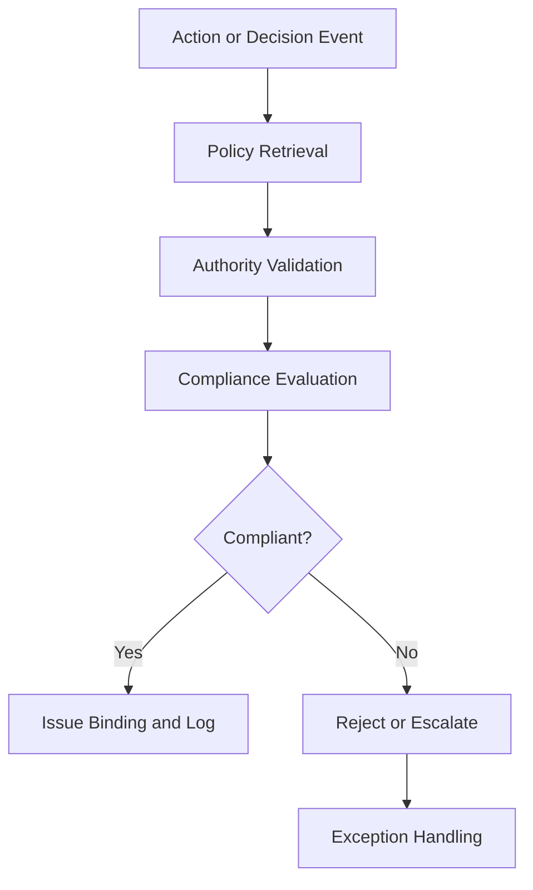

# Governance Agents

## Role

Governance Agents enforce institutional policies, track decision accountability, manage audit trails, and ensure that all AI-driven actions within the platform operate within defined authority boundaries. They are the "Fries" -- the high-margin governance layer that attaches to every operational agent.

Governance Agents implement the three core protocols: ORF (Obligation and Responsibility Finality) for decision accountability, ETLB (Execution-Time Liability Binding) for action authorization, and MCO (Mortality Compliance Object) for agent lifecycle management. Every agent on the platform interacts with at least one Governance Agent, making this category the highest-attachment, highest-margin segment.

## Agent Roster

| Name | Function | Trigger | Output |
|------|----------|---------|--------|
| ORF Enforcer | Validates that every decision has a clear obligation and responsible party | Decision event from any agent | ORF compliance record or rejection |
| ETLB Binder | Attaches liability bindings to agent actions at execution time | Execution request from any Executor | Signed ETLB binding certificate |
| MCO Lifecycle Manager | Enforces agent mortality rules -- creation, renewal, and termination | Agent lifecycle event | MCO status update or termination order |
| Policy Engine | Evaluates actions against organizational policy repositories | Action proposal from any agent | Policy compliance verdict with citations |
| Audit Trail Aggregator | Consolidates audit records across all agents into unified trails | Continuous (event-driven) | Unified audit log per process/entity |
| Authority Validator | Confirms that agents and users have the required authority for actions | Authorization request | Authority confirmation or escalation |
| Decision Lineage Tracker | Traces the full chain of reasoning from input to output for any decision | Audit request or compliance query | Decision lineage graph with timestamps |
| Governance Dashboard Agent | Produces real-time governance posture metrics across all entities | Continuous (5-minute aggregation) | Governance health dashboard |
| Policy Change Propagator | Detects policy changes and propagates updates to affected agents | Policy repository update event | Change propagation report with affected agents |
| Segregation of Duties Enforcer | Ensures no single agent or user holds conflicting authorities | Role assignment or action request | SoD compliance verdict |
| Governance Report Generator | Produces board-level governance reports on AI operations | Scheduled (monthly/quarterly) | Governance compliance report |
| Exception Manager | Handles governance exceptions with documented justification and approval | Exception request from any agent | Approved exception with conditions or denial |

## Composition

Governance Agents center on the **Verifier + Critic + Decider** primitive stack, augmented by **Memory Keeper** for audit persistence and **Monitor** for continuous compliance tracking. The Verifier confirms factual compliance. The Critic evaluates policy alignment. The Decider approves, rejects, or escalates.

The ORF Enforcer and ETLB Binder are lightweight: **Perceiver + Verifier + Decider + Memory Keeper**. The Policy Engine and Decision Lineage Tracker are heavier: **Retriever + Interpreter + Critic + Verifier + Memory Keeper + Reflector**.

## BPMN Workflow

## Integration Points

- **Core Systems**: Policy repositories, identity and access management, entity authority matrices
- **Marketplace Tools**: All marketplace offerings (Governance Agents are cross-cutting)
- **Upstream Feeds**: Every agent category (Governance is the universal middleware)
- **Downstream Consumers**: Audit systems, board reporting, regulatory filing systems

## Deployment Model

Governance Agents are deployed as **always-on singleton services** per entity. The ORF Enforcer, ETLB Binder, and MCO Lifecycle Manager run as platform-level services shared across all agents within an entity. Policy-specific agents (Policy Engine, SoD Enforcer) are instantiated per policy domain. Governance Agents are never auto-terminated -- they persist for the lifetime of the entity.

## Revenue Model

- **Governance tier subscription**: $2,500/month per entity (includes ORF, ETLB, MCO enforcement)
- **Audit trail storage**: $0.10 per 1,000 audit records retained beyond 90 days
- **Policy evaluation**: $0.25 per policy check beyond the included 10,000/month
- **Governance reports**: $200 per board-level report generation
- **Decision lineage queries**: $5 per lineage trace (complex graph traversal)
- **Margin**: 70-95% (governance is the primary profit driver)
