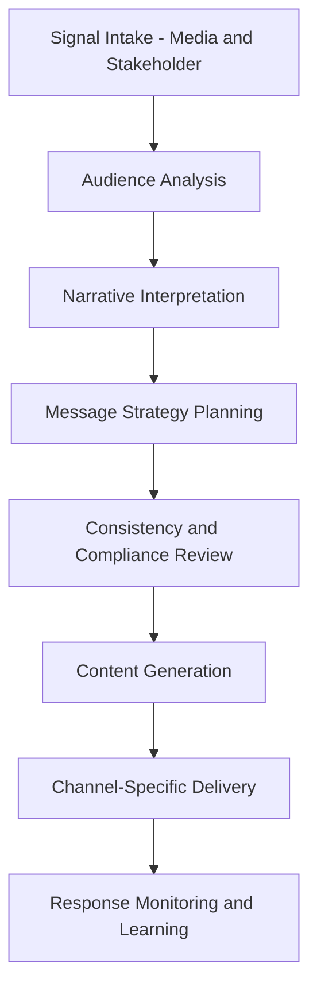

# Influence Agents

## Role

Influence Agents manage stakeholder relationships, shape narratives, coordinate communications, and optimize the institution's positioning across audiences -- regulators, partners, media, investors, and internal stakeholders. They operate at the intersection of communications strategy and data-driven audience analysis.

These agents do not fabricate or manipulate -- they ensure that institutional messaging is consistent, evidence-based, timely, and targeted to the right audiences through the right channels. In regulated industries, messaging errors carry legal and reputational consequences. Influence Agents reduce that risk by enforcing message governance and tracking stakeholder response patterns.

## Agent Roster

| Name | Function | Trigger | Output |
|------|----------|---------|--------|
| Stakeholder Mapper | Identifies and profiles key stakeholders by influence, interest, and position | Quarterly refresh or event trigger | Stakeholder map with influence scores |
| Message Consistency Enforcer | Validates that outbound communications align with approved messaging | Message draft submission | Consistency verdict with deviation flags |
| Regulatory Narrative Builder | Crafts regulatory submissions and public comments with evidence chains | Regulatory comment period or filing deadline | Draft regulatory narrative with citations |
| Media Intelligence Analyzer | Monitors media coverage and extracts sentiment, reach, and narrative trends | Continuous (hourly aggregation) | Media intelligence dashboard |
| Investor Communication Agent | Produces investor-ready materials with consistent financial narratives | Reporting cycle or material event | Investor communication drafts |
| Partnership Negotiation Prep | Analyzes counterparty positions and prepares negotiation frameworks | Pre-negotiation trigger | Negotiation brief with scenario analysis |
| Crisis Communication Agent | Generates crisis response messaging with stakeholder-specific variants | Crisis event declaration | Crisis communication package per audience |
| Public Comment Analyzer | Processes public comments on regulatory proposals at volume | Comment period close | Comment analysis report with theme extraction |
| Reputation Risk Monitor | Tracks institutional reputation signals across digital channels | Continuous (daily aggregation) | Reputation risk dashboard with alerts |
| Internal Communication Optimizer | Analyzes effectiveness of internal communications and recommends improvements | Monthly analysis cycle | Communication effectiveness report |
| Thought Leadership Generator | Produces evidence-based thought leadership content on institutional topics | Content calendar schedule | Draft content with supporting evidence |
| Channel Effectiveness Analyzer | Measures ROI of different communication channels by audience segment | Monthly aggregation | Channel effectiveness matrix |

## Composition

Influence Agents use a **Perceiver + Retriever + Interpreter + Planner + Critic + Memory Keeper** stack. The Perceiver ingests media feeds, stakeholder signals, and communication drafts. The Interpreter extracts sentiment and narrative patterns. The Planner structures communication strategies. The Critic ensures messaging consistency and compliance. The Memory Keeper tracks stakeholder relationship history.

The Crisis Communication Agent adds a **Router** for multi-audience dispatch and a **Decider** for escalation-level determination.

## BPMN Workflow

## Integration Points

- **Core Systems**: CRM, media monitoring platforms, content management systems, email/comms platforms
- **Marketplace Tools**: PIAR Generator (evidence chains), DocuFlow (regulatory filings)
- **Upstream Feeds**: Competitive Intelligence Agents (market positioning), Risk Agents (reputation risk), Culture Agents (internal sentiment)
- **Downstream Consumers**: Strategy Agents (stakeholder intelligence), Governance Agents (message compliance), Coordination Agents (campaign execution)

## Deployment Model

Influence Agents are deployed in two modes. **Continuous monitors** (Media Intelligence, Reputation Risk) run as always-on instances with hourly aggregation. **Event-driven agents** (Crisis Communication, Regulatory Narrative) are instantiated on demand and terminate after delivery. The Crisis Communication Agent has a guaranteed cold-start time of under 60 seconds with pre-warmed template caches.

## Revenue Model

- **Influence Suite**: $2,000/month per entity (includes monitoring agents)
- **Crisis communication activation**: $1,500 per crisis event (flat fee, unlimited messages)
- **Regulatory narrative generation**: $500 per filing
- **Stakeholder analysis**: $300 per stakeholder map refresh
- **Media intelligence**: $750/month for continuous monitoring with daily digests
- **Content generation**: $100-$400 per piece depending on length and research depth
