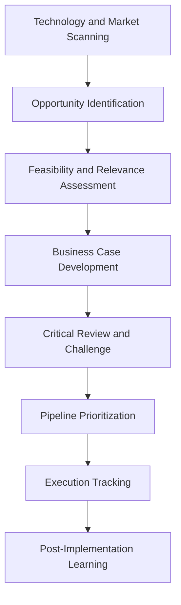

# Innovation Agents

## Role

Innovation Agents identify whitespace opportunities, evaluate emerging technologies, manage innovation pipelines, and quantify the potential impact of new initiatives. They scan the technology landscape, map capability gaps, model adoption curves, and help institutions decide where to invest their innovation budgets.

In institutional settings, innovation is not about moving fast and breaking things -- it is about making defensible bets with measurable expected returns. Innovation Agents provide the analytical rigor that transforms innovation from a buzzword into a capital allocation discipline. They connect technology trends to specific NAICS sector needs and organizational capabilities.

## Agent Roster

| Name | Function | Trigger | Output |
|------|----------|---------|--------|
| Technology Radar Agent | Scans emerging technologies and classifies by maturity and relevance | Monthly scan cycle | Technology radar with sector-specific relevance scores |
| Whitespace Identifier | Detects unserved or underserved market needs from competitive and customer data | Quarterly analysis | Whitespace map with opportunity sizing |
| Innovation Pipeline Manager | Tracks innovation initiatives from ideation through commercialization | Stage-gate event or weekly status | Pipeline dashboard with stage-gate status |
| ROI Modeler | Projects financial returns for proposed innovation investments | Investment proposal submission | ROI model with sensitivity analysis |
| Patent Strategy Agent | Recommends patent filing strategies based on competitive landscape | Invention disclosure or quarterly review | Patent strategy recommendation |
| Build vs. Buy Analyzer | Evaluates make/buy/partner options for capability acquisition | Capability need identification | Build-vs-buy decision matrix |
| Adoption Curve Modeler | Models expected adoption rates for new products and services | Product launch planning | Adoption curve projection with revenue impact |
| Innovation Metrics Tracker | Monitors innovation portfolio health using defined KPIs | Monthly aggregation | Innovation metrics dashboard |
| Technology Debt Assessor | Quantifies technical debt and prioritizes modernization investments | Annual assessment or threshold trigger | Technical debt inventory with remediation costs |
| Ecosystem Opportunity Mapper | Identifies partnership and platform opportunities in adjacent ecosystems | Quarterly scan | Ecosystem opportunity map |
| Proof of Concept Manager | Manages PoC execution tracking, success criteria, and go/no-go decisions | PoC initiation or milestone event | PoC status report with decision recommendation |
| Innovation Benchmark Agent | Compares institutional innovation metrics against industry benchmarks | Quarterly benchmark cycle | Benchmark comparison report |

## Composition

Innovation Agents use a **Retriever + Interpreter + Planner + Critic + Memory Keeper** core. The Retriever gathers technology landscape data, patent filings, and market signals. The Interpreter classifies opportunities by relevance and maturity. The Planner models investment scenarios. The Critic challenges assumptions and tests for optimism bias. The Memory Keeper tracks innovation portfolio history.

The ROI Modeler adds a **Verifier** for financial validation. The Technology Radar adds a **Perceiver + Monitor** pair for continuous technology scanning.

## BPMN Workflow

## Integration Points

- **Core Systems**: Product management tools, patent management systems, R&D project tracking
- **Marketplace Tools**: PIAR Generator (innovation impact assessment), AI Cost Optimization Engine (technology cost modeling)
- **Upstream Feeds**: Competitive Intelligence Agents (technology landscape), Strategy Agents (strategic priorities), Finance Agents (budget availability)
- **Downstream Consumers**: Strategy Agents (innovation as strategic input), Operations Agents (new capability deployment), Coordination Agents (cross-functional innovation projects)

## Deployment Model

Innovation Agents are deployed as **scheduled analysis instances** with persistent Memory Keeper state. Scanning agents (Technology Radar, Whitespace Identifier) run on monthly cycles. Pipeline management agents run continuously during active innovation periods. All innovation data is entity-isolated. Instances accumulate institutional innovation knowledge over time -- technology landscape awareness, past PoC outcomes, and organizational adoption patterns.

## Revenue Model

- **Innovation Suite**: $2,500/month per entity (includes all 12 agents)
- **Technology radar reports**: $400 per sector-specific radar
- **ROI modeling**: $500 per investment model with sensitivity analysis
- **Build-vs-buy analysis**: $750 per capability evaluated
- **Patent strategy analysis**: $1,000 per technology domain
- **Innovation benchmarking**: $400 per quarterly benchmark report
- **PoC management**: $200/month per active PoC tracked
