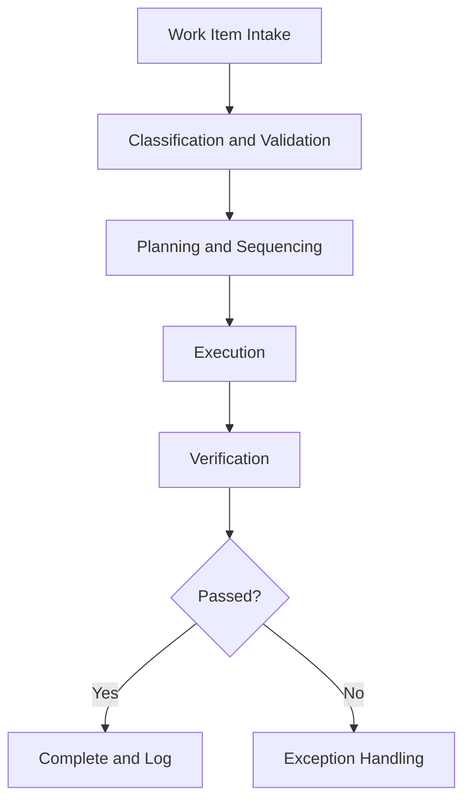

# Operations Agents

## Role

Operations Agents automate, optimize, and monitor the day-to-day execution of institutional processes. They handle document processing, workflow orchestration, resource scheduling, quality control, and operational reporting. These agents are the workhorses of the platform -- high volume, high frequency, measurable ROI per invocation.

Operations Agents are where the "Burger" economics come alive. Each agent processes discrete units of work (a document, a claim, a ticket) at costs 80% below what the institution would pay using direct provider APIs. The attachment rate to governance "Fries" layers is highest in this category because operational agents generate the most telemetry.

## Agent Roster

| Name | Function | Trigger | Output |
|------|----------|---------|--------|
| DocuFlow Processor | Classifies, extracts, and routes documents to target systems | Document upload or email receipt | Structured data + routing confirmation |
| Claims Processing Accelerator | Triages, validates, and routes insurance/benefit claims | Claim submission event | Adjudication recommendation + audit trail |
| Invoice Reconciler | Matches invoices to purchase orders and flags discrepancies | Invoice receipt or batch schedule | Reconciliation report with exception list |
| Workflow Orchestrator | Coordinates multi-step business processes across systems | Process initiation event | Process completion record with timing |
| Queue Manager | Prioritizes and distributes work items across human and agent teams | Work item arrival or SLA threshold | Prioritized queue assignments |
| SLA Monitor | Tracks operational SLAs and escalates before breach | Continuous (1-minute intervals) | SLA status dashboard + escalation alerts |
| Data Migration Agent | Validates, transforms, and loads data between systems | Migration job trigger | Migration report with error log |
| Report Generator | Produces scheduled and ad-hoc operational reports | Schedule or manual request | Formatted report (PDF/Excel/dashboard) |
| Ticket Classifier | Categorizes and routes support tickets to appropriate teams | Ticket creation event | Classification label + routing assignment |
| Batch Processor | Executes high-volume batch operations with error handling | Scheduled batch window | Batch completion report with statistics |
| Resource Scheduler | Optimizes allocation of shared resources (compute, staff, facilities) | Scheduling request or reoptimization trigger | Optimized schedule with utilization metrics |
| Quality Control Agent | Samples and evaluates operational outputs for defect rates | Sample interval or output threshold | QC scorecard with defect analysis |

## Composition

Operations Agents use the broadest primitive set: **Perceiver + Retriever + Interpreter + Planner + Executor + Monitor + Verifier + Memory Keeper**. The Perceiver handles high-volume intake. The Interpreter classifies work items. The Planner sequences multi-step operations. The Executor performs the actions. The Monitor tracks SLAs. The Verifier confirms output accuracy. The Memory Keeper logs everything for audit.

Simpler agents (Ticket Classifier, Batch Processor) use a reduced stack: **Perceiver + Interpreter + Router + Executor**.

## BPMN Workflow

## Integration Points

- **Core Systems**: Document management, ERP, CRM, ticketing, scheduling
- **Marketplace Tools**: DocuFlow, Claims Processing Accelerator, Billing Leakage Detector
- **Upstream Feeds**: Perceiver streams from all connected enterprise systems
- **Downstream Consumers**: Finance Agents (for cost tracking), Compliance Agents (for audit trails), Governance Agents (for policy enforcement)

## Deployment Model

Operations Agents are deployed as **auto-scaling pools**. Each agent type maintains a minimum instance count based on historical volume. Instances scale up during peak hours and batch windows, and scale down during off-hours. Termination is automatic after idle timeout (default: 15 minutes). Stateless agents (Ticket Classifier) scale most aggressively; stateful agents (Workflow Orchestrator) use sticky sessions.

## Revenue Model

- **Per-transaction pricing**: $0.05-$2.00 per work item depending on complexity
- **DocuFlow**: $0.50 per document processed (extraction + routing)
- **Claims Processing**: $2.00 per claim (triage + validation + routing)
- **Invoice Reconciliation**: $0.25 per invoice matched
- **Batch Processing**: $0.01 per record in batch operations
- **Volume discounts**: 20% discount above 10,000 transactions/month, 35% above 100,000
