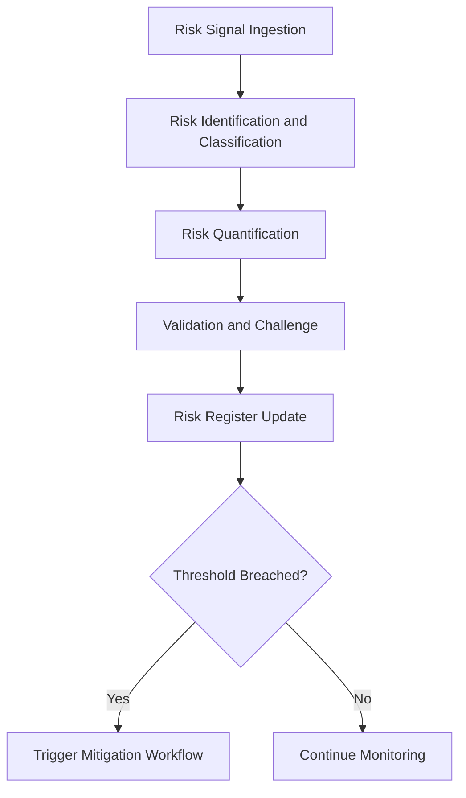

# Risk Agents

## Role

Risk Agents identify, quantify, monitor, and mitigate risks across all dimensions -- financial, operational, regulatory, reputational, cyber, and strategic. They process risk signals from internal operations and external sources, maintain risk registers, calculate exposure, and trigger mitigation workflows when thresholds are breached.

Risk management is the connective tissue between governance (which defines policy) and operations (which executes). Risk Agents make that connection quantitative and continuous rather than periodic and qualitative. For institutional clients in regulated sectors, risk management is not optional -- it is a regulatory requirement, and the quality of risk management directly impacts capital requirements and compliance costs.

## Agent Roster

| Name | Function | Trigger | Output |
|------|----------|---------|--------|
| Enterprise Risk Aggregator | Maintains a unified risk register across all risk categories | Continuous (event-driven updates) | Enterprise risk dashboard |
| Financial Risk Calculator | Quantifies financial exposure across credit, market, and liquidity risk | Daily recalculation or market event | Financial risk exposure report |
| Operational Risk Monitor | Tracks operational risk indicators (error rates, SLA breaches, incidents) | Continuous (1-minute intervals) | Operational risk scorecard with alerts |
| Regulatory Risk Scanner | Identifies upcoming regulatory changes that create compliance risk | Daily regulatory feed scan | Regulatory risk digest with impact assessment |
| Cyber Risk Assessor | Evaluates cybersecurity posture and identifies vulnerability exposure | Weekly scan or incident event | Cyber risk assessment with remediation priorities |
| Vendor Risk Evaluator | Assesses and monitors third-party vendor risk profiles | Vendor onboarding or quarterly review | Vendor risk scorecard |
| Concentration Risk Detector | Identifies dangerous concentrations (single client, vendor, or sector) | Monthly analysis or threshold breach | Concentration risk report with mitigation options |
| Scenario Stress Tester | Models risk exposure under adverse scenario conditions | Quarterly or significant event | Stress test results with capital impact |
| Risk Appetite Enforcer | Validates that activities remain within defined risk appetite boundaries | Action proposal or position change | Risk appetite compliance verdict |
| Emerging Risk Detector | Scans horizon signals for emerging risks not yet in the risk register | Weekly horizon scan | Emerging risk brief with probability assessment |
| Insurance Coverage Optimizer | Analyzes risk exposure against insurance coverage and identifies gaps | Annual renewal or risk profile change | Coverage gap analysis with recommendations |
| Risk Correlation Analyzer | Identifies hidden correlations between risk factors across categories | Quarterly deep analysis | Correlation matrix with amplification risks |

## Composition

Risk Agents use a **Perceiver + Retriever + Interpreter + Critic + Verifier + Monitor + Memory Keeper** stack. The Perceiver ingests risk signals. The Retriever pulls historical loss data and benchmarks. The Interpreter quantifies risk using actuarial and statistical models. The Critic challenges risk assessments for underestimation bias. The Verifier confirms that calculations match source data. The Monitor tracks risk metrics continuously. The Memory Keeper maintains the risk register.

The Scenario Stress Tester adds a **Planner** for scenario construction and a **Reflector** for comparing predicted vs. actual outcomes.

## BPMN Workflow

## Integration Points

- **Core Systems**: Risk register, incident management, financial systems, security tools
- **Marketplace Tools**: PIAR Generator (risk context), Billing Leakage Detector (financial risk), AI Cost Optimization Engine (cost risk)
- **Upstream Feeds**: Operations Agents (operational metrics), Finance Agents (financial data), Competitive Intelligence Agents (market risk), Compliance Agents (regulatory risk)
- **Downstream Consumers**: Strategy Agents (risk-adjusted strategy), Governance Agents (risk policy enforcement), Finance Agents (capital allocation)

## Deployment Model

Risk Agents are deployed as **always-on services** with elevated availability guarantees (99.9% uptime SLA). The Enterprise Risk Aggregator and Operational Risk Monitor are singleton instances per entity. Quantification agents (Financial Risk Calculator, Scenario Stress Tester) scale on demand during analysis periods. All Risk Agents maintain encrypted state with point-in-time recovery capability.

## Revenue Model

- **Risk Suite**: $4,000/month per entity (includes all 12 agents)
- **Enterprise risk dashboard**: $1,500/month standalone
- **Stress testing**: $500 per scenario set execution
- **Vendor risk assessments**: $200 per vendor evaluated
- **Cyber risk assessments**: $1,000 per assessment
- **Regulatory risk scanning**: $750/month for continuous monitoring
- **Custom risk model development**: $5,000-$15,000 per model (one-time)
