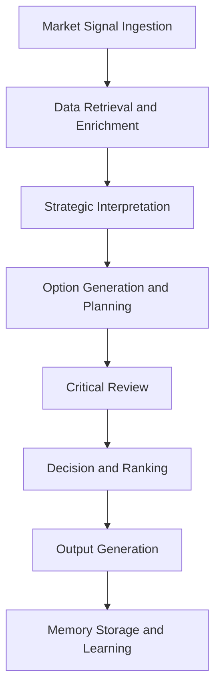

# Strategy Agents

## Role

Strategy Agents formulate, evaluate, and adapt organizational strategy at the institutional level. They ingest market data, competitive intelligence, financial performance, and regulatory signals to produce strategic recommendations, scenario analyses, and resource allocation plans.

These agents serve as the executive intelligence layer of the FrankMax platform. They do not replace human decision-makers -- they compress the time between question and informed decision from weeks to hours. Strategy Agents operate across all 8 entities and 20+ NAICS sectors, adapting their analytical frameworks to sector-specific strategic concerns.

## Agent Roster

| Name | Function | Trigger | Output |
|------|----------|---------|--------|
| Market Opportunity Scanner | Identifies underserved market segments using TAM/SAM/SOM analysis | Scheduled (weekly) or manual | Opportunity scorecard with revenue estimates |
| Competitive Position Analyzer | Maps competitive landscape and identifies strategic gaps | Competitor event or quarterly cycle | Competitive matrix with threat/opportunity ratings |
| Scenario Planner | Generates 3-5 strategic scenarios with probability-weighted outcomes | Strategic planning cycle or external shock | Scenario deck with decision trees |
| Resource Allocation Optimizer | Recommends budget and headcount allocation across strategic priorities | Budget cycle or reforecast trigger | Allocation matrix with ROI projections |
| Strategic Risk Assessor | Evaluates strategic initiatives against risk-adjusted return thresholds | Initiative proposal submission | Risk-adjusted scorecard per initiative |
| M&A Target Screener | Screens potential acquisition targets against strategic fit criteria | Quarterly or sector event trigger | Ranked target list with fit scores |
| Market Entry Evaluator | Assesses viability of entering new markets or NAICS sectors | Market entry proposal | Go/no-go recommendation with supporting analysis |
| Portfolio Rebalancer | Recommends adjustments to product/service portfolio mix | Revenue deviation or quarterly review | Rebalance recommendations with impact projections |
| Strategic KPI Tracker | Monitors progress of strategic initiatives against defined KPIs | Continuous (daily aggregation) | KPI dashboard with trend analysis |
| Partnership Evaluator | Assesses potential strategic partnerships for value alignment | Partnership opportunity identified | Partnership scorecard with term recommendations |
| Exit Strategy Planner | Models exit scenarios for underperforming initiatives or entities | Performance threshold breach | Exit plan with timeline and financial impact |
| Strategic Narrative Generator | Produces board-ready strategic narrative documents | Board meeting cycle | Strategic narrative document with supporting data |

## Composition

Strategy Agents are built from a common primitive stack: **Perceiver + Retriever + Interpreter + Planner + Decider + Memory Keeper**. The Perceiver ingests market and internal signals. The Retriever pulls historical benchmarks and competitive data. The Interpreter extracts strategic meaning. The Planner formulates options. The Decider ranks them. The Memory Keeper accumulates institutional strategic knowledge.

Higher-complexity agents (Scenario Planner, Portfolio Rebalancer) add a **Critic** for adversarial review and a **Reflector** for learning from past strategic accuracy.

## BPMN Workflow

## Integration Points

- **Core Systems**: Entity management (all 8 entities), NAICS sector ontology, financial reporting
- **Marketplace Tools**: AI Cost Optimization Engine, PIAR Generator, Billing Leakage Detector
- **Upstream Feeds**: Competitive Intelligence Agents, Finance Agents, Risk Agents
- **Downstream Consumers**: Coordination Agents, Operations Agents, Governance Agents

## Deployment Model

Strategy Agents are deployed as **long-lived instances** with persistent Memory Keeper state. Each entity gets its own instance pool. Agents are instantiated at entity onboarding, scaled horizontally during peak analysis periods (quarterly planning, annual budgeting), and terminated only when an entity churns. Strategic context accumulates over time, making older instances more valuable than new ones.

## Revenue Model

- **Base access**: Included in Governance tier subscriptions ($2,500/month per entity)
- **Strategic analysis runs**: $50-$200 per analysis depending on complexity and data sources queried
- **Scenario modeling**: $150 per scenario set (3-5 scenarios with probability weighting)
- **Board narrative generation**: $300 per document
- **Continuous KPI monitoring**: $500/month per entity for real-time strategic dashboards
