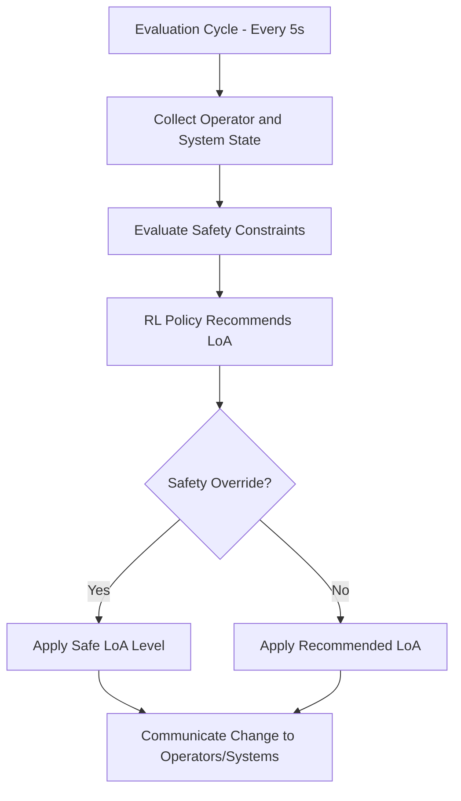

# Adaptive Automation Controller

## Purpose

The Adaptive Automation Controller dynamically adjusts the level of automation in human-machine systems based on real-time operational context. Rather than operating at a fixed automation level (fully manual or fully automated), this controller continuously modulates the balance -- increasing automation when conditions are stable and operators are fatigued, and decreasing automation when situations require human judgment, creativity, or ethical decision-making.

This addresses a critical problem in industrial AI: static automation either underwhelms (leaving routine tasks to overworked humans) or overwhelms (removing humans from the loop when their oversight is essential). The Adaptive Automation Controller uses a Levels of Automation (LoA) framework with 10 defined levels, from fully manual (Level 1) to fully autonomous (Level 10). The current LoA for each process is adjusted in real time based on inputs from the Operator Cognitive Load Monitor, Anomaly Detection for Physical Systems, production demand signals, and safety constraints defined in Smart Contract Governance.

## Architecture

The controller operates as a decision engine with a 5-second evaluation cycle. It consumes three input categories: Operator State (CLI scores, skill certifications, shift progress), System State (equipment health, anomaly alerts, throughput metrics), and Context (production urgency, quality requirements, safety mandates). A policy engine maps these inputs to LoA adjustment decisions using a combination of rule-based logic (safety-critical constraints) and reinforcement learning (optimization of throughput and quality). LoA changes are communicated to automated systems via OPC-UA command interface and to human operators via workstation displays and wearable alerts. All LoA transitions are logged to the Immutable Audit Chain for compliance traceability. A simulation sandbox allows testing LoA policies against historical production data before deployment.

## Core Capabilities

- **10-Level Automation Spectrum** -- Granular control from fully manual through shared control to fully autonomous, with defined capabilities and human roles at each level.
- **Real-Time LoA Adjustment** -- Automation level changes within 5 seconds based on operator cognitive state, equipment health, and production context.
- **Safety-First Constraints** -- Hard limits prevent automation levels that violate safety mandates, regardless of optimization pressure.
- **Reinforcement Learning Optimization** -- LoA policies improve over time by learning which automation levels produce the best outcomes for each process type.
- **Operator Transparency** -- Clear visual indicators show current LoA, reason for level, and what actions are automated vs. requiring human input.
- **Graceful Degradation** -- When automated systems fail, the controller orchestrates smooth transition to higher human involvement without production stoppage.

## BPMN Workflow

## Integration Points

| System | Integration Type | Data Flow |
|--------|-----------------|-----------|
| Operator Cognitive Load Monitor | CLI subscription | Inbound -- real-time cognitive load scores |
| Anomaly Detection for Physical Systems | Alert feed | Inbound -- equipment anomaly alerts and severity |
| Human-Robot Collaboration Orchestrator | LoA commands | Outbound -- automation level directives for task assignment |
| Smart Contract Governance | Safety policies | Inbound -- safety mandate constraints on automation levels |
| Physical KPI Feed Engine | Performance metrics | Inbound -- throughput and quality KPIs for RL optimization |
| Immutable Audit Chain | Transition logging | Outbound -- all LoA changes recorded with rationale |

## Target Audiences

- **Advanced Manufacturing** -- Flexible production lines where automation levels vary by product, shift, and demand
- **Process Industries** -- Chemical, pharmaceutical, and food processing with variable automation requirements
- **Energy** -- Power plant operations where automation level depends on grid conditions and operator availability
- **Healthcare** -- Surgical robotics where automation level adjusts based on procedure phase and surgeon preference
- **Defense** -- Mission-adaptive autonomy for human-machine teaming in dynamic environments

## Revenue Model

The Adaptive Automation Controller is priced per managed process line. Starter: 3 process lines at $6,000/month. Professional: 15 process lines with RL optimization and simulation sandbox at $20,000/month. Enterprise: unlimited process lines with custom LoA frameworks and dedicated automation engineers at $50,000/month. Implementation services for LoA framework design and safety constraint definition billed at $30,000-$100,000. Gross margin: 74%. The RL models trained on customer data are a "Kitchen" asset that compounds in value.
