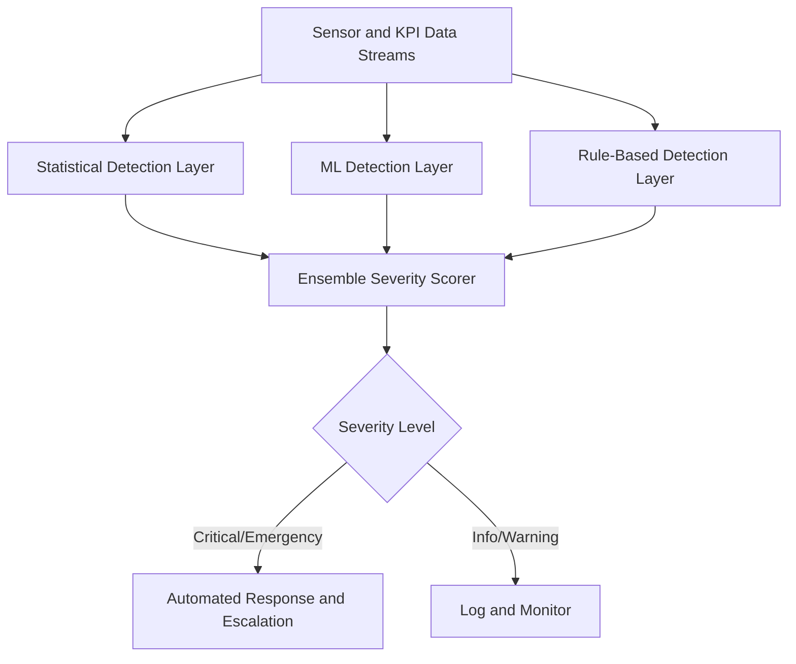

# Anomaly Detection for Physical Systems

## Purpose

Anomaly Detection for Physical Systems applies AI-powered pattern recognition to IoT sensor streams and computed KPIs to identify equipment failures, process deviations, and safety hazards before they cause costly downtime or compliance violations. This is not simple threshold alerting -- it uses multivariate statistical models and deep learning to detect subtle patterns that precede failures by hours or days.

The system continuously learns what "normal" looks like for each physical asset and process, then flags deviations that fall outside learned behavior envelopes. A bearing that vibrates 2% more than usual might be within static thresholds but outside its learned profile -- that is the kind of early warning this component provides. Every anomaly detection event is recorded on the Immutable Audit Chain, and critical anomalies trigger automated responses through Smart Contract Governance.

## Architecture

The anomaly detection engine runs as a distributed stream processing application consuming data from both the Sensor Data Ingestion Pipeline (raw signals) and the Physical KPI Feed Engine (computed metrics). Three detection layers operate in parallel: Statistical (Z-score, Isolation Forest for univariate outliers), Machine Learning (autoencoders and LSTM networks trained per-asset for multivariate pattern detection), and Rule-Based (expert-defined conditions for known failure modes). Detection results are fused through an ensemble scorer that assigns severity levels (Info, Warning, Critical, Emergency). Models retrain on a weekly cadence using the latest normal-operation data, with drift detection to prevent model staleness.

## Core Capabilities

- **Multi-Layer Detection** -- Statistical, machine learning, and rule-based detection layers operate in parallel for comprehensive anomaly coverage.
- **Per-Asset Learning** -- Individual behavior models for each physical asset, accounting for age, operating conditions, and maintenance history.
- **Predictive Lead Time** -- Typical 4-72 hour advance warning for mechanical failures, enabling planned maintenance instead of emergency response.
- **Severity Classification** -- Four-tier severity system (Info, Warning, Critical, Emergency) with configurable escalation workflows per tier.
- **Root Cause Correlation** -- When anomalies are detected across multiple sensors, the system identifies likely root causes by analyzing correlation patterns.
- **False Positive Suppression** -- Feedback loop where operator confirmations improve model precision, targeting a false positive rate below 5%.
- **Compliance-Linked Alerts** -- Anomalies that affect compliance mandates automatically flag the Mandate State Ledger and trigger governance review.

## BPMN Workflow

## Integration Points

| System | Integration Type | Data Flow |
|--------|-----------------|-----------|
| Sensor Data Ingestion Pipeline | Kafka consumer | Inbound -- raw sensor streams |
| Physical KPI Feed Engine | Kafka consumer | Inbound -- computed KPI values |
| Immutable Audit Chain | Event logging | Outbound -- anomaly detection events and severity |
| Smart Contract Governance | Alert trigger | Outbound -- critical anomalies trigger governance contracts |
| Mandate State Ledger | State update | Outbound -- compliance-affecting anomalies flagged |
| Digital Twin Data Connector | Anomaly overlay | Outbound -- anomaly visualizations on digital twin |

## Target Audiences

- **Manufacturing Operations** -- Predictive maintenance for production equipment, reducing unplanned downtime
- **Energy and Utilities** -- Early detection of grid instability, transformer degradation, and pipeline anomalies
- **Supply Chain and Logistics** -- Cold chain violation detection, vehicle fleet health monitoring
- **Healthcare Facilities** -- Critical equipment monitoring (HVAC, medical devices, power systems)
- **Insurance and Risk** -- IoT-based risk assessment for industrial underwriting

## Revenue Model

Anomaly Detection is priced per monitored asset and detection tier. Basic tier (statistical only): $50/asset/month, minimum 20 assets. Professional tier (statistical + ML): $120/asset/month with per-asset model training. Enterprise tier (full stack + custom rules): $200/asset/month with dedicated data science support. Volume discounts apply above 500 assets. This is a "Kitchen" component -- the failure library built from anomaly detections compounds daily and makes the system more valuable over time. Gross margin: 78%.
