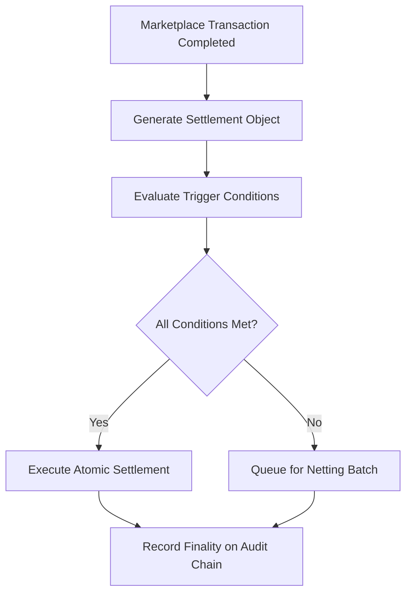

# Cross-Entity Settlement Chain

## Purpose

The Cross-Entity Settlement Chain automates financial reconciliation and obligation settlement across the 8 FrankMax entities (AINEFF, AINEF, AINEG, AINE, WGE, Frankmax, LPI, UniVenture). When an AI model sold by Frankmax uses infrastructure operated by AINEFF, compliance certified by WGE, and data governed by LPI, the revenue split, cost allocation, and liability distribution must settle automatically and verifiably.

This component eliminates the manual spreadsheet reconciliation that plagues multi-entity operations. Every marketplace transaction generates settlement obligations that are encoded as blockchain-native settlement contracts. These contracts execute automatically when all parties confirm delivery, compliance verification passes, and audit chain records are sealed. Settlement finality is achieved on-chain, creating an indisputable financial record across all entities.

## Architecture

The Cross-Entity Settlement Chain runs as a dedicated channel on the shared Hyperledger network, isolated from audit and mandate data for performance and privacy. Each marketplace transaction spawns a settlement object containing: revenue allocation rules, cost basis per entity, liability shares per ETLB binding, and payment trigger conditions. The settlement engine evaluates trigger conditions against data from the Immutable Audit Chain and Mandate State Ledger. When all conditions are satisfied, atomic multi-party transfers execute in a single block. A netting engine batches small transactions hourly to reduce on-chain overhead, with daily gross settlement for amounts exceeding $10,000.

## Core Capabilities

- **Automated Multi-Party Settlement** -- Revenue splits across 2-8 entities execute without manual reconciliation or invoice exchange.
- **Atomic Transaction Finality** -- All parties in a settlement either fully commit or fully revert; no partial settlements.
- **ETLB-Linked Liability Distribution** -- Liability costs are allocated based on the liability bindings established at AI execution time.
- **Netting Engine** -- Small-value transactions are batched hourly, reducing on-chain overhead by 85% while maintaining full auditability.
- **Dispute Resolution Protocol** -- On-chain dispute flagging with automated escalation to governance arbitration and configurable hold periods.
- **Real-Time Treasury View** -- Each entity has a live dashboard showing receivables, payables, and net position across all counterparties.

## BPMN Workflow

## Integration Points

| System | Integration Type | Data Flow |
|--------|-----------------|-----------|
| Immutable Audit Chain | Chain reference | Inbound -- transaction completion proofs |
| Smart Contract Governance | Contract trigger | Inbound -- compliance verification for settlement release |
| Mandate State Ledger | State query | Inbound -- mandate compliance status before settlement |
| Entity Treasury Systems | API integration | Outbound -- payment instructions and reconciliation data |
| ETLB Binding Engine | Liability lookup | Inbound -- liability distribution ratios per transaction |
| Financial Reporting | REST API | Outbound -- settlement summaries for entity-level accounting |

## Target Audiences

- **CFOs and Controllers** -- Automated inter-entity reconciliation eliminates month-end close delays
- **Treasury Operations** -- Real-time cash position visibility across all 8 entities
- **Internal Audit** -- On-chain settlement proof simplifies inter-company audit procedures
- **Financial Services Clients** -- Demonstrates institutional-grade financial infrastructure
- **Legal Teams** -- Dispute resolution protocol provides structured conflict management

## Revenue Model

The Cross-Entity Settlement Chain operates as internal infrastructure with costs allocated across entities based on transaction volume. External clients accessing multi-vendor AI deployments through the marketplace pay a 0.15% settlement processing fee on transactions under $100,000 and 0.08% on transactions above. Minimum monthly fee: $1,500. Dispute resolution services billed at $500 per escalation. The settlement layer drives platform stickiness -- once financial flows are on-chain, switching costs are significant.
