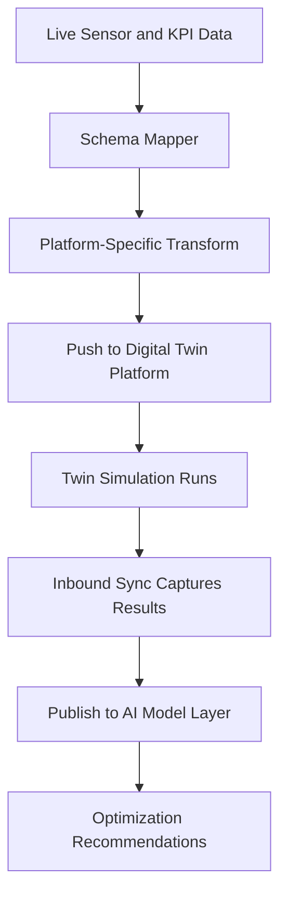

# Digital Twin Data Connector

## Purpose

The Digital Twin Data Connector synchronizes live IoT data, computed KPIs, and AI model outputs with digital twin representations of physical assets, processes, and facilities. A digital twin is only as useful as the data flowing into it -- this connector ensures that twin models reflect real-world state with sub-second latency, enabling simulation, what-if analysis, and predictive optimization grounded in actual operating conditions.

This component bridges the gap between the FrankMax IoT data layer and third-party digital twin platforms (Azure Digital Twins, AWS IoT TwinMaker, NVIDIA Omniverse, Siemens MindSphere). Rather than requiring customers to build custom integrations, the connector provides standardized adapters that map FrankMax sensor schemas and KPI outputs to twin model properties. It also flows data back from twin simulations into the marketplace AI models, creating a closed loop between physical reality, digital representation, and AI optimization.

## Architecture

The Digital Twin Data Connector operates as a bidirectional data bridge with three components. The Outbound Sync Engine subscribes to Kafka topics from the Sensor Data Ingestion Pipeline and Physical KPI Feed Engine, transforms data into twin-platform-specific formats (DTDL for Azure, TwinMaker schema for AWS, USD for Omniverse), and pushes updates via platform APIs. The Inbound Sync Engine receives simulation results and twin state changes from external platforms and publishes them as Kafka events for marketplace AI model consumption. The Schema Mapper is a configuration layer that defines relationships between FrankMax sensor/KPI schemas and twin model properties, supporting both auto-mapping and custom mapping rules.

## Core Capabilities

- **Multi-Platform Adapters** -- Pre-built connectors for Azure Digital Twins, AWS IoT TwinMaker, NVIDIA Omniverse, Siemens MindSphere, and PTC ThingWorx.
- **Sub-Second Synchronization** -- Live sensor data reflected in digital twin models within 800ms of physical measurement.
- **Bidirectional Data Flow** -- Not just data into twins, but simulation results and predictions flowing back into marketplace AI models.
- **Schema Auto-Mapping** -- Intelligent matching of FrankMax sensor schemas to twin model properties, reducing integration setup from weeks to hours.
- **Anomaly Overlay** -- Anomaly detection results from the physical systems layer are rendered as visual alerts within the digital twin environment.
- **Historical Replay** -- Feed historical sensor data into twin models for retrospective analysis and model validation.

## BPMN Workflow

## Integration Points

| System | Integration Type | Data Flow |
|--------|-----------------|-----------|
| Sensor Data Ingestion Pipeline | Kafka consumer | Inbound -- normalized sensor streams |
| Physical KPI Feed Engine | Kafka consumer | Inbound -- computed KPI values |
| Anomaly Detection for Physical Systems | Event overlay | Inbound -- anomaly alerts for twin visualization |
| Azure Digital Twins | REST/WebSocket | Outbound/Inbound -- twin property updates and simulation results |
| AWS IoT TwinMaker | REST API | Outbound/Inbound -- component updates and scene queries |
| AI Model Serving Layer | Kafka producer | Outbound -- simulation results as model input features |

## Target Audiences

- **Manufacturing and Industrial** -- Factory digital twins for production optimization and maintenance planning
- **Smart Buildings and Facilities** -- Building twins for energy optimization and space utilization
- **Energy and Utilities** -- Grid and plant twins for capacity planning and outage simulation
- **Supply Chain** -- Warehouse and logistics network twins for flow optimization
- **Engineering and Construction** -- Asset lifecycle twins from design through operations

## Revenue Model

The Digital Twin Data Connector is priced per twin instance and platform adapter. Base tier: 10 twin instances with 1 platform adapter at $3,000/month. Professional tier: 100 twin instances with 3 platform adapters at $12,000/month. Enterprise tier: unlimited twin instances and all platform adapters at $28,000/month. Custom adapter development for proprietary twin platforms billed at $15,000-$40,000 one-time. Gross margin: 80%. This component drives high platform stickiness because twin integration is complex to replicate.
