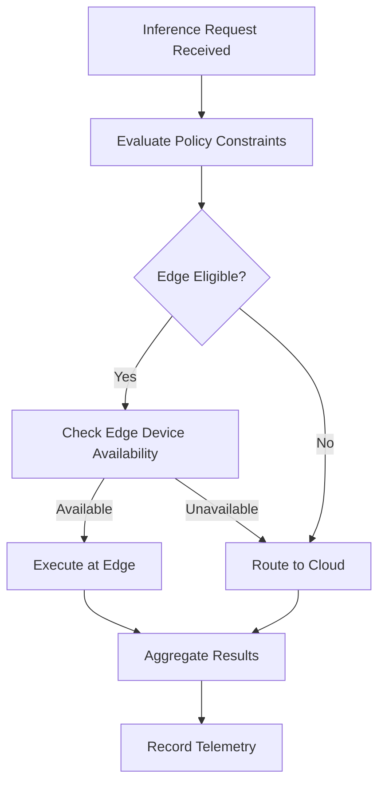

# Edge-Cloud AI Orchestrator

## Purpose

The Edge-Cloud AI Orchestrator determines where AI model inference should execute -- at the edge (on-premises, near sensors) or in the cloud (centralized, GPU-accelerated) -- based on latency requirements, data sensitivity, bandwidth constraints, and cost optimization. Not every AI workload belongs in the cloud, and not every edge device can run complex models. This orchestrator makes that decision dynamically, per inference request.

Manufacturing quality inspection needs sub-10ms inference at the production line. Regulatory compliance analysis can tolerate 2-second cloud round-trips. Patient data in a hospital may never leave the premises. The Edge-Cloud AI Orchestrator evaluates these constraints in real time and routes AI workloads to the optimal execution location, managing model deployment, version synchronization, and result aggregation across a heterogeneous compute landscape. It ensures that AI model access sold through the marketplace actually works in the physical environments where institutional customers operate.

## Architecture

The orchestrator consists of three layers. The Policy Engine defines placement rules based on latency SLAs, data residency requirements, model size, and cost budgets. The Scheduler evaluates incoming inference requests against policies and available compute resources (edge devices, on-prem GPUs, cloud instances) to select the optimal execution target. The Deployment Manager handles model distribution -- pushing optimized model artifacts (ONNX, TensorRT, TFLite) to edge devices and maintaining version parity between edge and cloud instances. A feedback loop monitors actual inference latency, accuracy, and cost against policy targets and adjusts routing decisions. Communication between edge and cloud uses gRPC with mTLS, with automatic fallback to cloud when edge devices are unavailable.

## Core Capabilities

- **Dynamic Workload Routing** -- Per-request routing decisions based on latency, cost, data sensitivity, and compute availability.
- **Multi-Format Model Deployment** -- Automatic model conversion and optimization for target hardware (ONNX for CPU, TensorRT for NVIDIA, TFLite for ARM).
- **Edge-Cloud Version Sync** -- Ensures edge-deployed models stay in sync with cloud versions, with rollback capability and A/B testing support.
- **Data Residency Enforcement** -- Guarantees that sensitive data never leaves designated geographic or network boundaries, with audit trail proof.
- **Cost Optimization** -- Routes workloads to minimize total cost of inference while meeting latency and accuracy SLAs.
- **Automatic Failover** -- If an edge device is unreachable, workloads automatically fail over to cloud with configurable degradation policies.
- **Inference Telemetry** -- Captures latency, throughput, accuracy, and cost metrics for every inference, feeding the Kitchen data layer.

## BPMN Workflow

## Integration Points

| System | Integration Type | Data Flow |
|--------|-----------------|-----------|
| Sensor Data Ingestion Pipeline | Co-located edge agents | Bidirectional -- sensor data in, inference results out |
| AI Model Marketplace | Model registry | Inbound -- model artifacts and deployment specifications |
| Smart Contract Governance | Policy enforcement | Inbound -- data residency and usage constraints |
| Immutable Audit Chain | Telemetry logging | Outbound -- inference execution records |
| Physical KPI Feed Engine | Result consumer | Outbound -- inference results feeding KPI calculations |
| Cloud GPU Infrastructure | Compute API | Bidirectional -- workload submission and result retrieval |

## Target Audiences

- **Manufacturing** -- Real-time quality inspection and process control requiring sub-10ms edge inference
- **Healthcare** -- On-premises AI execution for patient data that cannot leave hospital networks
- **Defense and Government** -- Disconnected or air-gapped environments requiring local AI execution
- **Retail and Logistics** -- Store-level and warehouse AI with intermittent connectivity
- **Energy** -- Remote site AI execution for oil rigs, wind farms, and solar installations

## Revenue Model

The Edge-Cloud AI Orchestrator is priced per managed inference endpoint. Starter tier: 10 endpoints at $2,500/month. Professional tier: 100 endpoints with advanced routing policies at $10,000/month. Enterprise tier: unlimited endpoints with dedicated edge support engineers at $30,000/month. Edge hardware reference designs and pre-configured appliances available through hardware partners at $2,000-$15,000 per device. Inference telemetry data feeds the Kitchen, creating compounding value. Gross margin: 72% (lower due to edge support costs).
