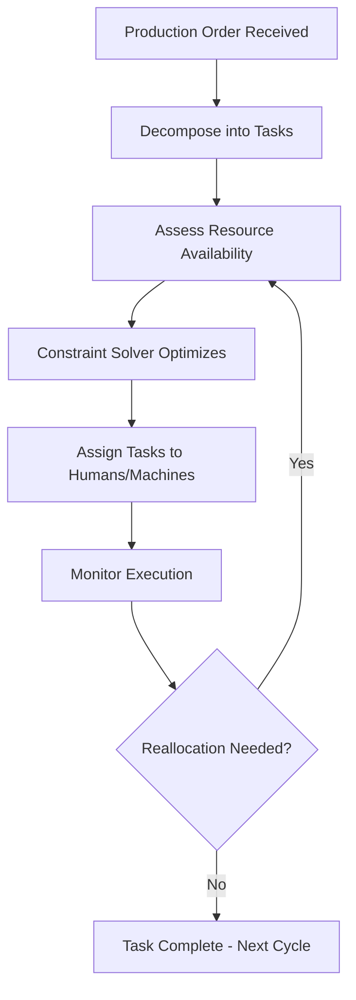

# Human-Robot Collaboration Orchestrator

## Purpose

The Human-Robot Collaboration Orchestrator manages the dynamic allocation of tasks between human workers and automated systems (robotic arms, AGVs, cobots, automated inspection stations) on manufacturing floors and in logistics operations. It decides, in real time, which tasks should be performed by humans, which by machines, and which require collaborative execution -- then coordinates handoffs to minimize idle time and maximize throughput.

This is not static automation programming. The orchestrator continuously adapts task assignments based on current production demands, worker availability and skill profiles, equipment status, and quality requirements. When a cobot encounters an edge case it cannot handle, the orchestrator reassigns to a nearby qualified human operator within seconds. When a human worker is fatigued (detected via the Operator Cognitive Load Monitor), lower-complexity tasks are shifted to automation. The goal is optimal human-machine teaming, not wholesale replacement of either.

## Architecture

The orchestrator runs as a real-time scheduling engine with three input streams: the Task Queue (production orders decomposed into discrete tasks with skill and equipment requirements), the Resource Registry (current status and capabilities of all human operators and automated systems), and the Context Feed (real-time sensor data, quality metrics, and cognitive load indicators). A constraint-satisfaction solver evaluates possible task-resource assignments every 5 seconds, optimizing for throughput, quality, safety, and worker well-being. Assignments are communicated to humans via wearable displays or workstation screens and to automated systems via standard industrial protocols (OPC-UA, ROS2). A simulation module allows testing new assignment strategies against historical production data before deployment.

## Core Capabilities

- **Dynamic Task Assignment** -- Real-time reallocation of tasks between humans and machines based on changing conditions, not static programming.
- **Skill-Based Routing** -- Tasks are matched to human operators by certified skill level and to automated systems by validated capability envelope.
- **Seamless Handoff Coordination** -- When tasks transfer between human and machine (or vice versa), the orchestrator manages spatial, temporal, and quality handoff protocols.
- **Safety Zone Management** -- Enforces collaborative workspace safety boundaries, adjusting robot speed and path when humans enter shared zones.
- **Fatigue-Aware Scheduling** -- Integrates with the Operator Cognitive Load Monitor to reduce task complexity for fatigued workers and shift load to automation.
- **Production Simulation** -- Test new collaboration strategies against historical data before deploying to live production.

## BPMN Workflow

## Integration Points

| System | Integration Type | Data Flow |
|--------|-----------------|-----------|
| Operator Cognitive Load Monitor | Real-time feed | Inbound -- fatigue and cognitive state indicators |
| Sensor Data Ingestion Pipeline | Equipment telemetry | Inbound -- robot status, conveyor speed, station availability |
| Adaptive Automation Controller | Policy sync | Bidirectional -- automation level adjustments |
| Physical KPI Feed Engine | Performance metrics | Outbound -- collaboration efficiency KPIs |
| Smart Contract Governance | Safety compliance | Inbound -- safety mandate enforcement for human-machine zones |
| Resilient Manufacturing Coordinator | Production orders | Inbound -- task queue and priority assignments |

## Target Audiences

- **Discrete Manufacturing** -- Automotive, electronics, and aerospace assembly lines with mixed human-robot workflows
- **Logistics and Warehousing** -- Order fulfillment centers with collaborative picking, packing, and sorting
- **Food and Beverage** -- Processing lines where human judgment and machine speed must coexist
- **Healthcare** -- Surgical robotics coordination and laboratory automation
- **Defense and Aerospace** -- Maintenance, repair, and overhaul operations with human-machine teaming

## Revenue Model

The Human-Robot Collaboration Orchestrator is priced per managed workspace (defined as a collaborative zone with humans and automated systems). Starter: 5 workspaces at $5,000/month. Professional: 25 workspaces with simulation module at $18,000/month. Enterprise: unlimited workspaces with custom solver constraints at $45,000/month. Integration services for connecting to existing MES and robotic systems billed at $20,000-$80,000 one-time. Gross margin: 76%. High switching costs once deployed into production workflows.
