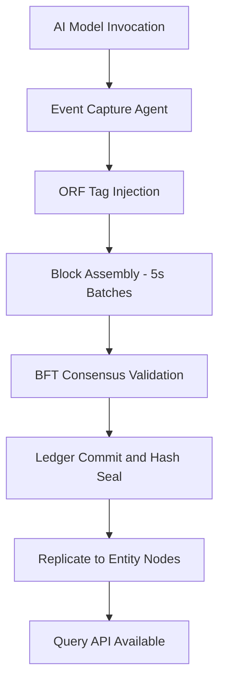

# Immutable Audit Chain

## Purpose

The Immutable Audit Chain is the foundational blockchain layer that records every AI model invocation, governance decision, and compliance event as a tamper-proof ledger entry. Every action taken across the FrankMax Marketplace -- from model selection to output delivery -- receives a cryptographic hash anchored to a distributed ledger, ensuring that no entity can retroactively alter operational history.

This component directly enforces the ORF (Obligation and Responsibility Finality) protocol by creating permanent, timestamped records of who authorized what, when, and under which compliance mandate. When regulators, auditors, or internal governance teams need to reconstruct a decision chain, the Immutable Audit Chain provides a single source of truth that withstands legal scrutiny across all 8 FrankMax entities.

## Architecture

The Immutable Audit Chain sits between the AI Execution Layer and the Governance Engine. Every API call that passes through the marketplace gateway generates an audit event. These events are batched into blocks at 5-second intervals, hashed using SHA-256, and appended to a permissioned Hyperledger-based chain shared across AINEFF, AINEF, AINEG, AINE, WGE, Frankmax, LPI, and UniVenture. The chain uses a BFT consensus mechanism optimized for low-latency enterprise workloads, achieving finality in under 2 seconds. Read replicas are distributed to each entity's compliance node for local query performance.

## Core Capabilities

- **Tamper-Proof Event Recording** -- Every AI invocation, parameter change, and governance decision is cryptographically sealed and immutable once committed.
- **ORF Protocol Compliance** -- Automatically tags each ledger entry with obligation ownership, responsibility assignment, and finality timestamp per ORF specification.
- **Cross-Entity Visibility** -- All 8 entities share a unified audit view while maintaining entity-level access controls and data partitioning.
- **Regulatory Export** -- One-click generation of audit reports in formats required by SOC 2, ISO 27001, HIPAA, and sector-specific regulators.
- **Real-Time Query API** -- Sub-200ms query latency for audit lookups by transaction ID, entity, time range, or compliance mandate.
- **Chain-of-Custody Proof** -- Generates verifiable proof certificates that demonstrate unbroken custody of data from ingestion through model output.
- **Retention Policy Enforcement** -- Configurable retention windows (7 years default) with automated archival to cold storage and hash-only stubs on the active chain.

## BPMN Workflow

## Integration Points

| System | Integration Type | Data Flow |
|--------|-----------------|-----------|
| AI Execution Gateway | Event hook | Inbound -- model invocation metadata |
| Governance Engine | Bidirectional API | Inbound/Outbound -- mandate status, compliance flags |
| Smart Contract Governance | Chain reference | Outbound -- audit hashes for contract validation |
| Cross-Entity Settlement Chain | Ledger link | Outbound -- settlement proof anchors |
| Regulatory Export Service | REST API | Outbound -- formatted audit reports |
| ETLB Binding Engine | Event subscription | Inbound -- liability assignment records |

## Target Audiences

- **Chief Compliance Officers** -- Primary consumers of audit trail data for regulatory filings
- **Internal Audit Teams** -- Use query API for investigation and spot-check workflows
- **Legal and Risk** -- Chain-of-custody proofs for litigation readiness
- **Government and Public Sector** -- Mandatory audit trail requirements for public AI procurement
- **Financial Services** -- SOX and Basel III compliant record-keeping

## Revenue Model

The Immutable Audit Chain is a core "Fries" component with 85% gross margins. Pricing follows a tiered volume model: Base tier includes 10,000 audit events/month at $2,500/month. Growth tier covers up to 500,000 events at $8,500/month. Enterprise tier offers unlimited events with dedicated consensus nodes at $25,000/month. Regulatory export add-on packages start at $1,500/month per compliance framework. Every AI model purchase (the "Burger") automatically generates audit events, driving mandatory attachment.
