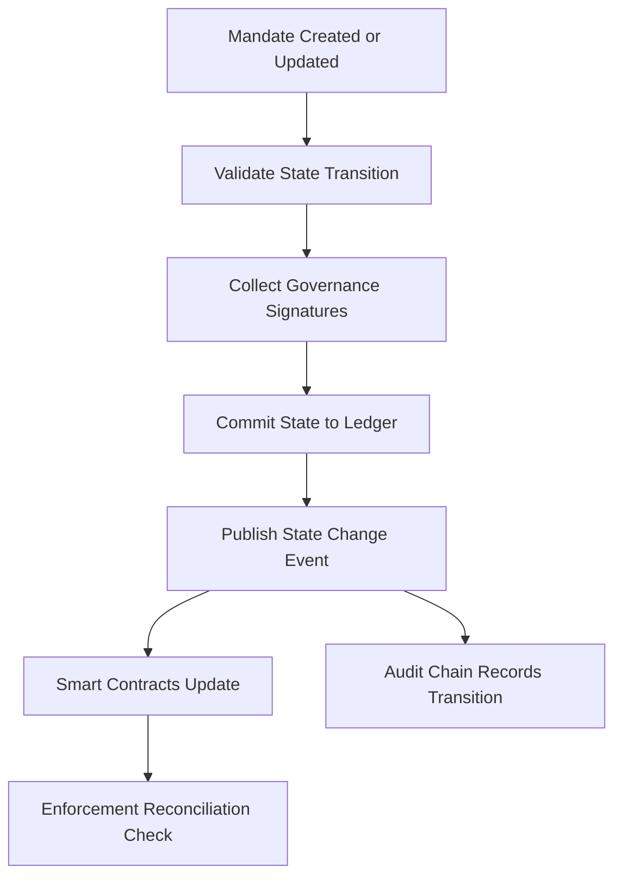

# Mandate State Ledger

## Purpose

The Mandate State Ledger tracks the real-time status of every regulatory mandate, compliance obligation, and governance directive across the FrankMax ecosystem. It answers the question every compliance officer dreads: "Which mandates apply to this AI deployment right now, and are we in compliance?" The ledger maintains a living state machine for each mandate, recording transitions from draft to active to fulfilled to expired.

Unlike static compliance checklists, the Mandate State Ledger reacts to external regulatory changes, internal policy updates, and cross-entity obligation transfers in real time. When a new NAICS sector regulation takes effect or an entity restructures its AI portfolio, the ledger propagates state changes to every affected smart contract, audit record, and settlement agreement within seconds. This is the single source of truth for "what rules apply where."

## Architecture

The Mandate State Ledger is a state-machine layer built on the same Hyperledger infrastructure as the Immutable Audit Chain but optimized for mutable state queries rather than append-only history. Each mandate is represented as a finite state machine with defined transitions (Draft, Pending Approval, Active, Suspended, Fulfilled, Expired, Revoked). State transitions require cryptographic signatures from authorized governance roles. The ledger publishes state change events via a message bus that Smart Contract Governance and the ORF engine subscribe to. A reconciliation daemon runs every 60 seconds to detect drift between mandate state and actual enforcement.

## Core Capabilities

- **Real-Time Mandate Tracking** -- Every regulatory obligation across 20+ NAICS sectors is tracked with sub-minute state freshness.
- **State Machine Enforcement** -- Invalid state transitions (e.g., skipping from Draft to Fulfilled) are rejected at the protocol level.
- **Cross-Entity Mandate Propagation** -- When AINEFF accepts a mandate, downstream obligations automatically cascade to AINEG, WGE, and other entities as defined in the ORF protocol.
- **Regulatory Change Ingestion** -- External regulatory feeds are parsed and mapped to existing mandates, triggering state transitions or new mandate creation.
- **Mandate Dependency Graphs** -- Visual and queryable dependency maps showing which mandates block or enable other mandates.
- **Compliance Gap Detection** -- Automated identification of mandates without corresponding smart contracts or enforcement mechanisms.
- **Historical State Replay** -- Reconstruct the exact mandate state at any point in time for audit or litigation purposes.

## BPMN Workflow

## Integration Points

| System | Integration Type | Data Flow |
|--------|-----------------|-----------|
| Smart Contract Governance | Event subscription | Outbound -- mandate state changes trigger contract updates |
| Immutable Audit Chain | Append event | Outbound -- all state transitions recorded as audit events |
| ORF Protocol Engine | Bidirectional API | Bidirectional -- obligation assignments and finality confirmations |
| Regulatory Feed Ingestion | Webhook | Inbound -- external regulatory updates |
| Cross-Entity Settlement Chain | State query | Outbound -- mandate status for settlement validation |
| Governance Dashboard | REST API | Outbound -- real-time mandate status visualization |

## Target Audiences

- **Regulatory Affairs Teams** -- Track mandate status across all 20+ NAICS sectors from a single ledger
- **Chief Compliance Officers** -- Real-time compliance posture across all 8 entities
- **Government and Public Sector** -- Demonstrate mandate adherence for public AI procurement
- **Healthcare and Life Sciences** -- FDA, HIPAA, and state-level mandate tracking
- **Financial Services** -- Basel III, SOX, FINRA mandate lifecycle management

## Revenue Model

The Mandate State Ledger is bundled with Smart Contract Governance at the Professional tier and above. Standalone access starts at $4,000/month for up to 200 active mandates. Enterprise tier at $18,000/month supports unlimited mandates with regulatory feed integration and custom state machine definitions. The regulatory change ingestion feed is an add-on at $2,000/month per jurisdiction. Gross margin: 88%.
