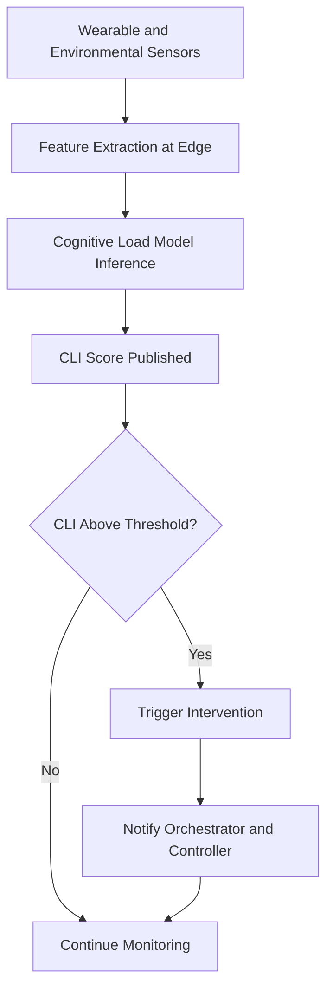

# Operator Cognitive Load Monitor

## Purpose

The Operator Cognitive Load Monitor tracks the mental workload, fatigue levels, and attention state of human operators working alongside AI systems and automated equipment. In high-stakes environments -- manufacturing floors, control rooms, surgical suites, logistics hubs -- human cognitive overload leads to errors, accidents, and quality failures. This component makes cognitive state a measurable, actionable input to operational decisions.

The monitor fuses data from multiple sources: wearable biosensors (heart rate variability, galvanic skin response), eye tracking systems, task performance metrics (error rates, response times), and environmental factors (noise, temperature, shift duration). A multimodal AI model converts these signals into a Cognitive Load Index (CLI) score from 0-100 for each operator, updated every 10 seconds. This score feeds into the Human-Robot Collaboration Orchestrator and Adaptive Automation Controller, enabling the system to automatically reduce task complexity, trigger break recommendations, or shift workload to automated systems when operators approach dangerous fatigue levels.

## Architecture

The monitor architecture has four layers. The Sensor Layer collects data from wearable devices (smartwatches, EEG headbands, eye trackers) and environmental sensors via Bluetooth LE and the Sensor Data Ingestion Pipeline. The Feature Extraction Layer computes physiological features (HRV metrics, blink rate, pupil dilation patterns) and behavioral features (keystroke dynamics, response latency, error frequency) in real time. The Inference Layer runs a per-operator cognitive load model that produces the CLI score, calibrated during an initial baseline session and continuously refined. The Action Layer publishes CLI scores to subscribing systems and triggers configurable interventions (break alerts, task reassignment, automation escalation) based on threshold policies.

## Core Capabilities

- **Cognitive Load Index (CLI)** -- Composite 0-100 score combining physiological, behavioral, and environmental indicators, updated every 10 seconds per operator.
- **Multi-Sensor Fusion** -- Combines wearable biosensors, eye tracking, task performance, and environmental data for robust cognitive state estimation.
- **Per-Operator Calibration** -- Individual baseline profiles account for personal differences in stress response, fatigue patterns, and cognitive capacity.
- **Proactive Intervention Triggers** -- Configurable thresholds that automatically initiate break recommendations, task reassignment, or automation escalation.
- **Shift Pattern Analysis** -- Identifies cognitive load trends across shifts, days, and weeks to optimize scheduling and rotation policies.
- **Privacy-Preserving Design** -- Raw biometric data is processed at the edge and only aggregate CLI scores are transmitted, with full operator consent management.
- **Compliance Documentation** -- Generates OSHA-compatible fatigue management records for regulatory compliance.

## BPMN Workflow

## Integration Points

| System | Integration Type | Data Flow |
|--------|-----------------|-----------|
| Sensor Data Ingestion Pipeline | Edge collection | Inbound -- wearable and environmental sensor data |
| Human-Robot Collaboration Orchestrator | CLI feed | Outbound -- cognitive load scores for task reassignment |
| Adaptive Automation Controller | CLI feed | Outbound -- fatigue indicators for automation level adjustment |
| Physical KPI Feed Engine | Operator KPIs | Outbound -- workforce cognitive load KPIs |
| Immutable Audit Chain | Compliance logging | Outbound -- intervention events and CLI history |
| Sustainability and Circularity Optimizer | Workforce wellness | Outbound -- aggregate fatigue data for sustainability reporting |

## Target Audiences

- **Manufacturing Operations** -- Production line operators, quality inspectors, and machine operators in high-attention roles
- **Energy and Utilities** -- Control room operators managing critical infrastructure
- **Healthcare** -- Surgeons, nurses, and lab technicians during extended procedures
- **Transportation and Logistics** -- Forklift operators, crane operators, and dispatchers
- **Defense** -- Command center operators and field maintenance technicians

## Revenue Model

The Operator Cognitive Load Monitor is priced per monitored operator. Basic tier (task performance metrics only): $75/operator/month, minimum 20 operators. Professional tier (wearables + task metrics): $150/operator/month with per-operator calibration. Enterprise tier (full multimodal fusion + shift analysis): $250/operator/month with dedicated occupational health analytics. Wearable device partnerships provide hardware at cost to reduce adoption friction. This is a "Kitchen" component -- the cognitive load dataset grows more valuable with scale. Gross margin: 70%.
