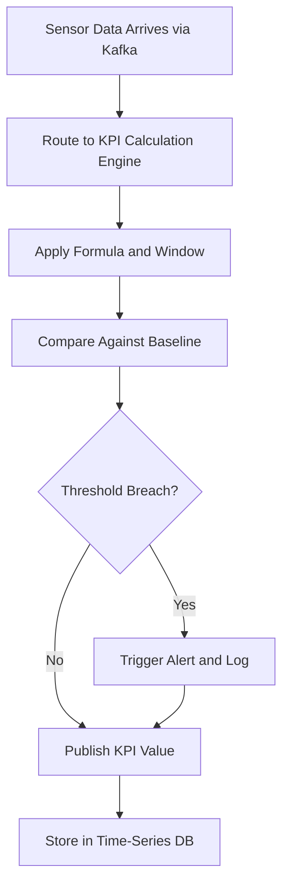

# Physical KPI Feed Engine

## Purpose

The Physical KPI Feed Engine transforms raw sensor data streams into calculated, business-meaningful Key Performance Indicators for physical operations. Raw temperature readings, vibration frequencies, and throughput counts mean nothing to a COO -- but Overall Equipment Effectiveness (OEE), Mean Time Between Failures (MTBF), and energy cost per unit produced are decision-driving metrics.

This engine sits between the Sensor Data Ingestion Pipeline and the AI model layer, computing KPIs in real time using configurable formulas and industry-standard calculation methodologies. It maintains rolling windows, historical baselines, and threshold alerts so that AI models and human operators work from the same standardized metrics. The KPI library covers 200+ pre-built indicators across manufacturing, logistics, energy, and facilities management, with support for custom KPI definitions.

## Architecture

The Physical KPI Feed Engine is a stream processing application built on Apache Flink, consuming normalized sensor data from Kafka topics. KPI definitions are stored as declarative YAML configurations specifying input sensors, calculation formulas, window sizes, and output destinations. The engine supports tumbling windows (fixed intervals), sliding windows (overlapping), and session windows (activity-based). Computed KPIs are published to a dedicated Kafka topic and persisted to a time-series database (TimescaleDB) for historical queries. A KPI Registry service manages definitions, versioning, and access controls. Real-time KPI values are also pushed to the Governance Dashboard and available via WebSocket subscriptions.

## Core Capabilities

- **200+ Pre-Built KPI Library** -- Industry-standard indicators for OEE, MTBF, MTTR, energy intensity, throughput yield, and more across manufacturing, logistics, and energy sectors.
- **Real-Time Computation** -- KPIs calculated within 2 seconds of sensor data arrival, enabling operational decisions at machine speed.
- **Custom KPI Builder** -- Drag-and-drop formula editor for defining organization-specific KPIs using any combination of sensor inputs and mathematical operations.
- **Historical Baseline Engine** -- Automatically maintains rolling 30/60/90-day baselines for every KPI, enabling trend detection and anomaly flagging.
- **Threshold Alerting** -- Configurable alert rules (absolute thresholds, percentage deviations, rate-of-change triggers) with multi-channel notification.
- **KPI Provenance** -- Every computed KPI value links back to the exact sensor readings and formula version that produced it.
- **NAICS Sector Templates** -- Pre-configured KPI packages aligned to specific NAICS sector requirements for rapid deployment.

## BPMN Workflow

## Integration Points

| System | Integration Type | Data Flow |
|--------|-----------------|-----------|
| Sensor Data Ingestion Pipeline | Kafka consumer | Inbound -- normalized sensor data streams |
| Anomaly Detection for Physical Systems | KPI feed | Outbound -- computed KPIs as anomaly detection inputs |
| Digital Twin Data Connector | API push | Outbound -- real-time KPI overlays for digital twin visualization |
| Governance Dashboard | WebSocket | Outbound -- live KPI values and alert status |
| Immutable Audit Chain | Event logging | Outbound -- KPI computation audit trail |
| AI Model Serving Layer | Feature store | Outbound -- KPI values as model input features |

## Target Audiences

- **Manufacturing Operations** -- OEE, throughput, quality yield, and equipment performance tracking
- **Supply Chain and Logistics** -- On-time delivery, inventory turnover, and transportation efficiency metrics
- **Energy and Utilities** -- Generation efficiency, grid stability, and consumption optimization indicators
- **Facilities Management** -- Building energy performance, HVAC efficiency, and occupancy utilization
- **C-Suite and Operations Leadership** -- Executive dashboards with drill-down from summary KPIs to raw sensor data

## Revenue Model

The Physical KPI Feed Engine is priced per active KPI and computation volume. Starter tier: 50 active KPIs at $2,000/month. Professional tier: 500 active KPIs with custom KPI builder at $7,500/month. Enterprise tier: unlimited KPIs with NAICS sector templates and dedicated computation resources at $22,000/month. Custom KPI development services billed at $2,500 per KPI definition. The engine is a high-margin "Fries" component at 82% gross margin, with strong attachment to the Sensor Data Ingestion Pipeline.
