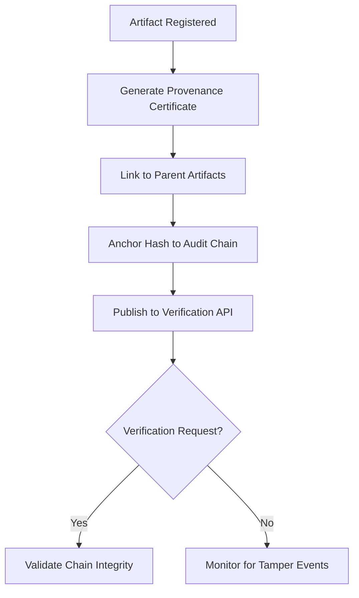

# Provenance Verification Network

## Purpose

The Provenance Verification Network traces the complete lineage of every AI model, dataset, and output in the FrankMax Marketplace. It answers the critical question: "Where did this model come from, what data trained it, who modified it, and what outputs has it produced?" Every artifact in the marketplace carries a cryptographic provenance certificate that chains back to its origin.

This is not optional metadata -- it is a regulatory requirement for institutional AI deployment. When a healthcare organization uses an AI model for clinical decision support, regulators demand proof of training data lineage, model version history, and output traceability. The Provenance Verification Network provides this proof on-chain, making it verifiable by any third party without requiring access to proprietary systems. It transforms AI model trust from "take our word for it" to "verify it yourself."

## Architecture

The Provenance Verification Network operates as a directed acyclic graph (DAG) overlay on the blockchain infrastructure. Each node in the DAG represents an artifact (model, dataset, configuration, output) with edges representing derivation relationships (trained-on, fine-tuned-from, generated-by). Provenance certificates are issued at each transformation step and anchored to the Immutable Audit Chain. The network supports both FrankMax-internal artifacts and third-party models onboarded to the marketplace, with attestation requirements varying by trust level. A verification API allows external parties to validate any provenance chain in under 3 seconds.

## Core Capabilities

- **End-to-End Model Lineage** -- Complete chain from training data source through model versions to production outputs, all cryptographically linked.
- **Third-Party Attestation** -- External model providers submit provenance declarations that are verified and anchored alongside internal artifacts.
- **Output Traceability** -- Every AI-generated output can be traced back to the exact model version, input data, and configuration that produced it.
- **Provenance Certificate API** -- Third parties verify artifact lineage without accessing internal systems, enabling zero-trust AI supply chain management.
- **Tamper Detection** -- Any modification to a registered artifact triggers automatic re-verification and alerts if provenance chain integrity is broken.
- **Regulatory Provenance Reports** -- Pre-formatted reports for FDA (SaMD), EU AI Act, and NIST AI RMF provenance requirements.

## BPMN Workflow

## Integration Points

| System | Integration Type | Data Flow |
|--------|-----------------|-----------|
| Immutable Audit Chain | Hash anchor | Outbound -- provenance hashes committed to audit ledger |
| AI Model Marketplace | Registration hook | Inbound -- new model and dataset registrations |
| Smart Contract Governance | Provenance check | Outbound -- lineage verification before contract execution |
| Third-Party Model Providers | Attestation API | Inbound -- external provenance declarations |
| Regulatory Export Service | REST API | Outbound -- formatted provenance reports |
| Digital Twin Data Connector | Lineage link | Inbound -- physical-world data source provenance |

## Target Audiences

- **Healthcare and Life Sciences** -- FDA SaMD requirements demand full model and data provenance
- **Government and Defense** -- Supply chain integrity verification for AI models in sensitive applications
- **Financial Services** -- Model risk management (SR 11-7) requires documented model lineage
- **AI/ML Engineering Teams** -- Reproducibility and debugging through complete artifact lineage
- **Procurement Officers** -- Verify vendor AI model claims before institutional deployment

## Revenue Model

Provenance Verification Network is a "Kitchen" component that compounds in value as more artifacts are registered. Pricing: Standard tier at $3,500/month covers 1,000 tracked artifacts with basic lineage. Professional tier at $10,000/month supports 25,000 artifacts with third-party attestation and regulatory reports. Enterprise tier at $30,000/month offers unlimited artifacts with dedicated verification nodes. Per-verification API calls for external parties: $0.10 each, creating a network-effect revenue stream. Gross margin: 92%.
