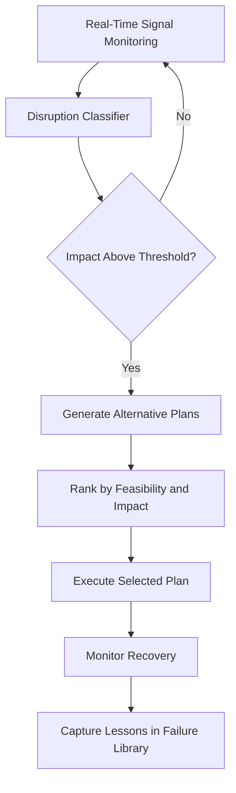

# Resilient Manufacturing Coordinator

## Purpose

The Resilient Manufacturing Coordinator ensures production continuity when disruptions occur -- equipment failures, supply chain delays, demand spikes, workforce shortages, or quality excursions. It acts as the central nervous system for manufacturing operations, continuously evaluating production plans against real-time conditions and executing contingency responses within minutes rather than the hours or days typical of manual replanning.

This component synthesizes inputs from across the entire IoT and Human-Machine layer: equipment health from Anomaly Detection, operator availability from the Cognitive Load Monitor, material status from sensor feeds, and quality metrics from the KPI engine. When disruptions are detected, it generates and evaluates alternative production plans, considering equipment reconfiguration, order reprioritization, supplier substitution, and workforce redeployment. The selected plan is executed through the Human-Robot Collaboration Orchestrator and Adaptive Automation Controller, creating a closed-loop resilience system that adapts faster than human planners can react.

## Architecture

The coordinator is built on a three-phase resilience loop. The Detection Phase ingests real-time signals from all IoT and human-machine components, running a disruption classifier that categorizes events by type, severity, and estimated production impact. The Planning Phase activates when a disruption exceeds configurable impact thresholds, generating alternative production plans using a constraint-based optimizer that considers available resources, order priorities, quality requirements, and contractual obligations. The Execution Phase pushes the selected plan to downstream systems: task reassignment through the Human-Robot Collaboration Orchestrator, automation level adjustments through the Adaptive Automation Controller, and schedule updates to ERP systems via standard APIs. A post-disruption analysis module captures lessons learned into the Kitchen failure library.

## Core Capabilities

- **Real-Time Disruption Detection** -- Classifies disruptions within 30 seconds using fused signals from equipment sensors, supply chain feeds, and workforce systems.
- **Automated Contingency Planning** -- Generates 3-5 alternative production plans within 2 minutes of disruption detection, ranked by feasibility and business impact.
- **Cross-System Execution** -- Pushes selected contingency plans to task orchestration, automation control, and ERP systems for coordinated response.
- **Supply Chain Integration** -- Monitors supplier delivery status and automatically triggers alternative sourcing when delays are detected.
- **Order Reprioritization** -- Dynamically reorders production queue based on customer priority, contractual penalties, and material availability.
- **Post-Disruption Learning** -- Every disruption and response is cataloged in the failure library, improving future detection speed and plan quality.

## BPMN Workflow

## Integration Points

| System | Integration Type | Data Flow |
|--------|-----------------|-----------|
| Anomaly Detection for Physical Systems | Alert subscription | Inbound -- equipment failure and degradation alerts |
| Operator Cognitive Load Monitor | Workforce status | Inbound -- operator availability and cognitive state |
| Human-Robot Collaboration Orchestrator | Task commands | Outbound -- reassigned task schedules and priorities |
| Adaptive Automation Controller | LoA directives | Outbound -- automation level adjustments for contingency |
| Physical KPI Feed Engine | Performance metrics | Inbound -- production throughput and quality KPIs |
| ERP Systems | API integration | Bidirectional -- production schedules, material availability, order status |

## Target Audiences

- **Discrete Manufacturing** -- Automotive, electronics, and consumer goods with complex multi-line production
- **Process Manufacturing** -- Chemical, pharmaceutical, and food processing where disruptions have cascading effects
- **Aerospace and Defense** -- Low-volume, high-value production with zero tolerance for schedule slippage
- **Supply Chain Operations** -- Distribution centers and logistics networks requiring rapid disruption response
- **Operations Leadership** -- COOs and VP Manufacturing seeking quantifiable resilience improvement

## Revenue Model

The Resilient Manufacturing Coordinator is the flagship product of the Human-Machine layer, priced per production facility. Starter: single facility with basic disruption detection at $8,000/month. Professional: up to 5 facilities with automated contingency planning and ERP integration at $28,000/month. Enterprise: unlimited facilities with supply chain integration, custom disruption classifiers, and dedicated resilience engineers at $65,000/month. Implementation services: $50,000-$200,000 depending on facility complexity. Gross margin: 72%. The failure library is a compounding "Kitchen" asset -- every disruption makes the system more valuable.
