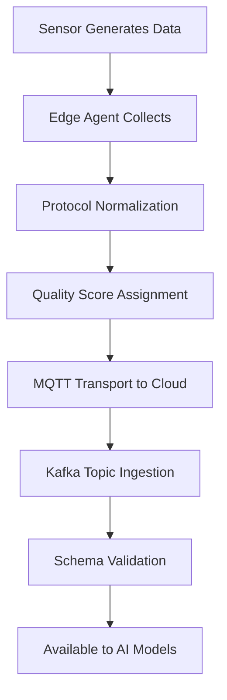

# Sensor Data Ingestion Pipeline

## Purpose

The Sensor Data Ingestion Pipeline connects physical-world IoT sensors to the FrankMax AI Marketplace, enabling AI models to process real-time data from manufacturing floors, supply chain checkpoints, building systems, and field equipment. This is the bridge between institutional AI models and the physical operations they are meant to optimize.

Without reliable sensor ingestion, AI models operate on stale spreadsheets and manual data entry. The pipeline handles the full complexity of industrial IoT: heterogeneous protocols (MQTT, OPC-UA, Modbus, BACnet), variable data quality, intermittent connectivity, and massive throughput requirements. It normalizes raw sensor streams into a unified schema that any marketplace AI model can consume, while maintaining provenance tracking and audit chain compliance for every data point.

## Architecture

The pipeline is built on a three-tier architecture. The Edge Tier runs lightweight collection agents on customer premises that speak native sensor protocols and perform initial data validation and buffering. The Transport Tier uses MQTT brokers with TLS encryption and guaranteed delivery to move data from edge to cloud, with automatic store-and-forward during connectivity gaps. The Cloud Tier receives normalized data into Apache Kafka topics partitioned by sensor type, customer, and NAICS sector. A schema registry enforces data contracts, and a provenance stamper tags each data point with source device ID, timestamp, and collection metadata before it enters the AI model serving layer.

## Core Capabilities

- **Multi-Protocol Support** -- Native connectors for MQTT, OPC-UA, Modbus TCP/RTU, BACnet, and REST/HTTP sensor endpoints.
- **Edge Buffering and Store-Forward** -- Data collection continues during network outages with automatic catch-up synchronization when connectivity resumes.
- **Schema Normalization** -- Raw sensor data is transformed into a unified FrankMax Sensor Schema, making any data source consumable by any marketplace AI model.
- **Throughput Scaling** -- Handles 1 million data points per second per customer with horizontal scaling via Kafka partition expansion.
- **Data Quality Scoring** -- Each ingested data point receives a quality score (0-100) based on completeness, timeliness, and plausibility checks.
- **Provenance Tagging** -- Every data point is linked to its physical source device, enabling end-to-end traceability from sensor to AI output.

## BPMN Workflow

## Integration Points

| System | Integration Type | Data Flow |
|--------|-----------------|-----------|
| Physical KPI Feed Engine | Kafka consumer | Outbound -- normalized sensor data for KPI calculation |
| Anomaly Detection for Physical Systems | Stream processing | Outbound -- real-time sensor feeds for anomaly analysis |
| Digital Twin Data Connector | Data bridge | Outbound -- live sensor data for twin synchronization |
| Provenance Verification Network | Metadata injection | Outbound -- sensor provenance certificates |
| Immutable Audit Chain | Event logging | Outbound -- ingestion events and quality scores |
| Edge-Cloud AI Orchestrator | Bidirectional | Bidirectional -- edge model inference requests and results |

## Target Audiences

- **Manufacturing and Industrial** -- Factory floor sensors, production line monitoring, equipment telemetry
- **Supply Chain and Logistics** -- GPS tracking, temperature monitoring, warehouse sensors
- **Energy and Utilities** -- Smart grid sensors, pipeline monitoring, renewable energy output
- **Healthcare Facilities** -- Building management, equipment monitoring, environmental controls
- **Agriculture and Food** -- Soil sensors, climate monitoring, cold chain tracking

## Revenue Model

The Sensor Data Ingestion Pipeline is priced per data volume and connector count. Base tier: 5 connectors and 100,000 data points/day at $1,500/month. Growth tier: 25 connectors and 5 million data points/day at $6,000/month. Enterprise tier: unlimited connectors and data points at $20,000/month with dedicated edge infrastructure support. Edge agent software is provided free to reduce deployment friction -- revenue comes from the cloud processing and AI model attachment. Gross margin: 75%.
