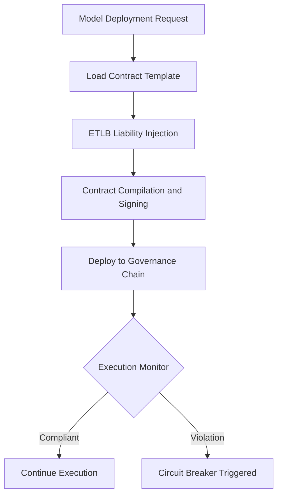

# Smart Contract Governance

## Purpose

Smart Contract Governance automates the enforcement of AI usage policies, licensing terms, and compliance mandates through self-executing blockchain contracts. Instead of relying on manual policy review or after-the-fact auditing, every AI model deployment is bound by programmatic rules that execute automatically when conditions are met -- or halt execution when violations are detected.

This layer implements the ETLB (Execution-Time Liability Binding) protocol, which means liability is assigned at the exact moment an AI model runs, not after the fact. Smart contracts encode who bears responsibility for model outputs, under what conditions usage is permitted, and what happens when thresholds are breached. The result is governance that operates at machine speed across all 713 marketplace offerings without human bottlenecks.

## Architecture

Smart Contract Governance operates as a contract execution layer on top of the Immutable Audit Chain. Contracts are authored in a domain-specific governance language (FMX-Gov) that compiles to Hyperledger Chaincode. Each marketplace offering has an associated contract template that specifies usage limits, liability assignments, data residency requirements, and escalation triggers. The ETLB Binding Engine injects liability parameters at deployment time. A contract monitor daemon watches execution state and triggers enforcement actions (throttle, suspend, alert) within 500ms of a violation.

## Core Capabilities

- **ETLB Protocol Enforcement** -- Liability is cryptographically bound to each AI execution at invocation time, not retroactively assigned.
- **Automated Policy Execution** -- Usage limits, data residency, and model versioning rules execute without human intervention.
- **Multi-Entity Contract Orchestration** -- Single contracts can span obligations across multiple FrankMax entities (e.g., AINEFF provides model, WGE handles compliance, LPI owns data).
- **Violation Circuit Breakers** -- Automatic suspension of model access within 500ms when contract terms are breached.
- **Contract Template Library** -- Pre-built templates for common governance patterns: usage caps, geographic restrictions, PII handling, and sector-specific mandates.
- **Version-Controlled Governance** -- Every contract revision is tracked on-chain with full diff history and approval signatures.

## BPMN Workflow

## Integration Points

| System | Integration Type | Data Flow |
|--------|-----------------|-----------|
| Immutable Audit Chain | Chain anchor | Outbound -- contract state hashes |
| ETLB Binding Engine | Direct API | Inbound -- liability parameters per execution |
| AI Model Marketplace | Pre-deployment hook | Inbound -- model metadata and licensing terms |
| Mandate State Ledger | State sync | Bidirectional -- mandate compliance status |
| Cross-Entity Settlement Chain | Contract trigger | Outbound -- settlement conditions met |
| MCO Engine | Event subscription | Inbound -- mortality compliance constraints |

## Target Audiences

- **Chief Risk Officers** -- Automated enforcement reduces manual governance overhead by 80%+
- **Legal Departments** -- Machine-readable contracts with on-chain proof of enforcement
- **AI Operations Teams** -- Self-service contract deployment without legal bottleneck
- **Financial Services** -- Automated compliance with model risk management (SR 11-7)
- **Healthcare Organizations** -- HIPAA and FDA mandate enforcement at execution time

## Revenue Model

Smart Contract Governance is a premium "Fries" layer with 90% gross margins. Pricing: Starter includes 50 active contracts at $3,000/month. Professional supports 500 active contracts with custom templates at $12,000/month. Enterprise offers unlimited contracts with dedicated governance analysts at $35,000/month. Contract template marketplace generates additional revenue at $500-$2,000 per custom template. Attachment rate target: 65% of enterprise customers.
