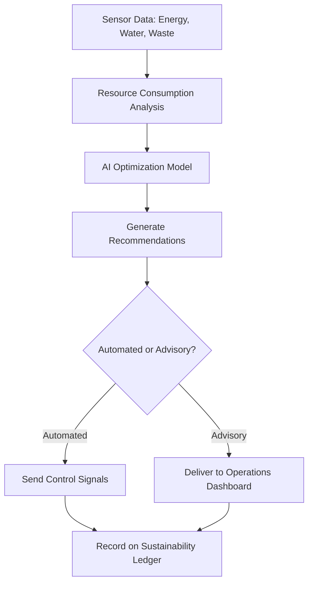

# Sustainability and Circularity Optimizer

## Purpose

The Sustainability and Circularity Optimizer applies AI-driven analysis to IoT data streams to minimize environmental impact, maximize resource efficiency, and enable circular economy practices across industrial operations. It transforms sustainability from a reporting burden into an operational optimization lever -- identifying concrete actions that simultaneously reduce costs and environmental footprint.

This component goes beyond carbon accounting dashboards. It actively optimizes energy consumption patterns, material waste flows, water usage, and product lifecycle decisions using real-time sensor data and predictive AI models. When a manufacturing process uses 15% more energy than the AI-determined optimal profile, the optimizer generates specific parameter adjustments. When materials approaching end-of-life still have recoverable value, it identifies circular pathways (remanufacture, recycle, repurpose) and connects them to marketplace offerings. Every optimization action is tracked on the Immutable Audit Chain for ESG reporting credibility.

## Architecture

The optimizer ingests data from three sources: the Sensor Data Ingestion Pipeline (energy meters, water flow sensors, emissions monitors, waste scales), the Physical KPI Feed Engine (efficiency metrics, yield rates, resource intensity KPIs), and external data feeds (energy grid carbon intensity, commodity prices, regulatory emission limits). An optimization engine runs continuous and scheduled analyses: real-time energy optimization (every 60 seconds), daily material flow optimization, and weekly lifecycle assessment updates. Results are delivered as actionable recommendations with projected cost and environmental impact, or as automated control signals to process equipment via the Adaptive Automation Controller. A blockchain-anchored sustainability ledger provides auditable ESG data for reporting frameworks (GRI, SASB, TCFD, CDP).

## Core Capabilities

- **Real-Time Energy Optimization** -- Minute-by-minute recommendations for reducing energy consumption based on production schedule, grid carbon intensity, and equipment efficiency curves.
- **Material Flow Analysis** -- Tracks material inputs, outputs, and waste streams to identify reduction, reuse, and recycling opportunities.
- **Circular Economy Pathway Matching** -- AI-powered identification of circular options for waste streams, connecting to marketplace partners for remanufacturing and recycling.
- **Carbon Footprint Tracking** -- Scope 1, 2, and 3 emissions calculated from actual operational data rather than industry averages.
- **ESG Report Generation** -- Automated generation of sustainability reports aligned to GRI, SASB, TCFD, and CDP frameworks with blockchain-verified data.
- **Regulatory Compliance Monitoring** -- Tracks emissions against permit limits and regulatory thresholds with proactive alerts before violations occur.

## BPMN Workflow

## Integration Points

| System | Integration Type | Data Flow |
|--------|-----------------|-----------|
| Sensor Data Ingestion Pipeline | Kafka consumer | Inbound -- energy, water, waste, and emissions sensor data |
| Physical KPI Feed Engine | KPI feed | Inbound -- resource efficiency and intensity KPIs |
| Adaptive Automation Controller | Control signals | Outbound -- process parameter adjustments for energy optimization |
| Immutable Audit Chain | ESG audit trail | Outbound -- sustainability actions and measurements |
| Digital Twin Data Connector | Simulation data | Bidirectional -- what-if analysis for sustainability scenarios |
| Provenance Verification Network | Material lineage | Inbound -- material source and composition provenance |

## Target Audiences

- **Manufacturing** -- Energy-intensive industries (metals, chemicals, cement) seeking operational decarbonization
- **Food and Agriculture** -- Water optimization, waste reduction, and supply chain sustainability
- **Real Estate and Facilities** -- Building energy optimization and green building certification support
- **Energy and Utilities** -- Grid optimization, renewable integration, and emissions compliance
- **Financial Services** -- ESG data for sustainable investment portfolio management and reporting

## Revenue Model

The Sustainability and Circularity Optimizer is priced by facility and module. Base tier (energy optimization only): $4,000/month per facility. Professional tier (energy + materials + emissions): $12,000/month per facility with ESG report generation. Enterprise tier (full circular economy suite): $25,000/month per facility with regulatory compliance monitoring and circular pathway matching. ESG data API access for financial services: $5,000/month. Carbon credit verification services: $2,000 per verification. Gross margin: 82%. Strong regulatory tailwinds drive adoption.
