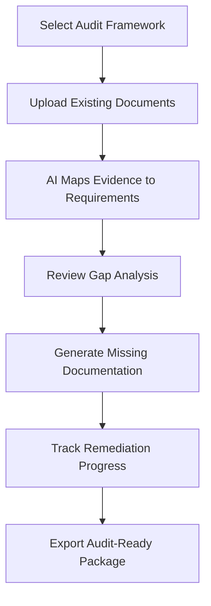

# AuditReady Pro

## What It Does

AuditReady Pro prepares small and mid-size businesses for financial, compliance, and operational audits by organizing evidence, identifying gaps, and generating audit-ready documentation packages. Instead of scrambling for three weeks before an auditor arrives, AuditReady Pro maintains continuous audit readiness -- so when the auditor calls, you hand them a complete, organized package and move on with your day.

The target user is the business owner, controller, or operations manager at a company with 10-500 employees facing regular audits (SOC 2, ISO 27001, HIPAA, financial audits, state inspections) without a dedicated compliance department. Upload your audit requirements (or select from pre-built frameworks), and the AI maps required evidence to your existing documents, identifies what is missing, and generates checklists and timelines for remediation. It turns audit preparation from a fire drill into a background process.

## Key Features

- **Audit Framework Library** -- Pre-built requirement mappings for SOC 2, ISO 27001, HIPAA, PCI-DSS, GDPR, state-specific audits, and financial statement audits.
- **Evidence Mapping** -- Upload documents and the AI maps them to specific audit requirements, showing coverage and gaps at a glance.
- **Gap Prioritization** -- Uncovered requirements are ranked by audit risk (material weakness, significant deficiency, minor observation) and remediation effort.
- **Document Generation** -- AI-assisted creation of policies, procedures, and evidence documents from templates customized to your organization.
- **Audit Timeline Manager** -- Tracks remediation tasks with deadlines, assignments, and progress reporting leading up to audit dates.
- **Auditor Package Export** -- One-click generation of organized, indexed audit evidence packages in the format auditors expect.
- **Continuous Monitoring** -- Ongoing checks that your compliance evidence stays current (expired certifications, outdated policies, missing periodic reviews).

## User Workflow

## Pricing

| Tier | Price | Includes |
|------|-------|----------|
| Single Audit | $49.99/month | 1 audit framework, evidence mapping, gap analysis |
| Multi-Audit | $79.99/month | 3 audit frameworks, document generation, timeline manager |
| Enterprise Lite | $99.99/month | Unlimited frameworks, continuous monitoring, team access (5 users), auditor export |

## Upgrade Path

AuditReady Pro is the entry point to the FrankMax enterprise governance stack. Enterprise Lite users hitting the limits of the consumer tool are offered the full enterprise audit and compliance platform with Immutable Audit Chain integration, Smart Contract Governance for automated policy enforcement, and multi-department workflow management at $25,000+/month. The pitch: "You are preparing for audits. The enterprise platform makes audits a non-event because compliance is enforced continuously."

## Data Flow

Audit preparation data feeds the Kitchen layer with anonymized insights: which audit frameworks have the most gaps by company size and industry, common evidence deficiencies, remediation time benchmarks, and audit outcome correlations with preparation thoroughness. This data improves enterprise compliance models, enhances the Immutable Audit Chain's reporting capabilities, and builds an audit readiness intelligence dataset that helps predict and prevent audit failures. No company-specific documents or findings are retained -- only aggregate patterns and statistical benchmarks.
