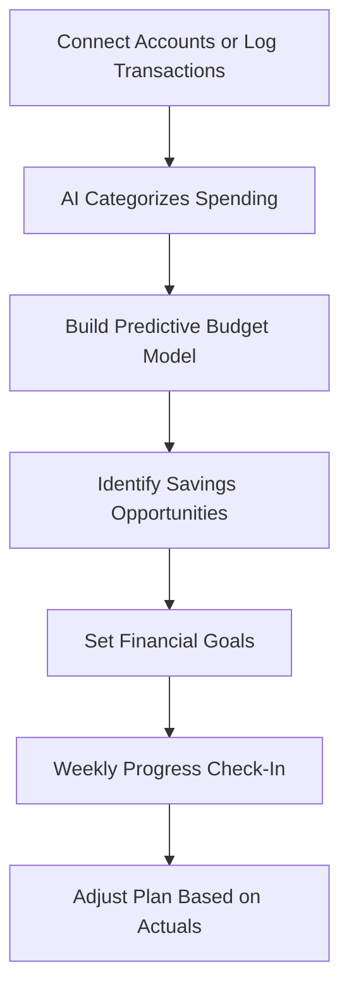

# BudgetBrain AI

## What It Does

BudgetBrain AI is a personal finance assistant that goes beyond tracking what you spent -- it predicts what you will spend, identifies savings opportunities you are not seeing, and builds actionable plans to hit your financial goals. Connect your bank accounts or manually log transactions, and the AI builds a dynamic financial model of your life that updates in real time.

The target user is anyone who wants to spend less and save more but finds traditional budgeting apps too rigid or too manual: young professionals building financial habits, families managing household expenses, freelancers with irregular income, or anyone paying down debt. BudgetBrain AI adapts to your actual spending patterns rather than forcing you into predetermined categories. It notices that you spend 30% more on food delivery when you work late, that your utility bills spike in February, and that your subscription services have crept up $47/month over the past year -- then suggests specific, realistic adjustments.

## Key Features

- **Predictive Budget** -- Forecasts next month's spending by category based on historical patterns, seasonal trends, and upcoming known expenses.
- **Savings Opportunity Detection** -- Identifies recurring charges you may have forgotten, subscription overlap, better rates on regular purchases, and timing optimizations.
- **Goal Tracker** -- Set financial goals (emergency fund, vacation, debt payoff) and the AI creates a realistic savings plan with weekly milestones.
- **Irregular Income Support** -- Designed for freelancers and gig workers with variable monthly income, building buffers and adjusting plans dynamically.
- **Bill Negotiation Alerts** -- Flags bills where historical data suggests negotiation or switching could save money (insurance, subscriptions, utilities).
- **Debt Payoff Optimizer** -- Calculates optimal debt payoff strategies (avalanche vs. snowball) with projected interest savings and timeline.

## User Workflow

## Pricing

| Tier | Price | Includes |
|------|-------|----------|
| Free | $0/month | Manual transaction logging, basic categorization, 1 goal |
| Smart | $9.99/month | Bank connection, predictive budgets, savings detection, 5 goals |
| Premium | $19.99/month | Irregular income support, debt optimizer, bill negotiation alerts |
| Family | $24.99/month | Up to 5 users, shared goals, household budget view |

## Upgrade Path

BudgetBrain AI users managing business expenses alongside personal finances are offered InvoiceSnap AI for business invoice management. Users with growing investment portfolios receive prompts for enterprise-grade financial planning tools. Small business owners using the Family tier for household and business budgeting are targeted for the AI Cost Optimization Engine, which applies the same pattern-detection logic to business financial operations at $10,000+/month.

## Data Flow

Anonymized spending pattern data feeds the Kitchen layer with insights on consumer financial behavior: seasonal spending patterns by geography, subscription fatigue indicators, debt repayment success rates by strategy type, and savings goal achievement correlations. This data improves marketplace financial AI models, enhances the Billing Leakage Detector's ability to identify unusual spending patterns for enterprise clients, and builds a behavioral finance dataset. No transaction details or account information are retained -- only aggregate patterns and statistical distributions.
