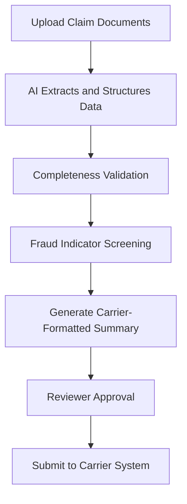

# ClaimsFast Pro

## What It Does

ClaimsFast Pro accelerates insurance claims processing for independent adjusters, small claims shops, and boutique insurance agencies. Upload claim documents (photos, estimates, medical records, police reports), and the AI extracts key data, checks for completeness, flags potential fraud indicators, and generates structured claim summaries ready for carrier submission. It cuts claim processing time from hours to minutes.

The target user is the insurance professional handling 20-200 claims per month who lacks the enterprise software that large carriers deploy: independent adjusters in the field, small agency claims teams, third-party administrators, and public adjusters representing policyholders. ClaimsFast Pro understands claim types across auto, property, liability, workers comp, and health, and adapts its extraction and validation logic based on carrier-specific requirements and state regulations.

## Key Features

- **Multi-Document Claim Assembly** -- Upload photos, PDFs, and handwritten notes; AI assembles them into a structured claim file with proper categorization.
- **Automated Data Extraction** -- Pulls claim numbers, policy information, loss details, amounts, dates, and party information from unstructured documents.
- **Completeness Checker** -- Validates that all required documents and data fields are present before carrier submission, flagging gaps.
- **Fraud Indicator Flags** -- AI identifies patterns associated with fraudulent claims (inconsistent dates, inflated amounts, known fraud patterns) for reviewer attention.
- **Carrier Format Compliance** -- Generates claim summaries formatted to specific carrier requirements, reducing rejection and rework cycles.
- **State Regulation Compliance** -- Tracks state-specific claims handling requirements (timelines, disclosure rules, documentation standards) and flags non-compliance.
- **Batch Processing** -- Process multiple claims simultaneously during high-volume periods (storm events, mass incidents).

## User Workflow

## Pricing

| Tier | Price | Includes |
|------|-------|----------|
| Solo | $49.99/month | 50 claims/month, basic extraction, completeness check |
| Team | $79.99/month | 200 claims/month, fraud flags, carrier formatting, 3 users |
| Agency | $99.99/month | Unlimited claims, batch processing, state compliance, 10 users |

## Upgrade Path

ClaimsFast Pro is the downsized version of the enterprise Claims Processing Accelerator (a top-5 revenue priority at $60,000+/month). Agency-tier users consistently processing high volumes receive direct outreach for enterprise deployment with carrier API integration, full fraud analytics, and regulatory compliance automation. The upgrade data point: "You processed X claims this quarter at Y minutes each. The enterprise platform does it in Z seconds with 95% straight-through processing."

## Data Flow

Claims processing data feeds the Kitchen layer with anonymized patterns: claim type distributions by geography and season, common documentation gaps by carrier, fraud indicator frequency and accuracy, and processing time benchmarks by claim complexity. This data directly improves the enterprise Claims Processing Accelerator's models, enhances fraud detection accuracy across the marketplace, and builds an insurance claims intelligence dataset that grows more valuable with every claim processed. No claim-specific details, policyholder data, or financial amounts are retained.
